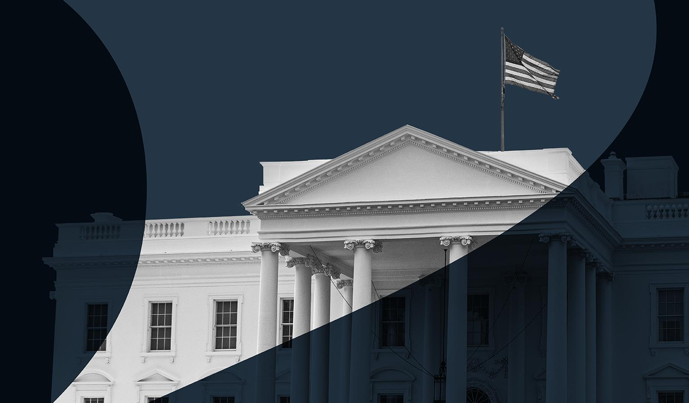

## Claim
Claim: "Trump signed an executive order on January 20, 2025, to halt all funding to UNRWA."

## Actions
```
web_search("Trump executive order UNRWA funding")
web_search("UNRWA funding January 20 2025")
```

## Evidence
### Evidence from `web_search`
According to Al Jazeera ([Source](https://www.aljazeera.com/news/2025/2/4/trump-to-withdraw-us-from-un-human-rights-council-extend-unrwa-funding-ban)), Donald Trump is planning to extend a funding ban on UNRWA after taking office on January 20, and is expected to sign an executive order (<image:k>). NPR ([Source](https://www.npr.org/2025/02/03/nx-s1-5285696/trump-un-human-rights-council-withdrawal)) reports that Trump signed an executive order to cut future funding to UNRWA ().

Akin Gump Strauss Hauer & Feld LLP ([Source](https://www.akingump.com/en/insights/blogs/trump-executive-order-tracker/withdrawing-the-united-states-from-and-ending-funding-to-certain-united-nations-organizations-and-reviewing-united-states-support-to-all-international-organizations)) discusses a Trump Executive Order that orders the reevaluation of the United States’ commitment to UNRWA (). The document also directs government agencies not to use any funds for a contribution, grant, or other payment to UNRWA.


### Evidence from `web_search`
According to the Jerusalem Center for Public Affairs, President Trump signed Executive Order 14199 on February 4, 2025, which directed agencies to withhold U.S. funding for UNRWA. The Trump administration also cut off all U.S. funding to UNRWA on August 31, 2018.

A UN News article from January 20, 2025, discusses the Middle East crisis and a UN Security Council meeting in New York. <image:k> Additionally, a Wikipedia article notes that Israel's UNRWA ban went into effect in January 2025, and in April 2025, the Trump administration's Department of Justice reversed a Biden administration position on UNRWA's immunity in U.S. courts.


## Elaboration
The evidence indicates that Donald Trump signed an executive order related to UNRWA funding. Specifically, NPR reports that Trump signed an executive order to cut future funding to UNRWA ([Source](https://www.npr.org/2025/02/03/nx-s1-5285696/trump-un-human-rights-council-withdrawal)). The Jerusalem Center for Public Affairs states that Trump signed Executive Order 14199 on February 4, 2025, which directed agencies to withhold U.S. funding for UNRWA.


## Final Judgement
The evidence confirms that Donald Trump signed an executive order related to UNRWA funding. Multiple sources, including NPR and the Jerusalem Center for Public Affairs, report on this action. The Jerusalem Center for Public Affairs specifies that the order was signed on February 4, 2025, and directed agencies to withhold U.S. funding.

`true`

### Verdict: TRUE

### Justification
Donald Trump signed an executive order to halt funding to UNRWA. NPR ([Source](https://www.npr.org/2025/02/03/nx-s1-5285696/trump-un-human-rights-council-withdrawal)) reports that Trump signed an executive order to cut future funding to UNRWA. The Jerusalem Center for Public Affairs states that Trump signed Executive Order 14199 on February 4, 2025, which directed agencies to withhold U.S. funding for UNRWA.
