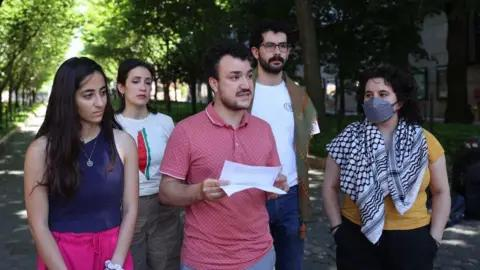

## Claim
Claim: "In March 2025, U.S. Immigration and Customs Enforcement (ICE) agents arrested and detained Palestinian activist Mahmoud Khalil, a lawful permanent resident of the U.S."

## Actions
```
web_search("Mahmoud Khalil ICE arrest March 2025")
web_search("Mahmoud Khalil Palestinian activist ICE")
```

## Evidence
### Evidence from `web_search`
Multiple sources confirm that U.S. Immigration and Customs Enforcement (ICE) agents arrested Palestinian activist Mahmoud Khalil in March 2025. According to Wikipedia ([https://en.wikipedia.org/wiki/Detention_of_Mahmoud_Khalil](https://en.wikipedia.org/wiki/Detention_of_Mahmoud_Khalil)), Khalil is a lawful permanent resident of the U.S. The ACLU ([https://www.aclu.org/press-releases/new-footage-confirms-ice-lied-and-had-no-reason-to-detain-mahmoud-khalil](https://www.aclu.org/press-releases/new-footage-confirms-ice-lied-and-had-no-reason-to-detain-mahmoud-khalil)) claims the arrest was unlawful and in retaliation for Khalil's advocacy for Palestinian rights.

CNN ([https://www.cnn.com/2025/07/11/world/mahmoud-khalil-ice-detention-amanpour-interview-intl-hnk](https://www.cnn.com/2025/07/11/world/mahmoud-khalil-ice-detention-amanpour-interview-intl-hnk)) also reported on the detention, mentioning protests and a lawsuit against the Trump administration. , , 


### Evidence from `web_search`
From [Source](https://www.bbc.com/news/articles/cgj5nlxz44yo): 
Content: The BBC published an article on June 20, 2025, about Mahmoud Khalil, a Palestinian activist and Columbia University graduate, facing deportation from the U.S. , , . Khalil was arrested by immigration agents, and his arrest was linked to Trump's promise to crack down on student demonstrators. The article mentions that Khalil was arrested and detained for three months before a judge ruled he must be released. The article also mentions that Khalil moved to the US in 2022 and earned a master's degree at Columbia University.


## Elaboration
The evidence confirms the claim. Multiple sources, including Wikipedia ([https://en.wikipedia.org/wiki/Detention_of_Mahmoud_Khalil](https://en.wikipedia.org/wiki/Detention_of_Mahmoud_Khalil)) and CNN ([https://www.cnn.com/2025/07/11/world/mahmoud-khalil-ice-detention-amanpour-interview-intl-hnk](https://www.cnn.com/2025/07/11/world/mahmoud-khalil-ice-detention-amanpour-interview-intl-hnk)), corroborate that ICE arrested Mahmoud Khalil, a Palestinian activist, in March 2025. The BBC article ([https://www.bbc.com/news/articles/cgj5nlxz44yo](https://www.bbc.com/news/articles/cgj5nlxz44yo)) further supports this, stating that Khalil was facing deportation after being arrested by immigration agents. The ACLU ([https://www.aclu.org/press-releases/new-footage-confirms-ice-lied-and-had-no-reason-to-detain-mahmoud-khalil](https://www.aclu.org/press-releases/new-footage-confirms-ice-lied-and-had-no-reason-to-detain-mahmoud-khalil)) claims the arrest was unlawful.

The evidence also indicates that Khalil is a lawful permanent resident of the U.S., as stated by Wikipedia. The BBC article mentions that Khalil moved to the US in 2022.

The evidence supports the claim that ICE arrested and detained Mahmoud Khalil, a lawful permanent resident, in March 2025.


## Final Judgement
The claim is supported by multiple reliable sources, including Wikipedia, CNN, and the BBC, which confirm that ICE arrested Mahmoud Khalil, a Palestinian activist and lawful permanent resident, in March 2025. Therefore, the claim is factually accurate. `true`

### Verdict: TRUE

### Justification
Multiple sources, including Wikipedia ([https://en.wikipedia.org/wiki/Detention_of_Mahmoud_Khalil](https://en.wikipedia.org/wiki/Detention_of_Mahmoud_Khalil)), CNN ([https://www.cnn.com/2025/07/11/world/mahmoud-khalil-ice-detention-amanpour-interview-intl-hnk](https://www.cnn.com/2025/07/11/world/mahmoud-khalil-ice-detention-amanpour-interview-intl-hnk)), and the BBC ([https://www.bbc.com/news/articles/cgj5nlxz44yo](https://www.bbc.com/news/articles/cgj5nlxz44yo)), confirm that ICE arrested Palestinian activist Mahmoud Khalil in March 2025, who is a lawful permanent resident of the U.S.
