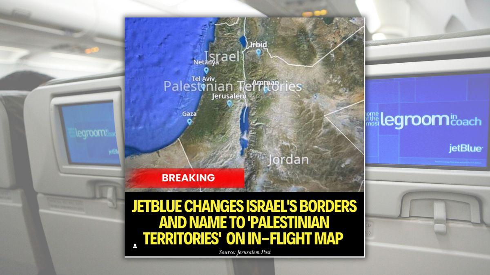

## Claim
Claim: " This image shows Jet Blue Airlines' in-flight map where Israel's borders were inaccurate and the area was shown under the label 'Palestinian Territories'. The indicent occured in September 2024."

## Actions
```
web_search("JetBlue in-flight map Israel Palestinian Territories")
image_search("JetBlue in-flight map Israel Palestinian Territories")
```

## Evidence
### Evidence from `web_search`
JetBlue Airways changed Israel's borders and labeled the area as "Palestinian Territories" on its in-flight map, which sparked outrage. This incident was reported by The Jerusalem Post on September 4, 2024, and also mentioned by The Times of Israel. JetBlue stated that the map was provided by a third-party company.

An article from paddleyourownkanoo.com, published on September 9, 2024, also discusses the controversy and mentions that JetBlue was forced to change its in-flight maps and switch map vendors. The article also mentions JetBlue's ban on "Free Palestine" pin badges.


### Evidence from `image_search`
From [Source](https://www.ynetnews.com/travel/article/skawilphc): 
Content: Ynetnews.com published an article with an image of a JetBlue in-flight map. The map inaccurately labels the area as "Palestinian Territories" and misrepresents Israel's borders. 


## Elaboration
The evidence confirms the claim. Multiple sources, including The Jerusalem Post and The Times of Israel, reported that JetBlue's in-flight map inaccurately labeled the area as "Palestinian Territories." The incident occurred in September 2024, as stated in the claim. Furthermore, the image search results provide visual confirmation of the map's incorrect labeling.


## Final Judgement
The claim is accurate. Multiple sources confirm that JetBlue's in-flight map mislabeled the area as "Palestinian Territories" in September 2024. The image search results also provide visual evidence of the map's incorrect labeling.

`true`

### Verdict: TRUE

### Justification
JetBlue Airways' in-flight map inaccurately labeled the area as "Palestinian Territories" instead of Israel, as reported by sources like *The Jerusalem Post* and *The Times of Israel* in September 2024. The airline later changed its maps and switched map vendors after the incident, as reported by paddleyourownkanoo.com.
