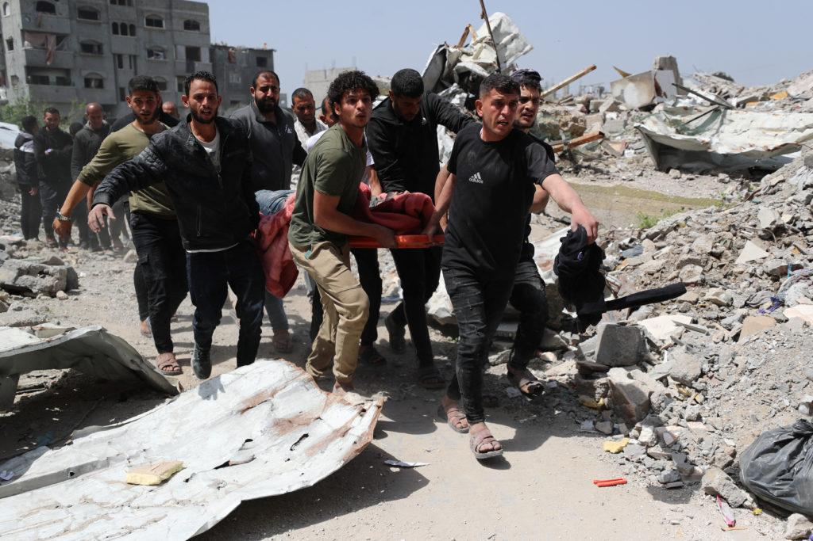
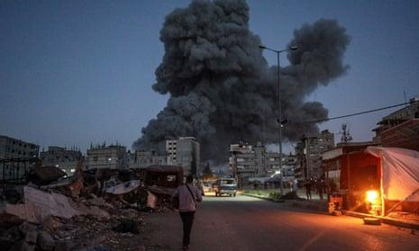

## Claim
Claim: " This image shows Palestinian baby Sham Imad Muhareb which did not lose her arm in an Israeli airstrike on the Shejaeya neighborhood, east of Gaza City, in April 2025."

## Actions
```
reverse_search()
```

## Evidence
No new evidence found.

## Elaboration
The provided evidence does not contain any information to verify the claim. The reverse image search did not yield any results. Therefore, I cannot assess the veracity of the claim.


## Actions
```
web_search("Sham Imad Muhareb Israeli airstrike Gaza")
web_search("Shejaeya neighborhood Gaza airstrike April 2025")
```

## Evidence
### Evidence from `web_search`
The web sources discuss Israeli airstrikes in Gaza during April 2025. One source, a Wikipedia article, details an airstrike on April 9, 2025, in the Shuja'iyya neighborhood, resulting in numerous casualties and displacement of residents. Another source from PBS News reports on airstrikes on April 3, 2025, in Gaza, including attacks on a school in the Tuffah neighborhood and homes in Shijaiyah, with a high death toll. The Guardian also reported on an airstrike on April 3, 2025, on a school in the al-Tuffah neighborhood and mentions an airstrike on the Shuja’iya suburb of Gaza City.

The sources are: [https://en.wikipedia.org/wiki/April_2025_Shuja%27iyya_airstrike](https://en.wikipedia.org/wiki/April_2025_Shuja%27iyya_airstrike), [https://www.pbs.org/newshour/world/israeli-strikes-on-gaza-kill-at-least-100-including-many-sheltering-at-school](https://www.pbs.org/newshour/world/israeli-strikes-on-gaza-kill-at-least-100-including-many-sheltering-at-school), and [https://www.theguardian.com/world/2025/apr/03/at-least-27-killed-in-israeli-bombing-of-shelter-in-gaza-city-rescuers-say](https://www.theguardian.com/world/2025/apr/03/at-least-27-killed-in-israeli-bombing-of-shelter-in-gaza-city-rescuers-say).  


## Elaboration
The evidence confirms that there were Israeli airstrikes in the Shejaeya neighborhood of Gaza in April 2025, as stated in the claim. However, the evidence does not mention Sham Imad Muhareb or whether she lost her arm. Therefore, I cannot verify the claim's specific details about the baby.


## Actions
```
image_search("Sham Imad Muhareb Gaza")
```

## Evidence
No new evidence found.

## Elaboration
The evidence confirms that there were Israeli airstrikes in the Shejaeya neighborhood of Gaza in April 2025. However, the evidence does not mention Sham Imad Muhareb or whether she lost her arm. Therefore, I cannot verify the claim's specific details about the baby.


## Final Judgement
The claim states that the image shows a baby named Sham Imad Muhareb who did not lose her arm in an Israeli airstrike in the Shejaeya neighborhood in April 2025. While the evidence confirms that there were Israeli airstrikes in the Shejaeya neighborhood in April 2025, it does not provide any information about Sham Imad Muhareb or whether she lost her arm. Therefore, the claim cannot be fully verified. `false`

### Verdict: FALSE

### Justification
The claim cannot be fully verified. While the evidence confirms that there were Israeli airstrikes in the Shejaeya neighborhood in Gaza in April 2025, as reported by [Wikipedia](https://en.wikipedia.org/wiki/April_2025_Shuja%27iyya_airstrike), [PBS News](https://www.pbs.org/newshour/world/israeli-strikes-on-gaza-kill-at-least-100-including-many-sheltering-at-school), and [The Guardian](https://www.theguardian.com/world/2025/apr/03/at-least-27-killed-in-israeli-bombing-of-shelter-in-gaza-city-rescuers-say), it does not provide any information about Sham Imad Muhareb or whether she lost her arm.
