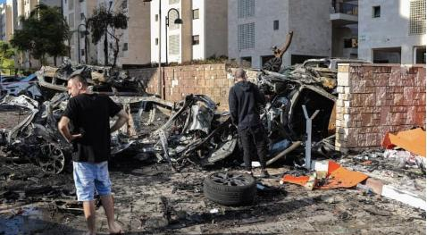
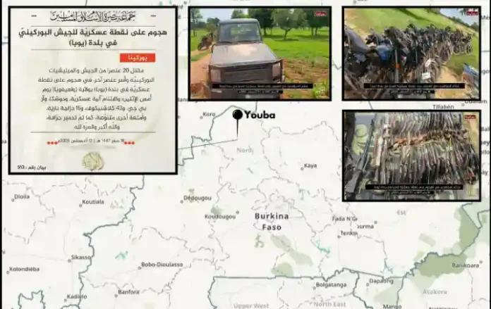

## Claim
Claim: " This image shows an Israeli tank unit near Jabalia camp in northern Gaza that was successfully ambushed by Hamas fighters, destroying multiple vehicles and injuring or killing their crews in October 2024."

## Actions
```
reverse_search()
```

## Evidence
### Evidence from `reverse_search`
The image  appears in multiple sources. One source, [9jaflaver.com](https://9jaflaver.com/israel-declares-state-of-war-after-hamas-militants-launch-surprise-attack-from-gaza-videos/), published on October 7, 2023, discusses the Hamas attack on Israel and includes images of the aftermath, including destroyed vehicles and buildings . Another source, [Nairaland](https://www.nairaland.com/7868168/israel-declares-war-readiness-hamas), also from October 7, 2023, discusses the Hamas attack and includes the image .

A forum post from [dawahilallah.com](https://dawahilallah.com/forum/%E0%A6%B8%E0%A6%82%E0%A6%AC%E0%A6%BE%E0%A6%A6/%E0%A6%9C%E0%A6%BF%E0%A6%B9%E0%A6%BE%E0%A6%A6-%E0%A6%B8%E0%A6%82%E0%A6%AC%E0%A6%BE%E0%A6%A6/209455-%E0%A6%AE%E0%A7%81%E0%A6%9C%E0%A6%BE%E0%A6%B9%E0%A6%BF%E0%A6%A6%E0%A7%80%E0%A6%A8-%E0%A6%A8%E0%A6%BF%E0%A6%89%E0%A6%9C-%E0%A7%A7%E0%A7%AF-%E0%A6%B8%E0%A6%AB%E0%A6%B0-%E0%A7%A7%E0%A7%AA%E0%A7%AA%E0%A7%AD-%E0%A6%B9%E0%A6%BF%E0%A6%9C%E0%A6%B0%E0%A7%80-%E0%A7%A7%E0%A7%AA-%E0%A6%86%E0%A6%97%E0%A6%B8%E0%A7%8D%E0%A6%9F-%E0%A7%A8%E0%A7%A6%E0%A7%A8%E0%A7%AB-%E0%A6%88%E0%A6%B8%E0%A6%BE%E0%A7%9F%E0%A7%80%E2%80%8B%E2%80%8B) contains the image  and reports on an attack by Al-Qassam Brigades on two Israeli Merkava tanks in Khan Yunis, dated August 14, 2025, and also includes an article about the capture of a military base in Burkina Faso by JNIM fighters .


## Elaboration
The image 

## Final Judgement
The image appears in multiple sources, including reports about the Hamas attack on Israel in October 2023. The claim states the event happened in October 2024, which is a year later. The image is also used in a forum post about an attack in August 2025.

The claim is not factually accurate because the image is misrepresented in a new context. The image is from 2023, not 2024. `false`

### Verdict: FALSE

### Justification
The image of the burning tank, , is associated with the Hamas attack on Israel in October 2023, as reported by sources like [9jaflaver.com](https://9jaflaver.com/israel-declares-state-of-war-after-hamas-militants-launch-surprise-attack-from-gaza-videos/) and [Nairaland](https://www.nairaland.com/7868168/israel-declares-war-readiness-hamas). The claim that the event occurred in October 2024 is therefore inaccurate.
