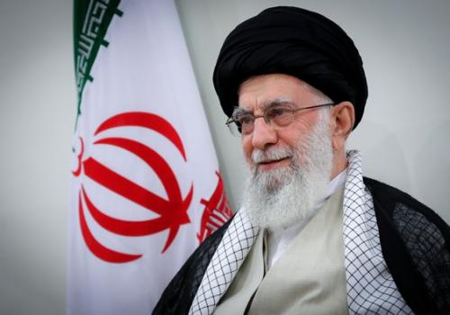
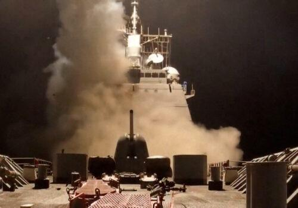

## Claim
Claim: "The Huthi rebels announced the final cessation of their military operations in international waters after Trump won the 2024 US presidential election."

## Actions
```
web_search("Huthi rebels military operations international waters Trump election")
```

## Evidence
### Evidence from `web_search`
An article from the Atlantic Council discusses Donald Trump's approach to the Houthi rebels in Yemen, including his intention to escalate military strikes due to their attacks on international shipping in the Red Sea. The US is also working to cut off Iran's shipments to the rebel group and increase naval patrols in the Red Sea and Gulf of Aden. [Source](https://www.atlanticcouncil.org/blogs/menasource/can-donald-trump-completely-annihilate-the-houthis-in-yemen/) , .

NBC News reports that Trump's fight against the Houthis cost America more than $1 billion since March. The article also mentions a deal announced by Trump in which the U.S. would suspend strikes if the Houthis halted their attacks. [Source](https://www.nbcnews.com/politics/national-security/trump-operation-houthis-cost-1-billion-rcna205333). CNN reports that Donald Trump ordered military action against Houthi rebels in Yemen on March 16, 2025, after winning the US presidential election. [Source](https://www.cnn.com/2025/03/15/politics/trump-houthis-military-action) <image:k>, <image:j>.


## Elaboration
The evidence suggests that Donald Trump took military action against the Houthi rebels after winning the 2024 US presidential election. The Atlantic Council article indicates Trump's intention to escalate military strikes, while NBC News mentions a deal involving the suspension of strikes if the Houthis halt their attacks. CNN confirms that Trump ordered military action against the Houthis on March 16, 2025.

The evidence does not support the claim that the Houthi rebels announced the final cessation of their military operations in international waters after Trump won the 2024 US presidential election. Instead, the evidence points to continued conflict and potential negotiations.

The claim is not supported by the evidence.


## Final Judgement
The evidence indicates that Donald Trump took military action against the Houthi rebels after winning the 2024 US presidential election, and there is no evidence to support the claim that the Houthi rebels announced the final cessation of their military operations.

`false`


### Verdict: FALSE

### Justification
The available evidence, including reports from the [Atlantic Council](https://www.atlanticcouncil.org/blogs/menasource/can-donald-trump-completely-annihilate-the-houthis-in-yemen/), [NBC News](https://www.nbcnews.com/politics/national-security/trump-operation-houthis-cost-1-billion-rcna205333), and [CNN](https://www.cnn.com/2025/03/15/politics/trump-houthis-military-action), indicates that Donald Trump escalated military actions against the Houthi rebels after winning the 2024 US presidential election. There is no evidence to support the claim that the Houthis ceased their military operations.
