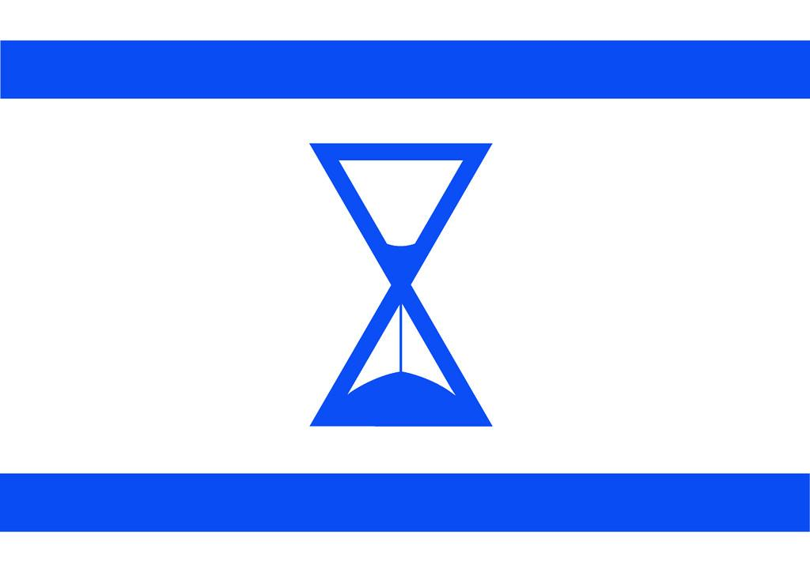

## Claim
Claim: " The image shows a screenshot of an authentic social media post from Mel Gibson saying that Israel will end soon and therefore destroy everything in its way together with a flag in the color of Israel that shows an hourglass."

## Actions
```
web_search("Mel Gibson Israel end destroy everything")
image_search("Israel flag hourglass")
```

## Evidence
### Evidence from `web_search`
The Associated Press ([Source](https://apnews.com/article/fact-check-mel-gibson-israel-post-342335121493)) and Yahoo ([Source](https://www.yahoo.com/entertainment/fact-check-mel-gibson-posted-235600604.html)) both state that the image of Mel Gibson's social media post is fake. The post includes an altered Israeli flag with an hourglass and the words "Soon the end and they know it, that's why they want to destroy everything in the way." 

The articles mention that Gibson does not have any public social media accounts. The independent Lebanese newspaper An-Nahar also debunked the same fake Gibson post.   


### Evidence from `image_search`
The search results show images related to the claim. One image shows a flag in the colors of Israel with an hourglass in the middle (). Another image shows an hourglass with the colors of the Israeli flag (). A third image shows an hourglass in front of an Israel flag ().

The sources are: [https://www.flickr.com/photos/talporat/4728247932](https://www.flickr.com/photos/talporat/4728247932), [https://www.shutterstock.com/image-illustration/hourglass-colors-national-flag-concept-clip-2131517309](https://www.shutterstock.com/image-illustration/hourglass-colors-national-flag-concept-clip-2131517309), and [https://www.123rf.com/photo_152379279_hourglass-and-israel-flag-soft-focus-copy-space.html](https://www.123rf.com/photo_152379279_hourglass-and-israel-flag-soft-focus-copy-space.html).


## Elaboration
The claim is false. The evidence indicates that the social media post attributed to Mel Gibson is fake. Multiple sources, including the Associated Press ([https://apnews.com/article/fact-check-mel-gibson-israel-post-342335121493](https://apnews.com/article/fact-check-mel-gibson-israel-post-342335121493)) and Yahoo ([https://www.yahoo.com/entertainment/fact-check-mel-gibson-posted-235600604.html](https://www.yahoo.com/entertainment/fact-check-mel-gibson-posted-235600604.html)), have debunked the post. Additionally, Gibson does not have any public social media accounts.


## Final Judgement
The claim is demonstrably false. The evidence from multiple reliable sources confirms that the social media post attributed to Mel Gibson is fake. The post includes an altered Israeli flag with an hourglass and the words "Soon the end and they know it, that's why they want to destroy everything in the way."

`false`

### Verdict: FALSE

### Justification
The claim is false. Multiple sources, including the Associated Press ([Source](https://apnews.com/article/fact-check-mel-gibson-israel-post-342335121493)) and Yahoo ([Source](https://www.yahoo.com/entertainment/fact-check-mel-gibson-posted-235600604.html)), confirm that the social media post attributed to Mel Gibson is fake.
