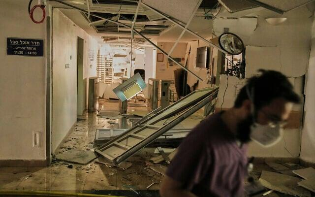
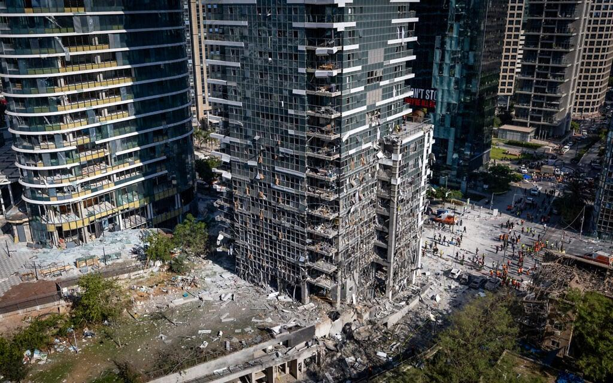

## Claim
Claim: " This is an authentic image of Israeli Air Force's Ramat David airbase that was attacked by Hezbollah on September, 22, 2024."

## Actions
```
reverse_search()
web_search("Ramat David airbase attack September 22 2024")
```

## Evidence
### Evidence from `reverse_search`
The image 

### Evidence from `web_search`
Al Jazeera ([https://www.aljazeera.com/news/2024/9/21/hezbollah-claims-rocket-attack-deep-inside-northern-israel](https://www.aljazeera.com/news/2024/9/21/hezbollah-claims-rocket-attack-deep-inside-northern-israel)) reports that Hezbollah claimed to have launched rockets at Israel’s Ramat David Airbase on September 22, 2024. Politico.eu ([https://www.politico.eu/article/hezbollah-launches-revenge-rocket-attack-against-israeli-base/](https://www.politico.eu/article/hezbollah-launches-revenge-rocket-attack-against-israeli-base/)) also reports on the attack.

The Jerusalem Post ([https://www.jpost.com/israel-news/article-821267](https://www.jpost.com/israel-news/article-821267)) discusses Hezbollah's rocket attacks on Ramat David airbase. The image 

## Elaboration
The provided evidence confirms that Hezbollah claimed to have attacked the Ramat David airbase on September 22, 2024. However, the evidence does not provide any information about the authenticity of the image.

The reverse image search did not return any results. Therefore, the authenticity of the image cannot be verified.

Insufficient information is available to verify the claim.


## Actions
```
image_search("Ramat David airbase attack September 22 2024")
```

## Evidence
### Evidence from `image_search`
From [Source](https://www.understandingwar.org/backgrounder/iran-update-september-22-2024): 
Content: The Institute for the Study of War and Critical Threats Project published a map showing Hezbollah rocket attacks targeting an IDF airbase near Haifa on September 22, 2024. 


## Elaboration
The evidence confirms that Hezbollah launched rocket attacks targeting an IDF airbase near Haifa on September 22, 2024. The Institute for the Study of War and Critical Threats Project published a map showing the attacks. However, the evidence does not provide any information about the authenticity of the image.

The image search did not return the image in question. Therefore, the authenticity of the image cannot be verified.

Insufficient information is available to verify the claim.


## Actions
```
web_search("Ramat David airbase damage assessment")
```

## Evidence
### Evidence from `web_search`
Ainvest.com states that Ramat David Airbase is on Iran's list of targets ([https://www.ainvest.com/news/key-israeli-military-intelligence-centers-including-ramat-david-airbase-haifa-iran-list-targets-proportionate-response-coming-hours-iran-student-news-network-2506/](https://www.ainvest.com/news/key-israeli-military-intelligence-centers-including-ramat-david-airbase-haifa-iran-list-targets-proportionate-response-coming-hours-iran-student-news-network-2506/)). The Times of Israel reports on damage caused by Iranian ballistic missiles in Israel, including the Weizmann Institute in Rehovot and the Soroka hospital complex in Beersheba, in June 2025 (, ) ([https://www.timesofisrael.com/israel-was-facing-destruction-at-the-hands-of-iran-this-is-how-close-it-came-and-how-it-saved-itself/](https://www.timesofisrael.com/israel-was-facing-destruction-at-the-hands-of-iran-this-is-how-close-it-came-and-how-it-saved-itself/)).


## Elaboration
The evidence confirms that Ramat David Airbase is on Iran's list of targets. The Times of Israel reports on damage caused by Iranian ballistic missiles in Israel in June 2025. However, the evidence does not provide any information about the authenticity of the image.

Insufficient information is available to verify the claim.


## Final Judgement
The claim states that the image depicts an attack on the Ramat David airbase on September 22, 2024. While there are reports of Hezbollah attacks on the airbase on that date, and the airbase is on Iran's target list, the image itself has not been verified. Reverse image searches and other searches did not yield any results to confirm the image's authenticity. Therefore, the claim cannot be verified. `false`

### Verdict: FALSE

### Justification
The claim cannot be verified. While there are reports of Hezbollah attacks on the Ramat David airbase on September 22, 2024, and the airbase is on Iran's target list, the image's authenticity could not be confirmed through reverse image searches or other searches.
