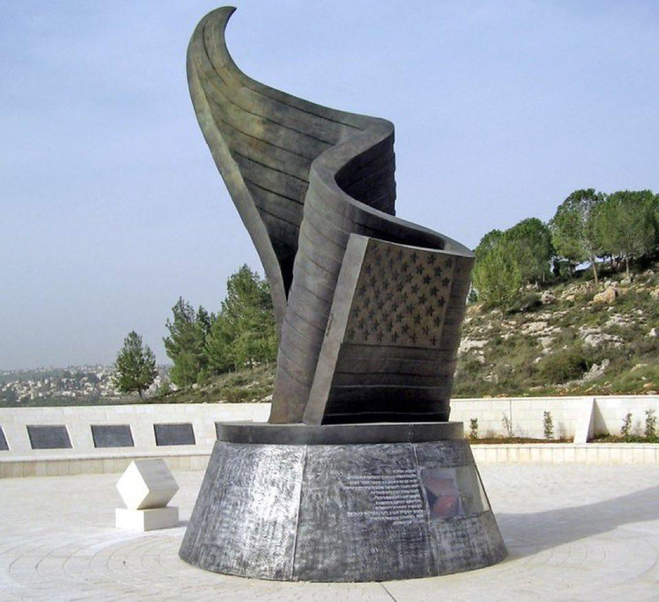

## Claim
Claim: " This image shows Israel's 9/11 memorial which is the only one outside the US."

## Actions
```
web_search("Israel 9/11 memorial")
```

## Evidence
### Evidence from `web_search`
The 9/11 Living Memorial Plaza in Jerusalem, Israel, is described in the search results. The memorial, designed by Eliezer Weishoff, is dedicated to the victims of the September 11 attacks and was completed in 2009. The memorial includes a 9-meter tall bronze sculpture. Memorial plaques commemorate the nearly 3000 people who perished in the disaster, including five Israelis. 

The sources are from Wikipedia ([https://en.wikipedia.org/wiki/9/11_Living_Memorial_Plaza](https://en.wikipedia.org/wiki/9/11_Living_Memorial_Plaza)) and KKL-JNF ([https://www.kkl-jnf.org/tourism-and-recreation/scenic-lookouts/center/twin-towers-living-memorial-jerusalem-park.aspx](https://www.kkl-jnf.org/tourism-and-recreation/scenic-lookouts/center/twin-towers-living-memorial-jerusalem-park.aspx)).


## Elaboration
The evidence confirms that the image depicts the 9/11 Living Memorial Plaza in Jerusalem, Israel. The memorial is dedicated to the victims of the September 11 attacks.

The claim states that this memorial is the only one outside the US. However, the provided evidence does not explicitly state whether this is the only 9/11 memorial outside the US.

Therefore, the claim's veracity cannot be fully determined based on the available information. Additional information would be needed to confirm if this is the only 9/11 memorial outside the US.


## Actions
```
web_search("9/11 memorials outside US")
```

## Evidence
### Evidence from `web_search`
The search results indicate that there are multiple 9/11 memorials outside the US. Memorial Mapping lists countries with 9/11 memorials, including Afghanistan, Australia, Barbados, and others. Wikipedia also lists several 9/11 memorials, including the one in Jerusalem, Israel, which is depicted in the image . Architectural Digest also mentions the Jerusalem memorial and other memorials in the US and abroad .

The sources are from Memorial Mapping ([http://www.memorialmapping.com/memorials/browse-by-country](http://www.memorialmapping.com/memorials/browse-by-country)), Wikipedia ([https://en.wikipedia.org/wiki/Memorials_and_services_for_the_September_11_attacks](https://en.wikipedia.org/wiki/Memorials_and_services_for_the_September_11_attacks)), and Architectural Digest ([https://www.architecturaldigest.com/gallery/september-11-memorials-slideshow](https://www.architecturaldigest.com/gallery/september-11-memorials-slideshow)).


## Elaboration
The evidence indicates that the claim is false. The search results show that there are multiple 9/11 memorials outside the US, not just the one in Israel.


## Final Judgement
The image depicts the 9/11 Living Memorial Plaza in Jerusalem, Israel. However, the claim that this is the only 9/11 memorial outside the US is false. Multiple sources confirm the existence of other 9/11 memorials outside the US.

`false`

### Verdict: FALSE

### Justification
The claim is false. While the image shows the 9/11 Living Memorial Plaza in Jerusalem, Israel, which is dedicated to the victims of the September 11 attacks, there are multiple other 9/11 memorials outside the US, as evidenced by sources like [Memorial Mapping](http://www.memorialmapping.com/memorials/browse-by-country) and [Wikipedia](https://en.wikipedia.org/wiki/Memorials_and_services_for_the_September_11_attacks).
