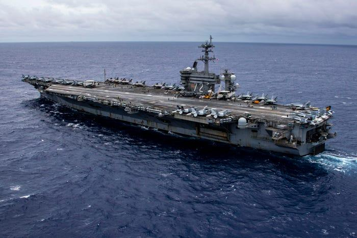
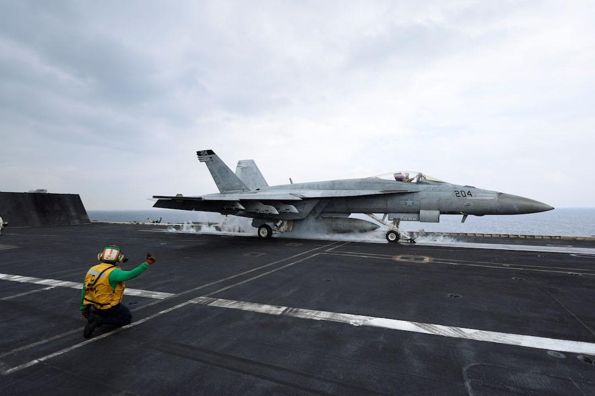

## Claim
Claim: " This image shows U.S. warships being en route to the Lebanon coast in August 2024 to support the Israel Defence Forces (IDF)."

## Actions
```
image_search("U.S. warships Lebanon coast August 2024")
web_search("U.S. warships support IDF August 2024")
```

## Evidence
### Evidence from `image_search`
Business Insider shows a U.S. Navy warship (). The New York Times published an article on August 2, 2024, about the U.S. military presence in the Middle East, including an image of a U.S. aircraft carrier (). The World Socialist Web Site published an article on August 13, 2024, discussing the deployment of U.S. warships ().

The sources are: [Source](https://www.businessinsider.com/these-us-navy-warships-near-middle-east-going-to-region-2024-8), [Source](https://www.nytimes.com/2024/08/02/world/middleeast/us-iran-israel-aircraft.html), and [Source](https://www.wsws.org/en/articles/2024/08/13/zfzr-a13.html).


### Evidence from `web_search`
In August 2024, the U.S. deployed additional warships and fighter jets to the Middle East to support the defense of Israel. The deployments included ballistic missile defense-capable cruisers and destroyers. (, , )

The BBC ([https://www.bbc.com/news/articles/cw5y5637eqdo](https://www.bbc.com/news/articles/cw5y5637eqdo)) and Reuters ([https://www.reuters.com/world/middle-east/pentagon-tells-israel-it-will-adjust-us-troops-middle-east-2024-08-02/](https://www.reuters.com/world/middle-east/pentagon-tells-israel-it-will-adjust-us-troops-middle-east-2024-08-02/)) reported on the deployments.


## Elaboration
The evidence confirms that the U.S. deployed warships to the Middle East in August 2024 to support Israel. However, the evidence does not specify that the warships were en route to the Lebanon coast. Therefore, the claim is partially supported.

The image search results show U.S. Navy warships and aircraft carriers in the Middle East during August 2024. The web search results confirm the deployment of U.S. warships to support Israel in August 2024.

The claim's veracity is uncertain because the evidence does not confirm the warships were specifically en route to the Lebanon coast.


## Actions
```
reverse_search()
```

## Evidence
### Evidence from `reverse_search`
The image () shows ships participating in the Baltic Operations 2024 exercise in the Baltic Sea on June 8, 2024. The USS Mount Whitney was also present in the image. The image was taken on June 8, 2024, in the Baltic Sea.


## Elaboration
The claim is false. The image depicts ships participating in the Baltic Operations 2024 exercise in the Baltic Sea on June 8, 2024, not U.S. warships en route to the Lebanon coast in August 2024.


## Final Judgement
The image shows ships participating in the Baltic Operations 2024 exercise in the Baltic Sea on June 8, 2024, not U.S. warships en route to the Lebanon coast in August 2024. The claim is therefore demonstrably false.

`false`

### Verdict: FALSE

### Justification
The claim is demonstrably false. The image provided depicts ships participating in the Baltic Operations 2024 exercise in the Baltic Sea on June 8, 2024, not U.S. warships en route to the Lebanon coast in August 2024, as confirmed by a reverse image search.
