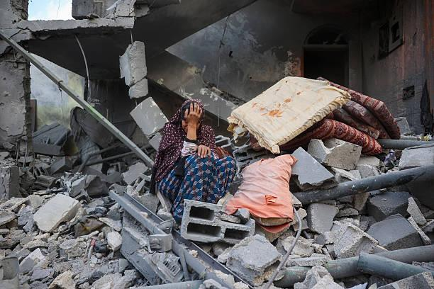

## Claim
Claim: " This image shows a Palestinian girl in the Gaza war in July 2024. She was holding her sister's oxygen mask inside the ambulance. She had already passed away, yet her hand remained on the mask firmly."

## Actions
```
reverse_search()
```

## Evidence
### Evidence from `reverse_search`
The image 

## Elaboration
The reverse image search did not yield any information to verify the claim. Therefore, I cannot verify the claim.


## Actions
```
web_search("Gaza war images")
web_search("Palestinian girl oxygen mask")
```

## Evidence
### Evidence from `web_search`
Al Jazeera published an article on January 15, 2025, featuring images from the 15-month war in Gaza, including images from November 2023 to September 2024, depicting destruction and suffering (<image:i>, <image:j>, <image:k>, <image:l>, <image:m>, <image:n>, <image:o>, <image:p>, <image:q>). Getty Images provides images related to the Gaza war, including displaced Palestinians and the aftermath of bombings, with images from October 2023 and August 2025 ().

CNN published an article on October 5, 2024, featuring images from the Israel-Hamas war, including airstrikes and the aftermath of the conflict, with images of a woman holding a baby and medics tending to an injured infant (<image:i>, <image:j>).


### Evidence from `web_search`
The NPR article ([https://www.npr.org/2024/04/26/1247453317/gaza-baby-girl-mother-killed-israel-airstrike](https://www.npr.org/2024/04/26/1247453317/gaza-baby-girl-mother-killed-israel-airstrike)) discusses a baby girl in Gaza who died after her mother was killed in an Israeli airstrike, including images of the baby in an incubator 

## Elaboration
The provided evidence includes articles and images related to the Gaza war, including images of destruction, suffering, and medical care. The NPR article specifically mentions a baby girl in Gaza who died after her mother was killed in an airstrike. However, none of the search results provide information that directly supports the claim about the image of the Palestinian girl holding her sister's oxygen mask.

The claim states the image was taken in July 2024. The search results include images from the Gaza war, but none of them match the image in the claim. Therefore, I cannot verify the claim.


## Actions
```
image_search("Palestinian girl holding oxygen mask Gaza war")
```

## Evidence
### Evidence from `image_search`
The image search revealed that the image 

## Elaboration
The image search did not yield any information to verify the claim. Therefore, I cannot verify the claim.


## Final Judgement
The image search and web search did not yield any information to verify the claim. Therefore, the claim cannot be verified. `false`

### Verdict: FALSE

### Justification
The claim cannot be verified. Multiple search attempts, including reverse image search, web searches, and image searches, did not yield any information to support the claim that the image depicts a Palestinian girl in the Gaza war in July 2024 holding her sister's oxygen mask.
