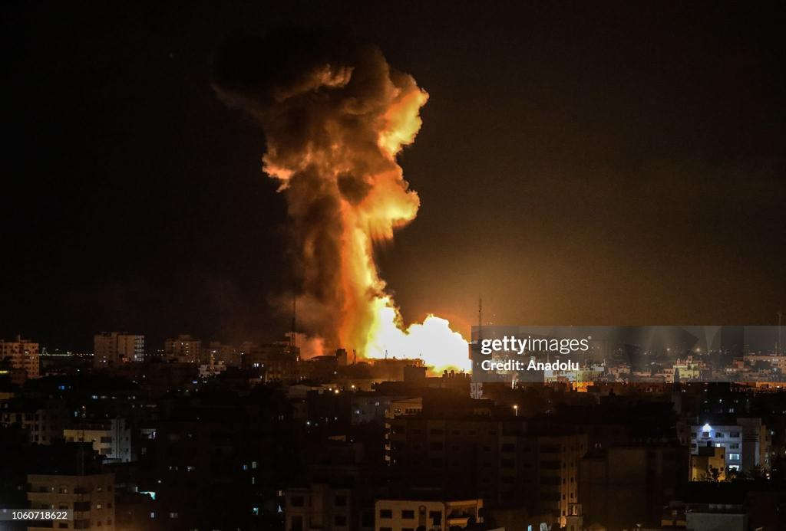

## Claim
Claim: "The chief of the Israeli Defense Forces (IDF), Herzi Halevi, was assassinated in a Hezbollah drone attack on an Israeli military base on October 13, 2024."

## Actions
```
web_search("Herzi Halevi Hezbollah drone attack October 13 2024")
web_search("Israeli military base drone attack October 13 2024")
```

## Evidence
### Evidence from `web_search`
CNN ([https://www.cnn.com/world/live-news/israel-lebanon-iran-gaza-attack-10-14-24-intl-hnk](https://www.cnn.com/world/live-news/israel-lebanon-iran-gaza-attack-10-14-24-intl-hnk)) reports on a Hezbollah drone attack on an Israeli army base on October 13, 2024, which killed four soldiers and injured over 60 people. , , , ,  The Long War Journal ([https://www.longwarjournal.org/archives/2024/10/hezbollah-drone-strikes-idf-base-as-israel-uncovers-weapons-in-lebanon.php](https://www.longwarjournal.org/archives/2024/10/hezbollah-drone-strikes-idf-base-as-israel-uncovers-weapons-in-lebanon.php)) and The Times of Israel ([https://www.timesofisrael.com/4-soldiers-killed-in-drone-strike-named-as-families-ask-why-there-was-no-warning-siren/](https://www.timesofisrael.com/4-soldiers-killed-in-drone-strike-named-as-families-ask-why-there-was-no-warning-siren/)) also report on the drone attack on October 13, 2024, which targeted a dining hall and killed four soldiers. , , , ,  Herzi Halevi visited the site.


### Evidence from `web_search`
On October 13, 2024, Hezbollah launched a drone strike on an Israeli military site near Binyamina, Israel, as part of the Israel–Hezbollah conflict (2023–present). The attack resulted in four deaths and over 60 injuries. The IDF is investigating the incident.

Sources: [https://en.wikipedia.org/wiki/2024_Hezbollah_drone_strike_on_Binyamina](https://en.wikipedia.org/wiki/2024_Hezbollah_drone_strike_on_Binyamina), [https://www.cnn.com/world/live-news/israel-war-iran-palestine-lebanon-10-13-24](https://www.cnn.com/world/live-news/israel-war-iran-palestine-lebanon-10-13-24), [https://www.aljazeera.com/news/2024/10/13/more-than-60-wounded-in-hezbollah-drone-attack-on-israeli-military-site](https://www.aljazeera.com/news/2024/10/13/more-than-60-wounded-in-hezbollah-drone-attack-on-israeli-military-site). , 


## Elaboration
The evidence confirms that a Hezbollah drone attack occurred on an Israeli military base on October 13, 2024, resulting in casualties. However, the evidence does not mention that Herzi Halevi was assassinated in the attack. It does state that Herzi Halevi visited the site.

Therefore, the claim is partially accurate, as the attack did occur, but the assertion that Herzi Halevi was assassinated is not supported by the evidence.


## Final Judgement
The fact-check confirms that a Hezbollah drone attack on an Israeli military base occurred on October 13, 2024. However, the claim that Herzi Halevi was assassinated in the attack is not supported by the evidence.

`false`


### Verdict: FALSE

### Justification
The claim is false. While a Hezbollah drone attack on an Israeli military base did occur on October 13, 2024, as reported by sources like [CNN](https://www.cnn.com/world/live-news/israel-lebanon-iran-gaza-attack-10-14-24-intl-hnk) and [The Times of Israel](https://www.timesofisrael.com/4-soldiers-killed-in-drone-strike-named-as-families-ask-why-there-was-no-warning-siren/), the evidence does not support the assertion that Herzi Halevi was assassinated in the attack.
