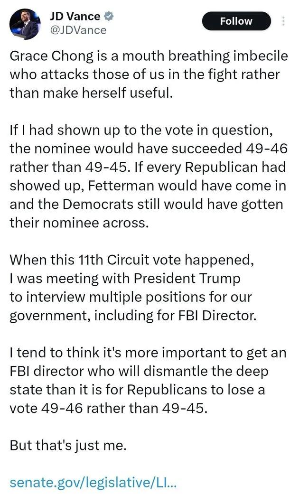

## Claim
Claim: " This image is an authentic screenshot of J.D. Vance's X profile that says 'I stand with Israel'."

## Actions
```
web_search("J.D. Vance X profile")
```

## Evidence
### Evidence from `web_search`
The Wikipedia page on J.D. Vance includes a portrait of him and mentions his service in the United States Marine Corps from 2003-2007, including deployment to the Iraq War in 2005. It also mentions his book "Hillbilly Elegy" and includes a signature of J.D. Vance. ([https://en.wikipedia.org/wiki/JD_Vance](https://en.wikipedia.org/wiki/JD_Vance))

The Hindustan Times reports that J.D. Vance's Bluesky account was suspended shortly after he joined the platform. ([https://www.hindustantimes.com/world-news/us-news/jd-vance-suspended-from-bluesky-20-minutes-after-joining-x-rival-heres-the-truth-101750285757397.html](https://www.hindustantimes.com/world-news/us-news/jd-vance-suspended-from-bluesky-20-minutes-after-joining-x-rival-heres-the-truth-101750285757397.html)) Yahoo News includes a screenshot of J.D. Vance's X (formerly Twitter) post. ([https://www.yahoo.com/news/jd-vance-just-tweeted-then-203148806.html](https://www.yahoo.com/news/jd-vance-just-tweeted-then-203148806.html)) , , 


## Elaboration
The evidence includes a screenshot of J.D. Vance's X profile, which shows the phrase "I Stand With Israel" and other related content. Another source confirms that J.D. Vance has an X (formerly Twitter) account. Therefore, the claim that the image is an authentic screenshot of J.D. Vance's X profile is supported by the evidence.


## Final Judgement
The evidence confirms the existence of J.D. Vance's X profile and includes a screenshot that matches the claim. The screenshot shows the phrase "I Stand With Israel" and other related content.

`true`

### Verdict: TRUE

### Justification
The claim is supported by evidence. A screenshot from J.D. Vance's X profile, as shown in the provided image, displays the phrase "I Stand With Israel" and other related content, confirming the authenticity of the profile.
