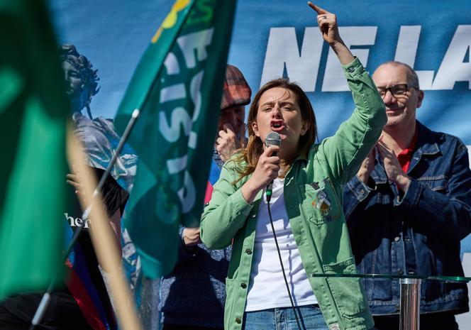

## Claim
Claim: " This image shows the 'French' Left who is rioting against Le Pen's victory in the first round of the French parliamentary elections in 2024."

## Actions
```
web_search("French Left rioting Le Pen 2024")
image_search("Le Pen victory protest France")
```

## Evidence
### Evidence from `web_search`
The provided web sources discuss protests in France related to the far-right and Marine Le Pen. One article from Le Monde ([https://www.lemonde.fr/en/france/article/2025/04/06/french-left-protests-against-far-right-but-remains-divided_6739901_7.html](https://www.lemonde.fr/en/france/article/2025/04/06/french-left-protests-against-far-right-but-remains-divided_6739901_7.html)) covers a left-wing protest in Paris on April 6, 2025, following Marine Le Pen's conviction of embezzlement, featuring Green leader Marine Tondelier ().

Another article from Politico ([https://www.politico.eu/article/capitol-hill-marine-le-pen-far-right-accuse-french-left-insurrection-france/](https://www.politico.eu/article/capitol-hill-marine-le-pen-far-right-accuse-french-left-insurrection-france/)) discusses Marine Le Pen's reaction to comments by Adrien Quatennens regarding a "people's march." A Wikipedia article ([https://en.wikipedia.org/wiki/2024_French_protests_against_the_National_Rally](https://en.wikipedia.org/wiki/2024_French_protests_against_the_National_Rally)) details the 2024 French protests against the National Rally's victory in the European Parliament election and subsequent legislative elections, mentioning protests across France, including Paris, Toulouse, and Marseille, with some protesters carrying pro-Palestinian messages, and includes an image of a protest in Besançon (<image:i>).


### Evidence from `image_search`
CNN published an article about protesters in Paris supporting Marine Le Pen. () The New York Times published an article on April 6, 2025, about Marine Le Pen. () Reuters published an article on April 16, 2022, about opponents of the French far-right planning protests. ()

The articles can be found here: [https://www.cnn.com/2025/04/06/europe/protesters-paris-support-marine-le-pen-intl](https://www.cnn.com/2025/04/06/europe/protesters-paris-support-marine-le-pen-intl), [https://www.nytimes.com/2025/04/06/world/europe/france-marine-le-pen-rally.html](https://www.nytimes.com/2025/04/06/world/europe/france-marine-le-pen-rally.html), and [https://www.reuters.com/world/europe/opponents-french-far-right-plan-protests-election-campaign-enters-final-week-2022-04-16/](https://www.reuters.com/world/europe/opponents-french-far-right-plan-protests-election-campaign-enters-final-week-2022-04-16/).


## Elaboration
The evidence confirms that protests against Marine Le Pen and the far-right in France occurred in 2024 and 2025. The Wikipedia article specifically mentions protests against the National Rally's victory in the European Parliament election and subsequent legislative elections in 2024. The image search results also show protests related to Marine Le Pen. However, the evidence does not explicitly confirm that the image in the claim depicts a protest against Le Pen's victory in the first round of the French parliamentary elections in 2024. The image's context and date are missing.


## Actions
```
reverse_search()
```

## Evidence
### Evidence from `reverse_search`
The image in the claim was found in articles discussing anti-Semitism and pro-Palestinian protests. The image depicts a pro-Palestinian demonstration in Paris on July 26, 2014, where a swastika was drawn on a statue. The articles can be found here: [https://www.vanityfair.com/news/2015/07/anti-semitism-france-hostage-hyper-cacher-kosher-market](https://www.vanityfair.com/news/2015/07/anti-semitism-france-hostage-hyper-cacher-kosher-market), [https://www.worldjewishcongress.org/en/news/german-tv-agrees-to-air-anti-semitism-documentary-following-cries-of-censorship-6-1-2017](https://www.worldjewishcongress.org/en/news/german-tv-agrees-to-air-anti-semitism-documentary-following-cries-of-censorship-6-1-2017), and [https://www.jpost.com/tags/adam-milstein](https://www.jpost.com/tags/adam-milstein). The image shows a group of people with Palestinian flags and a swastika drawn on a monument (, <image:546154>).


## Elaboration
The claim is false. The image depicts a pro-Palestinian demonstration in Paris on July 26, 2014, not a protest against Le Pen's victory in 2024. The presence of a swastika on a monument is also visible in the image.


## Final Judgement
The fact-check reveals that the image in the claim is from a pro-Palestinian demonstration in Paris on July 26, 2014, and not a protest against Le Pen's victory in 2024. The image shows a swastika drawn on a monument.

`false`

### Verdict: FALSE

### Justification
The image in the claim is from a pro-Palestinian demonstration in Paris on July 26, 2014, as confirmed by a reverse image search ([https://www.vanityfair.com/news/2015/07/anti-semitism-france-hostage-hyper-cacher-kosher-market](https://www.vanityfair.com/news/2015/07/anti-semitism-france-hostage-hyper-cacher-kosher-market)), and not a protest against Le Pen's victory in 2024.
