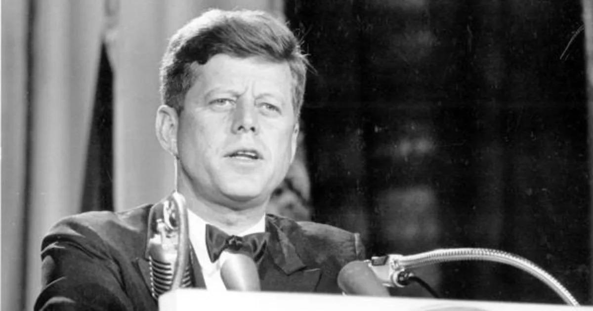

## Claim
Claim: "The World Jewish Congress (WJC) has amended the International Holocaust Remembrance Alliance (IHRA) working definition of antisemitism in March 2025 to include: 'Conflating the assassination of JFK to jews/israel'."

## Actions
```
web_search("World Jewish Congress IHRA antisemitism definition")
web_search("World Jewish Congress JFK assassination antisemitism")
```

## Evidence
### Evidence from `web_search`
The World Jewish Congress (WJC) website provides the International Holocaust Remembrance Alliance (IHRA) working definition of antisemitism, which was adopted on May 26, 2016. The definition includes examples of antisemitism, but does not mention the assassination of JFK. The IHRA definition has been adopted or endorsed by numerous countries and organizations. The United Kingdom adopted the IHRA definition on December 12, 2016, followed by Israel. Ireland adopted the definition on January 16, 2025.

The provided sources do not mention the WJC amending the IHRA definition to include "Conflating the assassination of JFK to jews/israel."


### Evidence from `web_search`
The claim that the World Jewish Congress (WJC) amended the International Holocaust Remembrance Alliance (IHRA) working definition of antisemitism in March 2025 to include "Conflating the assassination of JFK to jews/israel" is false. Both the WJC and the IHRA confirmed that the claim is misinformation, and no such amendment was made. A fact-check from Yahoo News, published by Full Fact, and a fact-check from aol.com, both confirm the claim's falsity. A study by the Combat Antisemitism Movement (CAM) discusses antisemitic conspiracy theories related to the JFK assassination, highlighting how some individuals are using the event to spread hate.

The sources include: [https://uk.news.yahoo.com/world-jewish-congress-not-amended-155825392.html](https://uk.news.yahoo.com/world-jewish-congress-not-amended-155825392.html), [https://combatantisemitism.org/studies-reports/congresswoman-luna-and-the-jfk-files-how-antisemitic-conspiracy-theorists-hijack-history-to-spread-hate/](https://combatantisemitism.org/studies-reports/congresswoman-luna-and-the-jfk-files-how-antisemitic-conspiracy-theorists-hijack-history-to-spread-hate/), and [https://www.aol.com/news/fact-check-world-jewish-congress-151433542.html](https://www.aol.com/news/fact-check-world-jewish-congress-151433542.html).  <image:k> 


## Elaboration
The claim is false. The World Jewish Congress (WJC) did not amend the International Holocaust Remembrance Alliance (IHRA) working definition of antisemitism in March 2025 to include "Conflating the assassination of JFK to jews/israel." Fact-checks from Yahoo News and aol.com confirm this.


## Final Judgement
The provided evidence from multiple sources, including fact-checks from Yahoo News and aol.com, confirms that the World Jewish Congress (WJC) did not amend the IHRA definition to include the JFK assassination. The claim is demonstrably false.

`false`


### Verdict: FALSE

### Justification
The claim that the World Jewish Congress amended the IHRA definition to include the JFK assassination is false. Multiple sources, including fact-checks from [Yahoo News](https://uk.news.yahoo.com/world-jewish-congress-not-amended-155825392.html) and aol.com, confirm that no such amendment was made.
