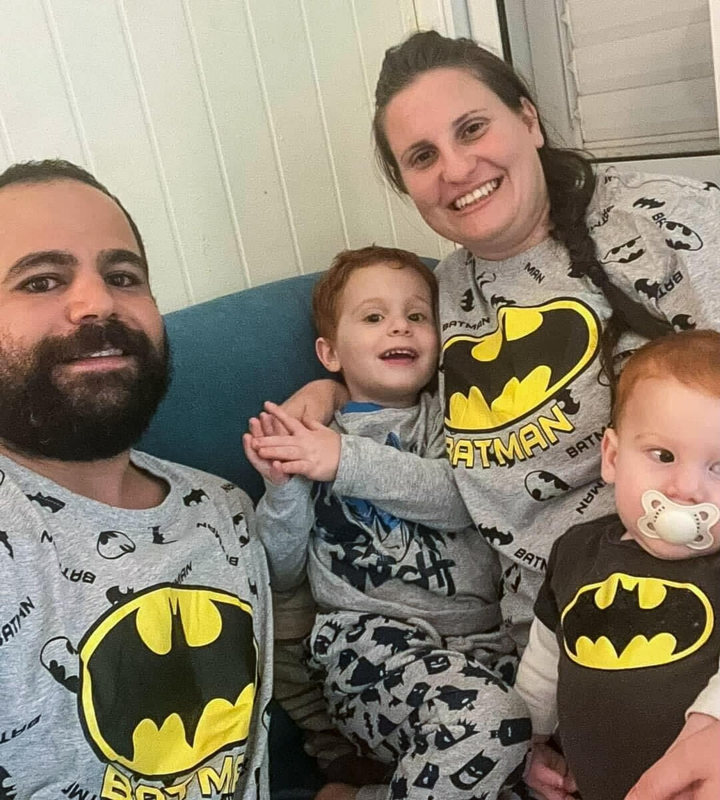
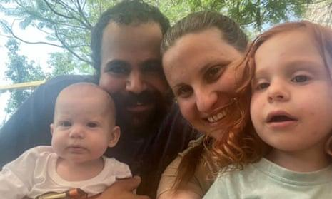

## Claim
Claim: " This image shows a screenshot of an authentic BBC article from February 2025 with the title 'Hamas just wanted to protect the Bibas family but Israel killed them - Hamas said.'"

## Actions
```
web_search("BBC Hamas Bibas family")
image_search("Bibas family Hamas Israel")
```

## Evidence
### Evidence from `web_search`
From [Source](https://www.bbc.com/news/articles/cjry3jzedl1o): 
Content: The BBC published an article on February 21, 2025, discussing the Bibas family. The article states that Israel said the children Ariel and Kfir Bibas were killed by their captors in Gaza. , . Hamas said the children and their mother were killed by Israeli bombing. The article also mentions that the father, Yarden Bibas, was released by Hamas on February 1, and that Shiri Bibas was not returned.


### Evidence from `image_search`
NBC News published an article about the Bibas family. () The Guardian published an article on January 31, 2025, about Hamas releasing the Israeli hostage Yarden Bibas, his wife, and children. ()

CNN published an article on February 18, 2025, about the Bibas family. ()


## Elaboration
The BBC did publish an article about the Bibas family on February 21, 2025, as stated in the evidence from the web search. The article discusses the conflicting claims regarding the deaths of the children, Ariel and Kfir Bibas. Israel stated the children were killed by their captors, while Hamas claimed they were killed by Israeli bombing.

The evidence does not contain the exact title of the BBC article. Therefore, the claim that the title is "Hamas just wanted to protect the Bibas family but Israel killed them - Hamas said" cannot be verified.

The evidence does not contain the image of the BBC article.


## Actions
```
reverse_search()
```

## Evidence
### Evidence from `reverse_search`
The reverse image search found the exact image in a BBC article from February 19, 2025, titled "Hamas says it will return bodies of four hostages including Bibas family" ([https://www.bbc.com/news/articles/czdnp4ly5d1o](https://www.bbc.com/news/articles/czdnp4ly5d1o)). The article discusses Hamas's claim that the Bibas family was killed in an Israeli bombardment. The image was also found in a CNN article from June 7, 2025, about Israel killing the leader of a Palestinian militant group ([https://www.cnn.com/2025/06/07/middleeast/israel-killed-leader-palestinian-mujahideen-brigades-gaza-latam-intl](https://www.cnn.com/2025/06/07/middleeast/israel-killed-leader-palestinian-mujahideen-brigades-gaza-latam-intl)), and in an NDTV article titled "Gaza's Youngest Hostage: Hamas Says He's Dead, Family Hoping Against Hope" ([https://www.ndtv.com/world-news/gazas-youngest-hostage-hamas-says-hes-dead-family-hoping-against-hope-7557381](https://www.ndtv.com/world-news/gazas-youngest-hostage-hamas-says-hes-dead-family-hoping-against-hope-7557381)). The CNN article includes images of the Bibas family (, , ).


## Elaboration
The reverse image search confirms that the image in the claim is from a BBC article. The BBC article, published on February 19, 2025, is titled "Hamas says it will return bodies of four hostages including Bibas family" ([https://www.bbc.com/news/articles/czdnp4ly5d1o](https://www.bbc.com/news/articles/czdnp4ly5d1o)). The claim's title is not the same as the BBC article's title.


## Final Judgement
The claim is about a BBC article with a specific title. While the image is from a BBC article, the title in the claim does not match the actual title of the BBC article. Therefore, the claim is not factually accurate. `false`

### Verdict: FALSE

### Justification
The claim is false. While the image in the claim is from a BBC article, the title presented in the claim does not match the actual title of the BBC article, which is "Hamas says it will return bodies of four hostages including Bibas family" ([https://www.bbc.com/news/articles/czdnp4ly5d1o](https://www.bbc.com/news/articles/czdnp4ly5d1o)).
