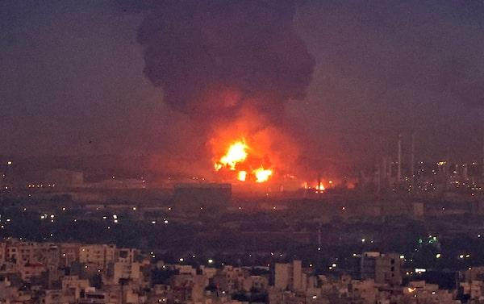

## Claim
Claim: " This image shows Israel bombing Tehran on October 26, 2024."

## Actions
```
reverse_search()
web_search("Israel bombing Tehran October 26 2024")
```

## Evidence
### Evidence from `reverse_search`
The image in the claim () appears in articles about a fire at an oil refinery near Tehran. The Times of Israel ([https://www.timesofisrael.com/liveblog_entry/huge-fire-at-refinery-near-tehran-extinguished-after-20-hours-report/](https://www.timesofisrael.com/liveblog_entry/huge-fire-at-refinery-near-tehran-extinguished-after-20-hours-report/)) published an article on June 2, 2021, about the fire.

The Globe and Mail ([https://www.theglobeandmail.com/world/article-massive-fire-breaks-out-at-oil-refinery-south-of-tehran/](https://www.theglobeandmail.com/world/article-massive-fire-breaks-out-at-oil-refinery-south-of-tehran/)) also published an article on June 2, 2021, with the same image (). The New Arab ([https://www.newarab.com/news/massive-fire-breaks-out-oil-refinery-near-irans-capital](https://www.newarab.com/news/massive-fire-breaks-out-oil-refinery-near-irans-capital)) also used the image () in an article about the fire.


### Evidence from `web_search`
Multiple news sources, including CNN ([https://www.cnn.com/world/live-news/israel-iran-strikes-lebanon-gaza-war-10-26-24](https://www.cnn.com/world/live-news/israel-iran-strikes-lebanon-gaza-war-10-26-24)), NPR ([https://www.npr.org/2024/10/25/nx-s1-5165574/israel-iran-airstrikes-tehran](https://www.npr.org/2024/10/25/nx-s1-5165574/israel-iran-airstrikes-tehran)), and The Guardian ([https://www.theguardian.com/world/2024/oct/26/idf-israel-iran-strikes-explosions-tehran](https://www.theguardian.com/world/2024/oct/26/idf-israel-iran-strikes-explosions-tehran)), reported on Israeli airstrikes against military targets in Iran on October 26, 2024, in retaliation for attacks against Israel.

The CNN article includes 

## Elaboration
The claim is partially accurate. The image (

## Final Judgement
The image is from a fire at an oil refinery near Tehran in June 2021, not from an event on October 26, 2024. While there were reports of Israeli airstrikes on Tehran on October 26, 2024, the image is not related to those events. The claim misrepresents the context of the image.

`false`

### Verdict: FALSE

### Justification
The image in the claim is from a fire at an oil refinery near Tehran in June 2021, as reported by The Times of Israel ([https://www.timesofisrael.com/liveblog_entry/huge-fire-at-refinery-near-tehran-extinguished-after-20-hours-report/](https://www.timesofisrael.com/liveblog_entry/huge-fire-at-refinery-near-tehran-extinguished-after-20-hours-report/)). While there were reports of Israeli airstrikes on Tehran on October 26, 2024, the image is not related to those events.
