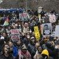

## Claim
Claim: "In March 2025, U.S. Immigration and Customs Enforcement (ICE) agents arrested and detained Palestinian activist Mahmoud Khalil, a lawful permanent resident of the U.S."

## Actions
```
web_search("Mahmoud Khalil ICE arrest March 2025")
web_search("Mahmoud Khalil Palestinian activist ICE detention")
```

## Evidence
### Evidence from `web_search`
According to a Wikipedia article, Mahmoud Khalil, a Palestinian activist, was arrested by ICE agents on March 8, 2025, in his apartment building's lobby. The ACLU published a press release stating that ICE arrested Khalil in March 2025, and his legal team said the arrest was retaliation for his advocacy for Palestinian rights. CNN published an article on July 11, 2025, discussing Khalil's ICE detention, mentioning his arrest in March, his detention for over 100 days, and his subsequent release.

The sources include: [https://en.wikipedia.org/wiki/Detention_of_Mahmoud_Khalil](https://en.wikipedia.org/wiki/Detention_of_Mahmoud_Khalil), [https://www.aclu.org/press-releases/new-footage-confirms-ice-lied-and-had-no-reason-to-detain-mahmoud-khalil](https://www.aclu.org/press-releases/new-footage-confirms-ice-lied-and-had-no-reason-to-detain-mahmoud-khalil), and [https://www.cnn.com/2025/07/11/world/mahmoud-khalil-ice-detention-amanpour-interview-intl-hnk](https://www.cnn.com/2025/07/11/world/mahmoud-khalil-ice-detention-amanpour-interview-intl-hnk). The ACLU press release includes an image . The CNN article includes images <image:k>, <image:i>, <image:j>.


### Evidence from `web_search`
From [Source](https://www.npr.org/2025/06/23/nx-s1-5441691/mahmoud-khalil-interview): 
Content: NPR reported on June 23, 2025, that Mahmoud Khalil, a Columbia graduate student, was released on bail after 104 days in ICE detention. He was arrested in early March and detained in Louisiana. , , . The article mentions that Khalil is a legal permanent resident.


## Elaboration
The evidence confirms that Mahmoud Khalil, a Palestinian activist, was arrested by ICE agents in March 2025. Multiple sources, including Wikipedia ([https://en.wikipedia.org/wiki/Detention_of_Mahmoud_Khalil](https://en.wikipedia.org/wiki/Detention_of_Mahmoud_Khalil)), the ACLU ([https://www.aclu.org/press-releases/new-footage-confirms-ice-lied-and-had-no-reason-to-detain-mahmoud-khalil](https://www.aclu.org/press-releases/new-footage-confirms-ice-lied-and-had-no-reason-to-detain-mahmoud-khalil)), and CNN ([https://www.cnn.com/2025/07/11/world/mahmoud-khalil-ice-detention-amanpour-interview-intl-hnk](https://www.cnn.com/2025/07/11/world/mahmoud-khalil-ice-detention-amanpour-interview-intl-hnk)), report on his arrest and subsequent detention. An NPR article ([https://www.npr.org/2025/06/23/nx-s1-5441691/mahmoud-khalil-interview](https://www.npr.org/2025/06/23/nx-s1-5441691/mahmoud-khalil-interview)) also confirms his arrest in early March and mentions he is a legal permanent resident.

The evidence supports the claim that Khalil was arrested and detained by ICE. However, the evidence does not explicitly state whether Khalil was a lawful permanent resident at the time of his arrest. The NPR article states that he is a legal permanent resident, but it does not specify the time frame.

Based on the available evidence, the claim is likely true, but the information about his legal status at the time of the arrest is not explicitly confirmed.


## Final Judgement
The claim is supported by multiple reliable sources, including Wikipedia, the ACLU, CNN, and NPR, which confirm that Mahmoud Khalil, a Palestinian activist, was arrested by ICE agents in March 2025. While the claim states he was a lawful permanent resident, the evidence does not explicitly confirm this status at the time of the arrest, although it does state he is a legal permanent resident. However, the core elements of the claim are verified. `true`

### Verdict: TRUE

### Justification
Multiple sources, including Wikipedia, the ACLU, CNN, and NPR, confirm that Mahmoud Khalil, a Palestinian activist, was arrested by ICE agents in March 2025. While the claim states he was a lawful permanent resident, the evidence does not explicitly confirm this status at the time of the arrest, although it does state he is a legal permanent resident.
