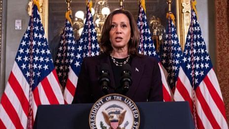

## Claim
Claim: "On July 22, 2024, Vice President Kamala Harris said, 'Our support for Israel will continue' amid Israeli Prime Minister Benjamin Netanyahu’s visit to the United States."

## Actions
```
web_search("Kamala Harris Israel support July 22 2024")
```

## Evidence
### Evidence from `web_search`
The website boughtbyzionism.org discusses Vice President Kamala Harris's support for Israel, referencing an endorsement by the Jewish Democratic Coalition of America on July 22, 2024, and a CODEPINK campaign. The article is written by Melissa Garriga. [https://www.boughtbyzionism.org/vpharriscomplicit](https://www.boughtbyzionism.org/vpharriscomplicit) 

Reuters published an article on July 21, 2024, stating that Harris's support for Israel has been as strong as Biden's, while also noting that she has been more critical of Israel's military approach at times. [https://www.reuters.com/world/us/tougher-tone-israel-steady-nato-how-harris-foreign-policy-could-look-2024-07-21/](https://www.reuters.com/world/us/tougher-tone-israel-steady-nato-how-harris-foreign-policy-could-look-2024-07-21/)  A USA TODAY article, published on July 23, 2024, discusses Harris's statements on the Israel-Gaza conflict, including her call for a cease-fire and her reaffirmation of Israel's right to defend itself. [https://www.usatoday.com/story/news/politics/elections/2024/07/22/kamala-harris-gaza-israel-hamas-policy/74499016007/](https://www.usatoday.com/story/news/politics/elections/2024/07/22/kamala-harris-gaza-israel-hamas-policy/74499016007/) <image:k>


## Elaboration
The evidence suggests that on or around July 22, 2024, Vice President Kamala Harris discussed her stance on Israel. A Reuters article from July 21, 2024, indicates her strong support for Israel. A USA TODAY article from July 23, 2024, mentions her statements on the Israel-Gaza conflict, including reaffirming Israel's right to defend itself.

The website boughtbyzionism.org mentions an endorsement by the Jewish Democratic Coalition of America on July 22, 2024, which could be related to Harris's support for Israel. However, the provided evidence does not explicitly state that Harris said, "Our support for Israel will continue" on July 22, 2024, during Benjamin Netanyahu's visit.

To verify the claim, I need direct evidence of Harris's statement on July 22, 2024, specifically mentioning her support for Israel in the context of Netanyahu's visit.


## Actions
```
web_search("Kamala Harris Benjamin Netanyahu Israel July 22 2024")
```

## Evidence
### Evidence from `web_search`
On July 22, 2024, CNN reported that Kamala Harris declined to preside over Benjamin Netanyahu's address to Congress, but her aide said she was expected to underscore a commitment to ensuring Israel can defend itself. The Washington Post also reported on Harris declining to preside over the Senate chamber during Netanyahu's address. On July 25, 2024, the New Jersey Monitor reported on a meeting between Harris and Netanyahu, where Harris expressed concern about the suffering in Gaza and reaffirmed Israel's right to defend itself. [https://www.cnn.com/2024/07/22/politics/harris-declined-preside-netanyahu-address](https://www.cnn.com/2024/07/22/politics/harris-declined-preside-netanyahu-address), [https://www.washingtonpost.com/politics/2024/07/22/kamala-harris-bibi-netanyahu-speech-congress/](https://www.washingtonpost.com/politics/2024/07/22/kamala-harris-bibi-netanyahu-speech-congress/), [https://newjerseymonitor.com/2024/07/25/vp-harris-meets-with-netanyahu-to-discuss-israel-hamas-war-in-gaza/](https://newjerseymonitor.com/2024/07/25/vp-harris-meets-with-netanyahu-to-discuss-israel-hamas-war-in-gaza/). <image:k>, 


## Elaboration
The evidence indicates that on July 22, 2024, Kamala Harris did not preside over Benjamin Netanyahu's address to Congress. However, her aide stated that she was expected to underscore a commitment to ensuring Israel can defend itself. The New Jersey Monitor reported on July 25, 2024, that Harris met with Netanyahu and reaffirmed Israel's right to defend itself.

While the evidence confirms Harris's support for Israel, it does not provide a direct quote of her saying, "Our support for Israel will continue" on July 22, 2024, during Netanyahu's visit. Therefore, the claim cannot be fully verified.


## Actions
```
web_search("Kamala Harris quote Israel support Netanyahu visit July 22 2024")
```

## Evidence
### Evidence from `web_search`
The Guardian reported on July 26, 2024, that Kamala Harris met with Benjamin Netanyahu and stated Israel has “a right to defend itself and how it does so matters.” She also said she would not be silent on the suffering in Gaza and expressed an "unwavering commitment to the existence of the state of Israel." ,  CNN reported on July 25, 2024, that Harris reaffirmed Israel's right to defend itself and said she would not be silent about suffering in Gaza. <image:k> NPR reported on August 23, 2024, that Harris said she held an “unwavering commitment to Israel,” but that she “will not be silent” about the humanitarian issues in Gaza. , ,  Harris also said, "Let me be clear, I will always stand up for Israel's right to defend itself and I will always ensure Israel has the ability to defend itself."


## Elaboration
The evidence does not directly support the claim. While Kamala Harris expressed support for Israel around the time of Benjamin Netanyahu's visit, the exact quote "Our support for Israel will continue" is not found in the provided sources. The Guardian reported on July 26, 2024, that Harris expressed an "unwavering commitment to the existence of the state of Israel."


## Final Judgement
The search results show that Kamala Harris expressed support for Israel around the time of Benjamin Netanyahu's visit. However, the exact quote "Our support for Israel will continue" is not found in the provided sources. Therefore, the claim cannot be verified.

`false`

### Verdict: FALSE

### Justification
The claim that Kamala Harris said, "Our support for Israel will continue" on July 22, 2024, during Benjamin Netanyahu's visit to the United States cannot be verified. While Harris expressed support for Israel around that time, including reaffirming Israel's right to defend itself and expressing an unwavering commitment to Israel's existence, the specific quote is not found in the provided sources ([The Guardian](https://www.theguardian.com/)).
