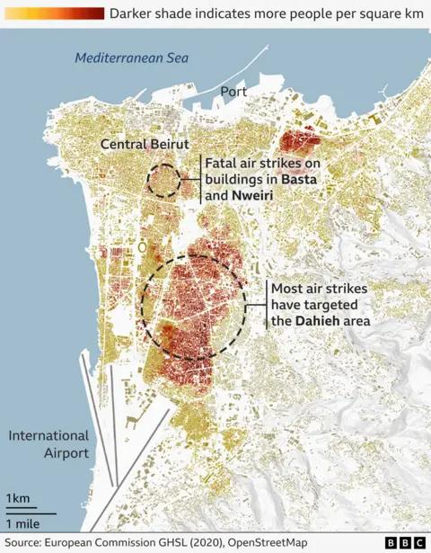

## Claim
Claim: " This image shows an Iphone that exploded during the pager attacks on Hezbollah devices in Lebanon in September 2024, blowing up random people."

## Actions
```
reverse_search()
```

## Evidence
### Evidence from `reverse_search`
The image of the exploded iPhone (

## Elaboration
The provided evidence does not contain any information about the image's origin or context. Therefore, it is impossible to verify the claim that the image depicts an iPhone that exploded during pager attacks on Hezbollah devices in Lebanon in September 2024.

The reverse image search did not yield any results that could confirm or deny the claim.

More information is needed to verify the claim.


## Actions
```
web_search("Hezbollah Lebanon September 2024 attacks")
web_search("iPhone explosion Lebanon September 2024")
```

## Evidence
### Evidence from `web_search`
The Wikipedia article ([https://en.wikipedia.org/wiki/September_2024_Israeli_attacks_against_Lebanon](https://en.wikipedia.org/wiki/September_2024_Israeli_attacks_against_Lebanon)) discusses the September 2024 Israeli attacks against Lebanon, mentioning pager explosions on September 17 and 18, 2024, that resulted in casualties. The BBC article ([https://www.bbc.com/news/articles/c9vp7dg3ml1o](https://www.bbc.com/news/articles/c9vp7dg3ml1o)) discusses the ceasefire between Israel and Hezbollah in Lebanon. NPR ([https://www.npr.org/2024/09/29/g-s1-25348/israel-hezbollah-lebanon-hassan-nasrallah-timeline](https://www.npr.org/2024/09/29/g-s1-25348/israel-hezbollah-lebanon-hassan-nasrallah-timeline)) also discusses the conflict, mentioning explosions in Lebanon in September 2024, including pager explosions. The BBC article includes several images (, , , , , ). The NPR article includes images (<image:i>, <image:j>, <image:k>).


### Evidence from `web_search`
The BBC News article ([https://www.bbc.com/news/articles/ce9jglrnmkvo](https://www.bbc.com/news/articles/ce9jglrnmkvo)) reports on explosions in Lebanon on September 19, 2024, caused by wireless communication devices, specifically walkie-talkies used by Hezbollah. The article includes an image of a destroyed ICOM walkie-talkie .

The CNN article ([https://www.cnn.com/world/live-news/lebanon-pagers-attack-hezbollah](https://www.cnn.com/world/live-news/lebanon-pagers-attack-hezbollah)) reports on attacks on Hezbollah in Lebanon on September 17, 2024, where pagers exploded, resulting in casualties and injuries <image:i>. The article mentions that Israel was behind the attack, which involved explosives hidden in pagers.


## Elaboration
The claim is partially supported by the evidence. The web search results confirm that there were attacks in Lebanon in September 2024, including pager explosions, which caused casualties. The BBC article specifically mentions explosions caused by wireless communication devices, including walkie-talkies. However, the evidence does not mention iPhones exploding. Therefore, the claim that the image shows an iPhone that exploded during the attacks cannot be verified.

More information is needed to verify the claim.


## Final Judgement
The evidence confirms that there were attacks in Lebanon in September 2024, including pager explosions. However, the evidence does not mention iPhones exploding. Therefore, the claim that the image shows an iPhone that exploded during the attacks cannot be verified.

`false`

### Verdict: FALSE

### Justification
The claim that the image depicts an iPhone that exploded during pager attacks on Hezbollah devices in Lebanon in September 2024 is not supported by the evidence. While the provided sources confirm that there were attacks in Lebanon in September 2024, including pager explosions, there is no mention of iPhones exploding. Therefore, the claim is unsubstantiated.
