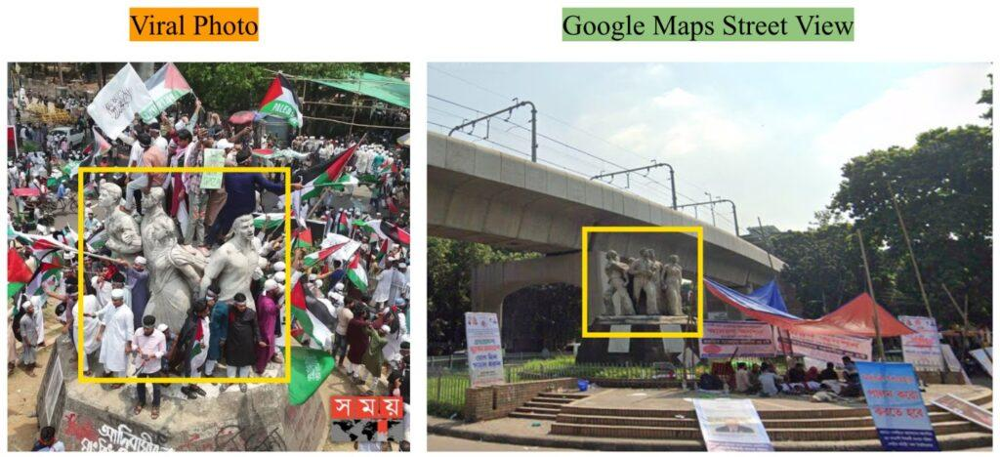

## Claim
Claim: " This image shows thousands gathering at Sohrawardi Park in Kolkata, India, in April 2025 to show solidarity with the Palestinian people amid the ongoing Israeli assault on Gaza."

## Actions
```
web_search("Sohrawardi Park Kolkata protest Palestine")
image_search("Sohrawardi Park Kolkata Palestine protest")
```

## Evidence
### Evidence from `web_search`
The image shows a pro-Palestine protest that took place in Dhaka, Bangladesh, not Kolkata, India, as claimed. The protest, known as the “March for Gaza,” occurred on April 12, 2025, at Suhrawardy Udyan and attracted approximately 100,000 participants. The photos were falsely shared as being from Kolkata.

Sources: [Factly](https://factly.in/photos-of-a-protest-held-in-solidarity-with-palestine-in-dhaka-bangladesh-are-falsely-shared-as-those-from-kolkata/), [NewsMobile](https://www.newsmobile.in/nm-fact-checker/fact-check-images-of-pro-palestine-protest-in-bangladeshs-dhaka-falsely-linked-to-india/), and [TezzFeed](https://tezzfeed.com/latest-news/palestinian-media-shares-bangladeshs-pro-gaza-protest-photos-mistakenly-labels-them-as-kolkata-1744522142539). , , 


## Elaboration
The claim is false. The image shows a pro-Palestine protest that took place in Dhaka, Bangladesh, not Kolkata, India. The protest occurred on April 12, 2025, at Suhrawardy Udyan. The photos were falsely shared as being from Kolkata.


## Final Judgement
The image depicts a pro-Palestine protest that occurred in Dhaka, Bangladesh, not Kolkata, India, as the claim states. The protest took place on April 12, 2025, at Suhrawardy Udyan. The photos were falsely shared as being from Kolkata.

The claim is demonstrably false because the location of the protest is incorrect. `false`


### Verdict: FALSE

### Justification
The image in the claim shows a pro-Palestine protest that occurred in Dhaka, Bangladesh, not Kolkata, India, as stated. The protest, known as the “March for Gaza,” took place on April 12, 2025, at Suhrawardy Udyan, and was falsely attributed to Kolkata, as reported by [Factly](https://factly.in/photos-of-a-protest-held-in-solidarity-with-palestine-in-dhaka-bangladesh-are-falsely-shared-as-those-from-kolkata/), [NewsMobile](https://www.newsmobile.in/nm-fact-checker/fact-check-images-of-pro-palestine-protest-in-bangladeshs-dhaka-falsely-linked-to-india/), and [TezzFeed](https://tezzfeed.com/latest-news/palestinian-media-shares-bangladeshs-pro-gaza-protest-photos-mistakenly-labels-them-as-kolkata-1744522142539).
