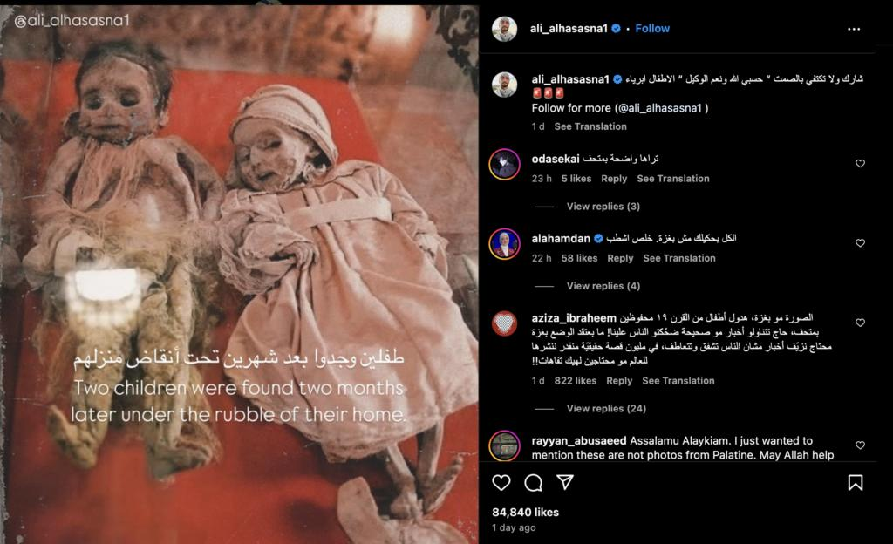

## Claim
Claim: " This image shows two children in Gaza in April 2025 found dead under the rubble of their home two months after an Israeli airstrike destroyed it."

## Actions
```
web_search("children found rubble home Gaza")
image_search("children found rubble home")
```

## Evidence
### Evidence from `web_search`
The UN News published an article on July 21, 2025, discussing the impact of the conflict in Gaza, including images of destroyed buildings and displaced people. ([https://news.un.org/en/story/2025/07/1165450](https://news.un.org/en/story/2025/07/1165450)) , , ,  The BBC published an article on January 31, 2024, discussing the impact of the war in Gaza on children, mentioning that many children have been found under the rubble. ([https://www.bbc.com/news/world-middle-east-68141039](https://www.bbc.com/news/world-middle-east-68141039)) , , ,  PBS News published an article on March 20, 2025, about a month-old girl pulled from the rubble in Gaza after an Israeli airstrike killed her parents and brother. ([https://www.pbs.org/newshour/world/month-old-girl-pulled-from-rubble-in-gaza-after-airstrike-killed-her-parents](https://www.pbs.org/newshour/world/month-old-girl-pulled-from-rubble-in-gaza-after-airstrike-killed-her-parents)) 


### Evidence from `image_search`
Al Jazeera published an article about children being pulled from the rubble in Turkey and Syria. ([https://www.aljazeera.com/news/2023/2/8/hope-heartbreak-as-children-pulled-from-rubble-in-turkey-syria](https://www.aljazeera.com/news/2023/2/8/hope-heartbreak-as-children-pulled-from-rubble-in-turkey-syria))  The Guardian published a video of children being pulled from the rubble after their home was hit by an Israeli airstrike. ([https://www.theguardian.com/world/video/2023/oct/19/gaza-moment-children-are-pulled-from-rubble-after-home-hit-by-israeli-airstrike-video](https://www.theguardian.com/world/video/2023/oct/19/gaza-moment-children-are-pulled-from-rubble-after-home-hit-by-israeli-airstrike-video)) 

The UN News published an article with an image of a teddy bear in the rubble. ([https://news.un.org/en/story/2016/08/537042](https://news.un.org/en/story/2016/08/537042)) 


## Elaboration
The evidence confirms that children have been found under the rubble of destroyed homes in Gaza. The BBC and PBS News articles mention children being found in the rubble after Israeli airstrikes. However, the evidence does not provide information about the specific image in the claim. Therefore, the claim cannot be fully verified.

The claim's veracity is uncertain because the evidence does not confirm the image's authenticity or the specific details provided in the claim.


## Actions
```
reverse_search()
```

## Evidence
### Evidence from `reverse_search`
From [Source](https://kashif.ps/en/index.php/2025/04/14/image-of-two-mummified-children-in-a-bolivian-museum-goes-viral-as-from-gaza/): Found exact image on website with title: Image of two mummified children in a Bolivian museum goes viral as ...
Content: The website Kashif published an article on April 14, 2025, stating that the image in the claim is of two mummified children in a Bolivian museum, not children found in Gaza. The image was posted on Flickr in 2006 and is of mummified Spanish children from the 19th century. , .


## Elaboration
The claim is false. The image depicts mummified children from a Bolivian museum, not children found in Gaza.


## Final Judgement
The image in the claim is of mummified children from a Bolivian museum, not children found in Gaza. The image was posted on Flickr in 2006 and is of mummified Spanish children from the 19th century. `false`

### Verdict: FALSE

### Justification
The claim is false. The image depicts mummified children from a Bolivian museum, not children found in Gaza. The image was posted on Flickr in 2006 and is of mummified Spanish children from the 19th century, as reported by [Kashif](https://kashif.ps/en/index.php/2025/04/14/image-of-two-mummified-children-in-a-bolivian-museum-goes-viral-as-from-gaza/).
