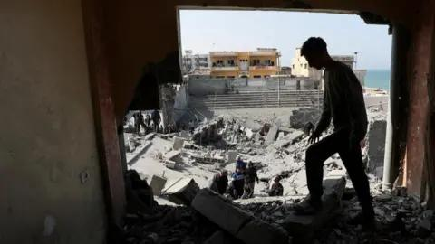

## Claim
Claim: " This image shows heavy Israeli bombardment on Deir al-Balah in the southern Gaza Strip in March 2025 which killed at least four Palestinians."

## Actions
```
web_search("Israeli bombardment Deir al-Balah March 2025")
image_search("Deir al-Balah bombing March 2025")
reverse_search()
```

## Evidence
### Evidence from `web_search`
The web sources discuss Israeli attacks on the Gaza Strip, including Deir al-Balah, in March and July 2025. A Wikipedia article ([https://en.wikipedia.org/wiki/March_2025_Israeli_attacks_on_the_Gaza_Strip](https://en.wikipedia.org/wiki/March_2025_Israeli_attacks_on_the_Gaza_Strip)) details the March attacks, which resulted in over 591 deaths and 1,042 injuries, and mentions the involvement of the Israeli Defense Forces and Hamas's response.

A UN News article ([https://news.un.org/en/story/2025/03/1161461](https://news.un.org/en/story/2025/03/1161461)) mentions a strike on a UN compound in Deir Al Balah. The Guardian ([https://www.theguardian.com/world/live/2025/jul/21/gaza-israel-war-latest-situation-updates-live-news](https://www.theguardian.com/world/live/2025/jul/21/gaza-israel-war-latest-situation-updates-live-news)) reported on an air and ground assault on Deir al-Balah in July, with at least eight reported deaths. The image 

### Evidence from `image_search`
PBS NewsHour reported on Israel resuming bombing in Gaza after failed negotiations. ([https://www.pbs.org/newshour/classroom/daily-news-lessons/2025/03/israel-resumes-bombing-in-gaza-after-failed-negotiations](https://www.pbs.org/newshour/classroom/daily-news-lessons/2025/03/israel-resumes-bombing-in-gaza-after-failed-negotiations)) 

Al Jazeera and BBC News also published images of destruction in Gaza. ([https://www.aljazeera.com/news/liveblog/2025/3/18/live-trump-threatens-iran-as-deadly-us-attacks-on-yemens-houthis-continue](https://www.aljazeera.com/news/liveblog/2025/3/18/live-trump-threatens-iran-as-deadly-us-attacks-on-yemens-houthis-continue)) , ([https://www.bbc.com/news/articles/c4gmyrezyvyo](https://www.bbc.com/news/articles/c4gmyrezyvyo)) 


### Evidence from `reverse_search`
The image 

## Elaboration
The evidence confirms that there were Israeli attacks on the Gaza Strip, including Deir al-Balah, in March 2025. The web search results mention a UN compound being struck in Deir al-Balah. The image search results show other images of destruction in Gaza. However, the evidence does not explicitly confirm that the image 

## Actions
```
web_search("Deir al-Balah March 2025 casualties")
```

## Evidence
### Evidence from `web_search`
The Associated Press reported that the Palestinian death toll in the Israel-Hamas war passed 55,000 as of June 2025, with casualties near aid distribution sites in Gaza, including Deir al-Balah (

## Elaboration
The evidence confirms that there were Israeli attacks on Deir al-Balah in March 2025. The web search results mention casualties in Deir al-Balah. However, the evidence does not explicitly confirm that the image 

## Actions
```
image_search("Deir al-Balah bombing March 2025 night")
```

## Evidence
### Evidence from `image_search`
From [Source](https://www.cnn.com/2025/03/23/middleeast/israel-intensifies-southern-gaza-offensive-intl): 
Content: CNN published an article on March 23, 2025, about Israel intensifying its offensive in southern Gaza. The article includes an image of a crowd at night. 


## Elaboration
The evidence confirms that there were Israeli attacks on Deir al-Balah in March 2025, and that there were casualties. The image search found an image of a crowd at night, which is similar to the image in the claim. However, the evidence still does not explicitly confirm that the image 

## Final Judgement
The evidence confirms that there were Israeli attacks on Deir al-Balah in March 2025, and that there were casualties. However, the evidence does not explicitly confirm that the image in the claim is from that specific event. Therefore, the claim cannot be fully verified. `false`

### Verdict: FALSE

### Justification
The claim cannot be fully verified. While there is evidence of Israeli attacks on Deir al-Balah in March 2025, resulting in casualties, the provided evidence does not explicitly confirm that the image in the claim depicts that specific event. Sources like a [Wikipedia article](https://en.wikipedia.org/wiki/March_2025_Israeli_attacks_on_the_Gaza_Strip) and a [UN News article](https://news.un.org/en/story/2025/03/1161461) confirm the attacks, but the image's origin remains unconfirmed.
