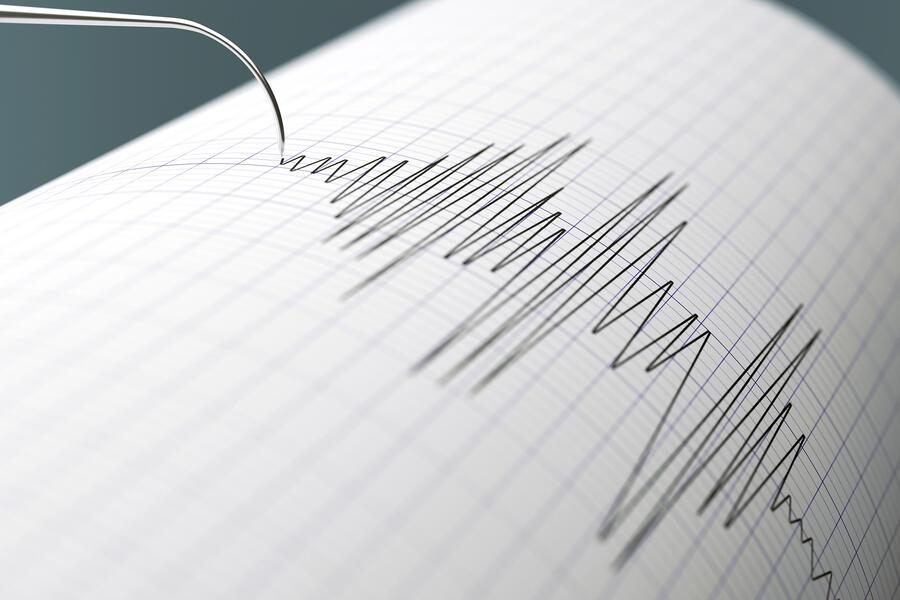
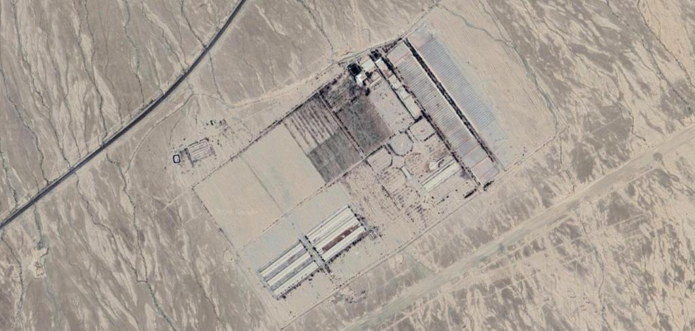

## Claim
Claim: "Israel experienced an earthquake on October 5, 2024."

## Actions
```
web_search("earthquake Israel October 5 2024")
```

## Evidence
### Evidence from `web_search`
Multiple sources discuss an earthquake in Israel on October 5, 2024. An article from Johns Hopkins University ([https://hub.jhu.edu/2025/02/04/earthquake-nuclear-test-misinformation/](https://hub.jhu.edu/2025/02/04/earthquake-nuclear-test-misinformation/)) mentions misinformation linking an Iranian earthquake to a seismic event in Israel on the same evening .

NDTV ([https://www.ndtv.com/world-news/earthquakes-in-iran-and-israel-sparks-speculation-of-nuclear-tests-6735904](https://www.ndtv.com/world-news/earthquakes-in-iran-and-israel-sparks-speculation-of-nuclear-tests-6735904)) also reported on earthquakes in Iran and Israel on October 5, 2024, sparking speculation about nuclear tests <image:k>. An article from alphadefense.in ([https://alphadefense.in/index.php/2024/10/07/iran-seismic-activity-nuclear-test-or-earthquake/](https://alphadefense.in/index.php/2024/10/07/iran-seismic-activity-nuclear-test-or-earthquake/)) discusses a seismic event in Iran on the same date, which led to speculation about whether it was an earthquake or a nuclear test , , .


## Elaboration
The evidence confirms that multiple sources reported an earthquake in Israel on October 5, 2024. The Johns Hopkins University article ([https://hub.jhu.edu/2025/02/04/earthquake-nuclear-test-misinformation/](https://hub.jhu.edu/2025/02/04/earthquake-nuclear-test-misinformation/)) mentions it, and NDTV ([https://www.ndtv.com/world-news/earthquakes-in-iran-and-israel-sparks-speculation-of-nuclear-tests-6735904](https://www.ndtv.com/world-news/earthquakes-in-iran-and-israel-sparks-speculation-of-nuclear-tests-6735904)) also reported on it.

The evidence also indicates that the earthquake in Israel was linked to an earthquake in Iran on the same date, which led to speculation about nuclear tests.


## Final Judgement
The search results confirm that multiple sources reported an earthquake in Israel on October 5, 2024. The evidence includes articles from Johns Hopkins University and NDTV, which mention the seismic event.

`true`

### Verdict: TRUE

### Justification
Multiple sources, including articles from Johns Hopkins University ([https://hub.jhu.edu/2025/02/04/earthquake-nuclear-test-misinformation/](https://hub.jhu.edu/2025/02/04/earthquake-nuclear-test-misinformation/)) and NDTV ([https://www.ndtv.com/world-news/earthquakes-in-iran-and-israel-sparks-speculation-of-nuclear-tests-6735904](https://www.ndtv.com/world-news/earthquakes-in-iran-and-israel-sparks-speculation-of-nuclear-tests-6735904)), confirm that Israel experienced an earthquake on October 5, 2024.
