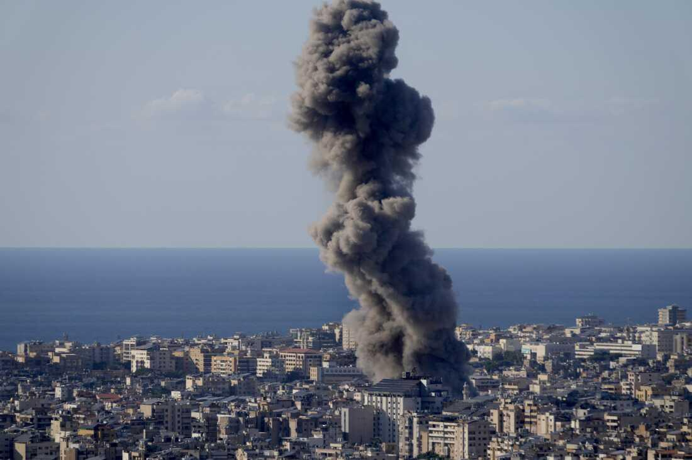

## Claim
Claim: "Netanyahu left Israel and fled to Poland amid Iran's missile attack on Israel on October 1, 2024."

## Actions
```
web_search("Netanyahu Poland October 1 2024")
```

## Evidence
### Evidence from `web_search`
Al Jazeera ([https://www.aljazeera.com/news/2025/1/9/poland-says-it-will-protect-benjamin-netanyahu-from-potential-arrest](https://www.aljazeera.com/news/2025/1/9/poland-says-it-will-protect-benjamin-netanyahu-from-potential-arrest)) reported on January 9, 2025, that Poland will protect Benjamin Netanyahu from potential arrest, as he may attend the 80th anniversary of the liberation of the Auschwitz-Birkenau concentration camp on January 27, 2025. The article mentions an arrest warrant issued by the International Criminal Court (ICC) for alleged war crimes. 

The Los Angeles Times ([https://www.latimes.com/world-nation/story/2025-01-09/polish-president-seeks-protection-for-netanyahu-if-he-attends-auschwitz-anniversary-event](https://www.latimes.com/world-nation/story/2025-01-09/polish-president-seeks-protection-for-netanyahu-if-he-attends-auschwitz-anniversary-event)) also reported on January 9, 2025, that the Polish President is seeking protection for Netanyahu if he attends the Auschwitz anniversary event. DW.COM ([https://www.dw.com/en/auschwitz-poland-netanyahu-arrest-pledge/a-71377468](https://www.dw.com/en/auschwitz-poland-netanyahu-arrest-pledge/a-71377468)) reported on January 22, 2025, that the Polish government guaranteed safe passage to Netanyahu, should he attend the event, and that Netanyahu was not planning to attend. <image:k> <image:k>


## Elaboration
The evidence indicates that in January 2025, Poland was preparing to protect Netanyahu from potential arrest, possibly related to an ICC warrant, if he attended the Auschwitz anniversary. However, the evidence does not mention any events from October 1, 2024, or an Iranian missile attack. The evidence also states that Netanyahu was not planning to attend the event.

Therefore, the claim cannot be verified based on the provided evidence. The evidence does not support the claim that Netanyahu fled to Poland on October 1, 2024.

To verify the claim, information about Netanyahu's whereabouts on October 1, 2024, and any related events, such as an Iranian missile attack, would be needed.


## Actions
```
web_search("Iran missile attack Israel October 1 2024")
web_search("Netanyahu whereabouts October 1 2024")
```

## Evidence
### Evidence from `web_search`
On October 1, 2024, Iran launched a missile attack on Israel, also known as "Operation True Promise II" according to a Wikipedia article ([https://en.wikipedia.org/wiki/October_2024_Iranian_strikes_on_Israel](https://en.wikipedia.org/wiki/October_2024_Iranian_strikes_on_Israel)). NPR ([https://www.npr.org/2024/10/01/g-s1-25707/iran-israel-hezbollah-lebanon-attack](https://www.npr.org/2024/10/01/g-s1-25707/iran-israel-hezbollah-lebanon-attack)) and Al Jazeera ([https://www.aljazeera.com/news/2024/10/1/irans-missile-attack-against-israel-what-we-know-and-what-comes-next](https://www.aljazeera.com/news/2024/10/1/irans-missile-attack-against-israel-what-we-know-and-what-comes-next)) also reported on the attack. Benjamin Netanyahu responded to the attack, calling it a "big mistake."   


### Evidence from `web_search`
The Wikipedia article ([https://en.wikipedia.org/wiki/2024_drone_attack_on_Benjamin_Netanyahu%27s_residence](https://en.wikipedia.org/wiki/2024_drone_attack_on_Benjamin_Netanyahu%27s_residence)) states that on October 19, 2024, a drone strike targeted Netanyahu's home in Caesarea, Israel, which Hezbollah claimed responsibility for on October 22, 2024. NPR ([https://www.npr.org/2024/10/19/nx-s1-5158375/netanyahu-house-drone-israel](https://www.npr.org/2024/10/19/nx-s1-5158375/netanyahu-house-drone-israel)) reported on October 19, 2024, about the drone attack on Netanyahu's house. The BBC ([https://www.bbc.com/news/live/c4g77k4jl68t](https://www.bbc.com/news/live/c4g77k4jl68t)) provided live updates on October 21, 2024, including reports of Israeli strikes on Iran and Hezbollah. , , , , , , , , 


## Elaboration
The evidence confirms that Iran launched a missile attack on Israel on October 1, 2024. The evidence also indicates that Netanyahu responded to the attack, calling it a "big mistake." However, the evidence does not state that Netanyahu left Israel or fled to Poland.

Therefore, the claim is not supported by the evidence.


## Final Judgement
The evidence confirms that an Iranian missile attack on Israel occurred on October 1, 2024, and that Netanyahu responded to it. However, there is no evidence to support the claim that Netanyahu left Israel and fled to Poland on that date.

`false`

### Verdict: FALSE

### Justification
The claim is false. While an Iranian missile attack on Israel occurred on October 1, 2024, and Netanyahu responded to it, there is no evidence to support the claim that he left Israel and fled to Poland on that date.
