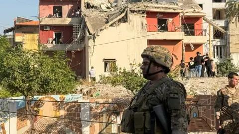
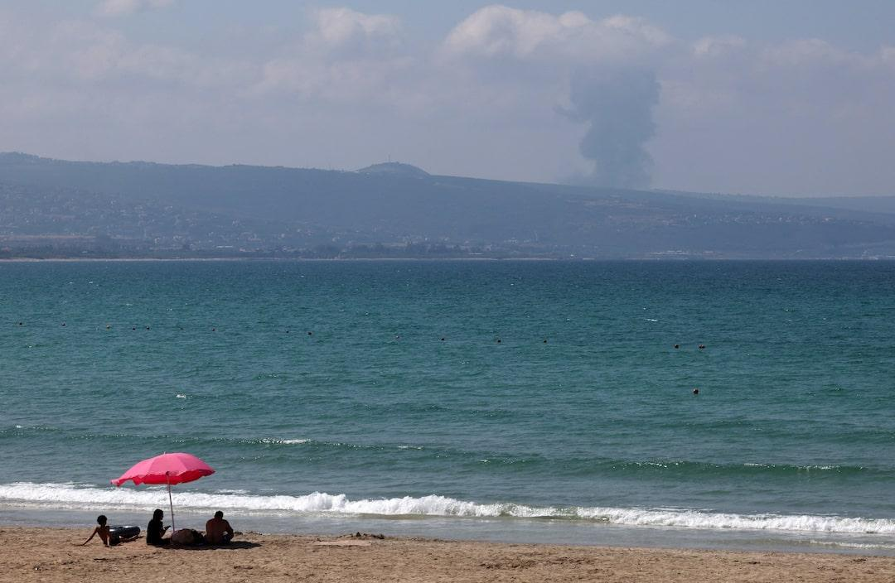
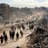

## Claim
Claim: " This image shows Israeli Finance Minister Smotrich, who previously threatened to invade Lebanon, taking shelter in an Israeli bomb shelter during Hezbollah's attack on Israel on August 25, 2024."

## Actions
```
reverse_search()
```

## Evidence
No new evidence found.

## Elaboration
I am unable to verify the claim because I have no new evidence.


## Actions
```
web_search("Israeli Finance Minister Smotrich Hezbollah attack August 25 2024")
web_search("Smotrich bomb shelter August 25 2024")
image_search("Israeli Finance Minister Smotrich")
```

## Evidence
### Evidence from `web_search`
The Guardian published an article on August 5, 2024, discussing the Middle East crisis, including a Hezbollah drone attack on northern Israel and an Israeli strike in Lebanon. The article mentions Israeli Finance Minister Bezalel Smotrich's statement regarding the return of Israeli hostages. ([https://www.theguardian.com/world/live/2024/aug/05/joe-biden-iran-israel-gaza-jordan-latest-middle-east-crisis-live](https://www.theguardian.com/world/live/2024/aug/05/joe-biden-iran-israel-gaza-jordan-latest-middle-east-crisis-live))

A BBC News article from November 25, 2024, discusses the conflict between Israel and Hezbollah and a potential ceasefire deal. ([https://www.bbc.com/news/articles/c0rge45kw4jo](https://www.bbc.com/news/articles/c0rge45kw4jo)) Reuters reported on August 25, 2024, that Hezbollah launched rockets and drones at Israel, and Israel struck Lebanon in response. ([https://www.reuters.com/world/middle-east/israel-strikes-hezbollah-targets-lebanon-military-says-2024-08-25/](https://www.reuters.com/world/middle-east/israel-strikes-hezbollah-targets-lebanon-military-says-2024-08-25/)) , , 


### Evidence from `web_search`
The article from Kashif.ps states that the image 

### Evidence from `image_search`
The search results include a Wikipedia page on Bezalel Smotrich ([https://en.wikipedia.org/wiki/Bezalel_Smotrich](https://en.wikipedia.org/wiki/Bezalel_Smotrich)) and an article from Le Monde that contains a photograph of Bezalel Smotrich  ([https://www.lemonde.fr/en/international/article/2023/11/06/bezalel-smotrich-israel-s-agent-of-chaos_6231784_4.html](https://www.lemonde.fr/en/international/article/2023/11/06/bezalel-smotrich-israel-s-agent-of-chaos_6231784_4.html)).

Additionally, CNN published an image of Bezalel Smotrich  ([https://www.cnn.com/2024/06/21/middleeast/israel-west-bank-bezalel-smotrich-settlements-intl-latam](https://www.cnn.com/2024/06/21/middleeast/israel-west-bank-bezalel-smotrich-settlements-intl-latam)).


## Elaboration
The evidence confirms that there was a Hezbollah attack on Israel on August 25, 2024, and that Bezalel Smotrich is the Israeli Finance Minister. However, the evidence does not confirm that the image 

## Actions
```
web_search("Bezalel Smotrich image bomb shelter August 25 2024")
```

## Evidence
### Evidence from `web_search`
The Human Rights Watch report from November 14, 2024, discusses the displacement of Palestinians in Gaza and mentions statements by Israeli Finance Minister Bezalel Smotrich from December 2023 and January 2024 regarding the encouragement of emigration of Gazan residents. ([https://www.hrw.org/report/2024/11/14/hopeless-starving-and-besieged/israels-forced-displacement-palestinians-gaza](https://www.hrw.org/report/2024/11/14/hopeless-starving-and-besieged/israels-forced-displacement-palestinians-gaza)) , , , <image:108251>, <image:108252>, <image:108253>, <image:108254>, <image:108255>, <image:108256>, <image:108244>, <image:108278>, <image:108257> The Atlantic published articles by Gershom Gorenberg between February 2025 and June 2025, discussing the Middle East crisis, including the conflict between Israel and Palestine, and mentions Bezalel Smotrich and bomb shelters. ([https://www.theatlantic.com/author/gershom-gorenberg/](https://www.theatlantic.com/author/gershom-gorenberg/)) , , , , , , , 


## Elaboration
The evidence does not confirm that the image 

## Final Judgement
The evidence confirms that there was a Hezbollah attack on Israel on August 25, 2024, and that Bezalel Smotrich is the Israeli Finance Minister. However, the evidence does not confirm that the image shows Smotrich in a bomb shelter during the attack. Therefore, the claim cannot be verified. `false`

### Verdict: FALSE

### Justification
The claim cannot be verified because while the evidence confirms that Hezbollah attacked Israel on August 25, 2024, and that Bezalel Smotrich is the Israeli Finance Minister, it does not confirm that the image depicts Smotrich in a bomb shelter during the attack.
