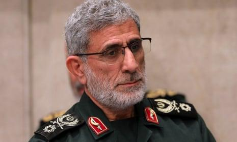

## Claim
Claim: " This is an authentic image of Esmail Qaani, the commander of the Iranian Revolutionary Guards, disguised in a hijab in fear of Israeli bombing."

## Actions
```
reverse_search()
web_search("Esmail Qaani hijab disguise")
```

## Evidence
### Evidence from `reverse_search`
From [Source](https://www.nairaland.com/8460455/commander-ghost-qaanis-great-escape): Found exact image on website with title: "From Commander To Ghost: Qaani's Great Escape?" - Foreign Affairs
Content: The search result is from Nairaland, a Nigerian forum. It discusses an article titled "From Commander To Ghost: Qaani’s Great Escape?" which references an image of Esmail Qaani, commander of Iran's IRGC Quds Force, in civilian disguise. The article suggests this was a survival tactic following reported Israeli airstrikes in June 2025.  is included in the article. The post also includes a link to a tweet by @MOSSADil. The forum post includes multiple comments discussing the situation.


### Evidence from `web_search`
The Nairaland Forum discusses a photo of Esmail Qaani in a hijab, which circulated during the Israel-Hezbollah war, suggesting his escape when an attempt was made on his life while in Lebanon. The JFeed article discusses rumors that Qaani might be a spy for Israel’s Mossad, and that he was reportedly killed in an Israeli airstrike. The New Arab reports that Qaani is in good health and includes a photo of him. <image:k>

The sources are: [https://www.nairaland.com/8460455/commander-ghost-qaanis-great-escape/1](https://www.nairaland.com/8460455/commander-ghost-qaanis-great-escape/1), [https://www.jfeed.com/news-israel/ismail-qaani-mossad-agent-rumors](https://www.jfeed.com/news-israel/ismail-qaani-mossad-agent-rumors), and [https://www.newarab.com/news/iran-quds-forces-qaani-good-health-following-death-claims](https://www.newarab.com/news/iran-quds-forces-qaani-good-health-following-death-claims).


## Elaboration
The evidence suggests that the image in question depicts Esmail Qaani in disguise. The Nairaland forum post, referencing an article, claims the disguise was a survival tactic following reported Israeli airstrikes. The web search results further support this, mentioning the image's circulation during the Israel-Hezbollah war and linking it to an alleged attempt on Qaani's life.

However, the evidence also presents conflicting information. One source discusses rumors of Qaani being a Mossad agent and reports of his death in an airstrike, while another source, The New Arab, states that Qaani is in good health.

Therefore, while the image's authenticity as a depiction of Qaani in disguise is supported, the specific context and motivations behind the disguise, as well as the claims of Israeli attacks, remain uncertain. More information is needed to verify the claim's assertion about the reason for the disguise.


## Actions
```
web_search("Esmail Qaani disguise Israeli bombing")
image_search("Esmail Qaani disguise")
```

## Evidence
### Evidence from `web_search`
The Guardian's article from October 10, 2024, discusses Esmail Ghaani's whereabouts following Israeli strikes, mentioning conflicting reports about his health and location, but does not mention him being in disguise or wearing a hijab. The article includes a photo of Ghaani in military uniform. ([https://www.theguardian.com/world/2024/oct/10/iran-esmail-ghaani-al-quds-beirut-lebanon-israeli-strikes-hezbollah](https://www.theguardian.com/world/2024/oct/10/iran-esmail-ghaani-al-quds-beirut-lebanon-israeli-strikes-hezbollah)) 

The Jerusalem Post published an article on June 30, 2025, about an X account linked to Mossad denying rumors of ties to Esmail Qaani, including a photo of Qaani. ([https://www.jpost.com/israel-news/article-859504](https://www.jpost.com/israel-news/article-859504)) This is Beirut reported on October 5, 2024, that Quds Force Commander Esmail Qaani may have been wounded in a Beirut bombing. ([https://thisisbeirut.com.lb/news/47665/quds-force-commander-esmail-qaani-may-have-been-wounded-in-beirut-bombing-jerusalem-post](https://thisisbeirut.com.lb/news/47665/quds-force-commander-esmail-qaani-may-have-been-wounded-in-beirut-bombing-jerusalem-post)) <image:k>


### Evidence from `image_search`
Al Jazeera published an article about Esmail Qaani, the new commander of Iran's Quds Force. Newsweek reports that Esmail Qaani is alive and that there were reports of an Israeli strike.  

The sources are: [https://www.aljazeera.com/features/2020/1/20/esmaii-qaani-new-shadow-commander-of-irans-quds-force](https://www.aljazeera.com/features/2020/1/20/esmaii-qaani-new-shadow-commander-of-irans-quds-force) and [https://www.newsweek.com/irgc-commander-qanni-alive-israel-strike-2090365](https://www.newsweek.com/irgc-commander-qanni-alive-israel-strike-2090365).


## Elaboration
The evidence confirms that Esmail Qaani is the commander of the Iranian Revolutionary Guards. The image search results show multiple photos of him, including one in military uniform. The web search results mention reports of Israeli strikes and conflicting information about his health and location. However, none of the provided sources explicitly state that Qaani was disguised in a hijab due to fear of Israeli bombing. Therefore, the claim's assertion about the reason for the disguise remains unverified.


## Actions
```
web_search("Esmail Qaani hijab image origin")
```

## Evidence
### Evidence from `web_search`
The Jerusalem Post reported on Esmail Qaani's travel to Lebanon after the killing of Hezbollah leader Sayyed Hassan Nasrallah in an Israeli airstrike. ([https://www.jpost.com/israel-hamas-war/article-823444](https://www.jpost.com/israel-hamas-war/article-823444)) Wikipedia states that Qaani is the commander of the IRGC Quds Force and mentions reports of his death in Israeli airstrikes. ([https://en.wikipedia.org/wiki/Esmail_Qaani](https://en.wikipedia.org/wiki/Esmail_Qaani)) <image:k>


## Elaboration
The evidence confirms that Esmail Qaani is the commander of the IRGC Quds Force. While there are reports of Israeli airstrikes and rumors about his death, the provided sources do not offer any information about the origin of the image or the reason for the disguise. Therefore, the claim remains unverified.


## Final Judgement
The image is likely of Esmail Qaani, but the claim that he is disguised in a hijab due to fear of Israeli bombing is not supported by the evidence. While there are reports of Israeli strikes and rumors about his death, the provided sources do not offer any information about the origin of the image or the reason for the disguise.

`false`

### Verdict: FALSE

### Justification
The image is likely of Esmail Qaani, the commander of the Iranian Revolutionary Guards, but the claim that he is disguised in a hijab due to fear of Israeli bombing is not supported by the evidence. While there are reports of Israeli strikes and rumors about his death, the provided sources do not offer any information about the origin of the image or the reason for the disguise.
