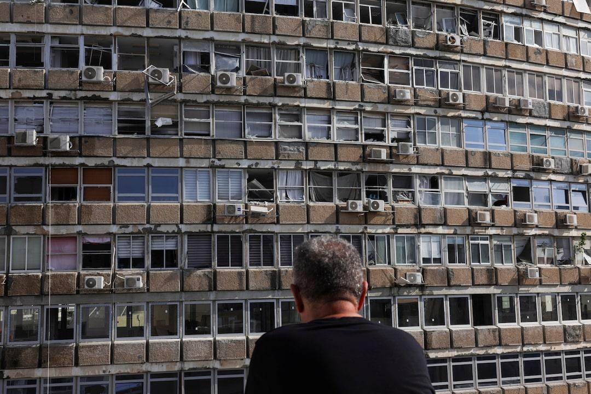

## Claim
Claim: " This image shows the aftermath of a Houthi attack on Tel Aviv, Israel, in July 2024."

## Actions
```
web_search("Houthi attack Tel Aviv July 2024")
image_search("Tel Aviv attack July 2024")
reverse_search()
```

## Evidence
### Evidence from `web_search`
The web sources discuss a Houthi attack on Tel Aviv, Israel, in July 2024. One source, from Wikipedia, details a drone attack on July 19, 2024, that targeted an apartment building, resulting in one death and ten injuries. The Houthis claimed responsibility for the attack. The article also mentions that the drone was not intercepted due to human error. ([https://en.wikipedia.org/wiki/2024_Houthi_drone_attack_on_Israel](https://en.wikipedia.org/wiki/2024_Houthi_drone_attack_on_Israel))

Reuters reports that a long-range Iranian-made drone hit Tel Aviv on July 19, 2024, in an attack claimed by the Yemen-based Houthi militia, which killed one man and wounded four others.  ([https://www.reuters.com/world/middle-east/israeli-military-says-tel-aviv-blast-apparently-caused-by-drone-2024-07-19/](https://www.reuters.com/world/middle-east/israeli-military-says-tel-aviv-blast-apparently-caused-by-drone-2024-07-19/)) The New York Times reports that Houthi militants launched a missile that landed in Tel Aviv. The article is dated December 20, 2024.


### Evidence from `image_search`
Al Jazeera reports on a drone attack on Tel Aviv in July 2024 ([https://www.aljazeera.com/news/2024/7/19/drone-attack-on-israels-tel-aviv-leaves-one-dead-at-least-10-injured](https://www.aljazeera.com/news/2024/7/19/drone-attack-on-israels-tel-aviv-leaves-one-dead-at-least-10-injured)). CNN published an article on July 19, 2024, about an explosion in Tel Aviv, Israel ([https://www.cnn.com/2024/07/19/middleeast/israel-tel-aviv-explosion-us-embassy-intl-hnk](https://www.cnn.com/2024/07/19/middleeast/israel-tel-aviv-explosion-us-embassy-intl-hnk)).

The New York Times published an article about a shooting in Tel Aviv ([https://www.nytimes.com/2024/10/01/world/middleeast/israel-tel-aviv-shooting.html](https://www.nytimes.com/2024/10/01/world/middleeast/israel-tel-aviv-shooting.html)). The web search results include images related to the events in Tel Aviv (, , ).


### Evidence from `reverse_search`
The image () appears in multiple sources. One source, from LBC Group, describes an explosion in a Tel Aviv building, with bomb disposal experts on the scene, published on July 19, 2024. ([https://www.lbcgroup.tv/news/middleeastnews/784660/explosion-in-tel-aviv-building-bomb-disposal-experts-on-site-israeli-p/en](https://www.lbcgroup.tv/news/middleeastnews/784660/explosion-in-tel-aviv-building-bomb-disposal-experts-on-site-israeli-p/en))

Another source, from The Times of Israel, reports on a rocket attack from Gaza, published on October 7, 2023. ([https://www.timesofisrael.com/liveblog-october-7-2023/](https://www.timesofisrael.com/liveblog-october-7-2023/)) A third source from India.com, published on October 22, 2024, reports that Hezbollah fired 20 rockets at Tel Aviv. ([https://www.india.com/news/israel-hezbollah-war-hezbollah-fires-20-rockets-at-israels-capital-tel-aviv-horrific-videos-go-viral-watch-7342129/](https://www.india.com/news/israel-hezbollah-war-hezbollah-fires-20-rockets-at-israels-capital-tel-aviv-horrific-videos-go-viral-watch-7342129/))


## Elaboration
The evidence confirms that there was a Houthi attack on Tel Aviv in July 2024. The image () depicts the aftermath of an explosion in Tel Aviv, which aligns with reports of a drone attack on July 19, 2024. The reverse image search confirms that the image is associated with the event.


## Final Judgement
The claim is supported by multiple sources that confirm a Houthi attack on Tel Aviv in July 2024, and the image is associated with the event.

`true`

### Verdict: TRUE

### Justification
The claim is supported by evidence from multiple sources, including Wikipedia ([https://en.wikipedia.org/wiki/2024_Houthi_drone_attack_on_Israel](https://en.wikipedia.org/wiki/2024_Houthi_drone_attack_on_Israel)), Reuters, and Al Jazeera, which confirm a Houthi drone attack on Tel Aviv in July 2024. The image in the claim is associated with the aftermath of an explosion in Tel Aviv, as reported by LBC Group.
