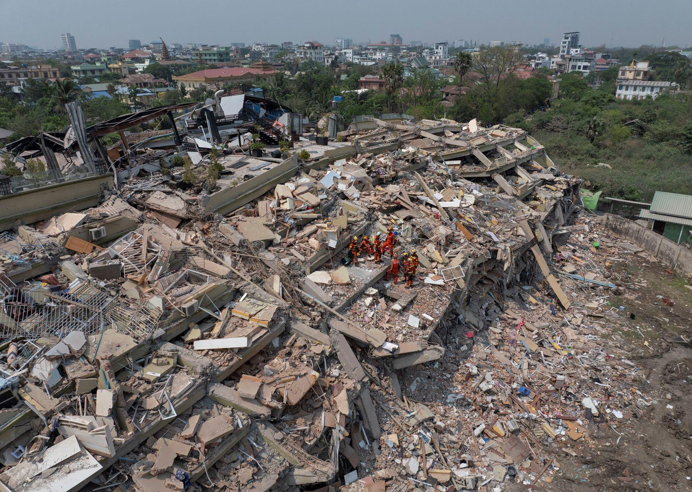
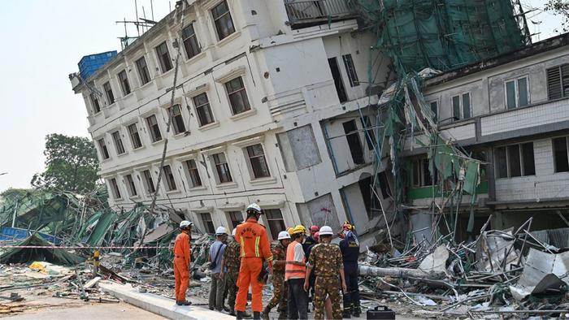
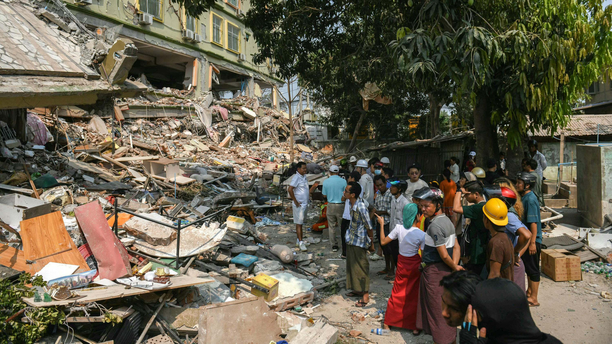

## Claim
Claim: " This image shows the ruins after a 7.9-magnitude earthquake in Myanmar on March 28, 2025."

## Actions
```
reverse_search()
image_search("earthquake Myanmar 2025")
```

## Evidence
### Evidence from `reverse_search`
The image 

### Evidence from `image_search`
Britannica ([https://www.britannica.com/event/Myanmar-earthquake-of-2025](https://www.britannica.com/event/Myanmar-earthquake-of-2025)) provides an image of the aftermath of the Myanmar earthquake of 2025.  EurekAlert.org ([https://www.eurekalert.org/news-releases/1084117](https://www.eurekalert.org/news-releases/1084117)) contains an image of a damaged building with rescue workers, related to an earthquake in Myanmar. 

The New York Times ([https://www.nytimes.com/2025/03/28/world/asia/earthquake-myanmar-thailand-death-toll.html](https://www.nytimes.com/2025/03/28/world/asia/earthquake-myanmar-thailand-death-toll.html)) published an article on March 28, 2025, about an earthquake in Myanmar. 


## Elaboration
The evidence confirms that there was an earthquake in Myanmar on March 28, 2025. However, the provided images from Britannica, EurekAlert, and The New York Times do not match the image in the claim.

Therefore, the claim is not supported by the provided evidence. The image in the claim may depict the aftermath of a different event.

I am missing information about the image in the claim to verify its authenticity.


## Actions
```
geolocate()
```

## Evidence
### Evidence from `geolocate`
The most likely countries where the image was taken are: {'China': 0.77, 'Bangladesh': 0.05, 'Indonesia': 0.02, 'Japan': 0.02, 'Palestine': 0.02, 'Philippines': 0.02, 'Taiwan': 0.02, 'Jordan': 0.01, 'Nigeria': 0.01, 'Pakistan': 0.01}

## Elaboration
The geolocation analysis suggests that the image is most likely from China. This contradicts the claim that the image shows the ruins after an earthquake in Myanmar.

Therefore, the claim is false.


## Final Judgement
The image in the claim does not match the images of the Myanmar earthquake of 2025. The geolocation analysis suggests that the image is most likely from China, contradicting the claim.

`false`

### Verdict: FALSE

### Justification
The claim is false. While there was an earthquake in Myanmar on March 28, 2025, the image provided in the claim does not match the images of the event, and geolocation analysis suggests the image is most likely from China.
