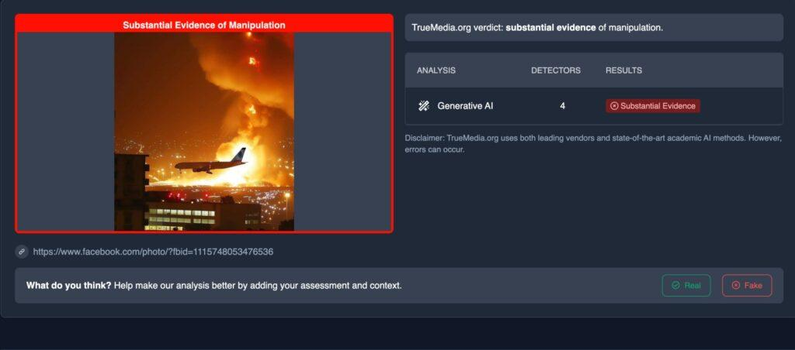
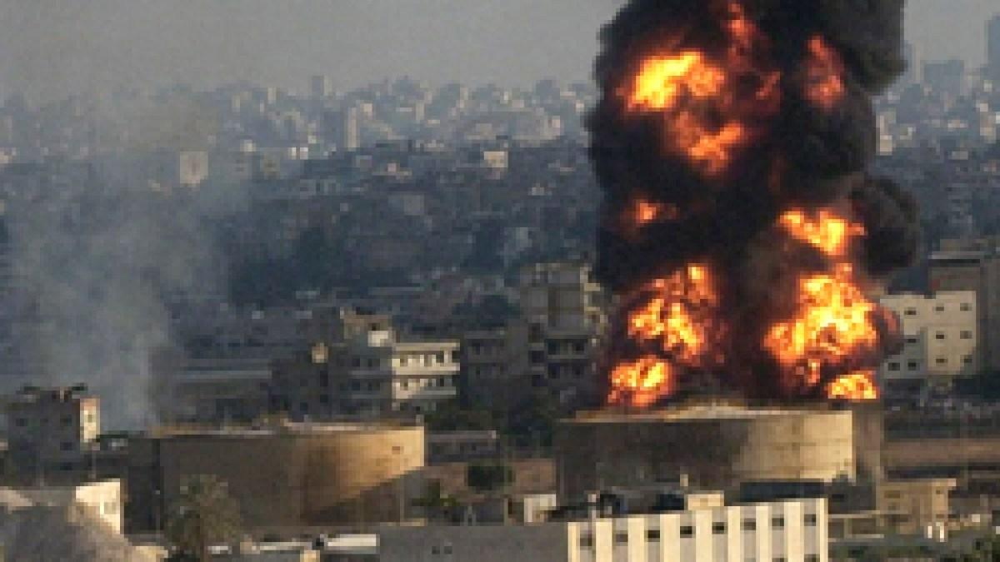
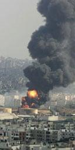

## Claim
Claim: " This is an authentic image of Israel bombing Beirut's International Airport in October 2024."

## Actions
```
reverse_search()
image_search("Beirut airport bombing")
```

## Evidence
### Evidence from `reverse_search`
The image  is AI-generated and does not depict a real event. According to [India Today](https://www.indiatoday.in/fact-check/story/fact-check-photo-middle-east-airlines-flight-israel-airstrikes-beirut-lebanon-ai-generated-2622766-2024-10-24), the image was fact-checked and confirmed to be AI-generated.

Factly.in also confirms the image is AI-generated, citing an Instagram post from October 21, 2024, that identified the image as AI-generated. The article includes images , , , , and .


### Evidence from `image_search`
Al Jazeera reports on Israel bombing Beirut airport. () The Guardian published an article on July 14, 2006, with an image of a fire in Beirut. ()

The ABC News website published an article on July 14, 2006, about Israel bombing Beirut airport, including an image of a plane in front of a fire. ()


## Elaboration
The image is AI-generated and does not depict a real event. Multiple sources, including India Today and Factly.in, confirm that the image is AI-generated. The image was identified as AI-generated in an Instagram post from October 21, 2024.


## Final Judgement
The claim is demonstrably false. The image is AI-generated and does not depict a real event. `false`

### Verdict: FALSE

### Justification
The image is AI-generated, as confirmed by fact-checks from [India Today](https://www.indiatoday.in/fact-check/story/fact-check-photo-middle-east-airlines-flight-israel-airstrikes-beirut-lebanon-ai-generated-2622766-2024-10-24) and Factly.in, and does not depict an authentic event.
