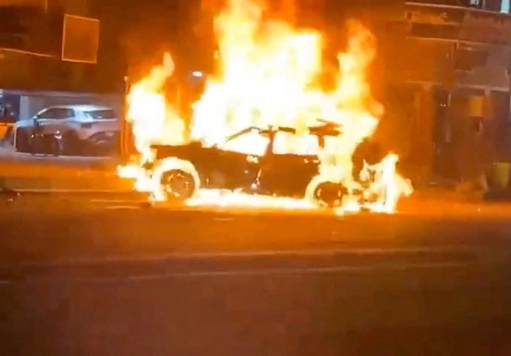
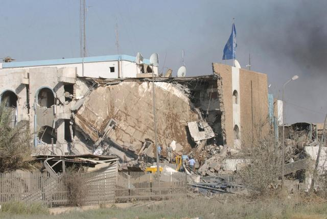
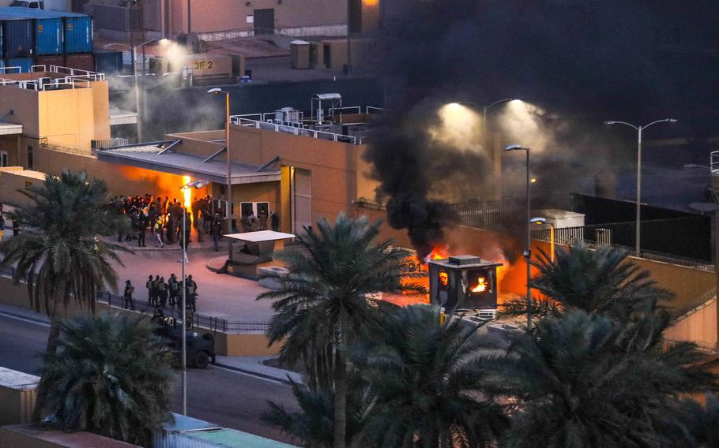
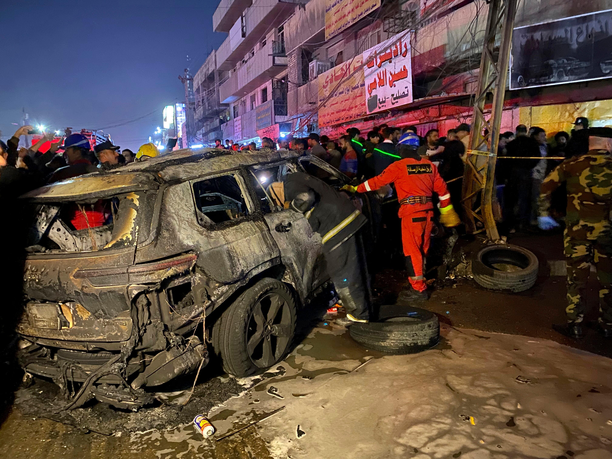

## Claim
Claim: " This image shows a US factility come under attack in Baghdad on September 30, 2024 as the conflict between Israel and the Iran-backed militant group Hezbollah escalated."

## Actions
```
reverse_search()
image_search("Baghdad facility attack September 30 2024")
geolocate()
```

## Evidence
### Evidence from `reverse_search`
The image 

### Evidence from `image_search`
Al Jazeera published an article on February 8, 2024, which includes an image of a burning car (). The Washington Post published an article about a US strike in Baghdad, including an image of a crime scene ().

The Denver Post published an article about the 20th anniversary of the attack on the UN headquarters in Iraq ().


### Evidence from `geolocate`
The most likely countries where the image was taken are: {'Nigeria': 0.13, 'United Arab Emirates': 0.09, 'Ukraine': 0.08, 'Chile': 0.05, 'Ecuador': 0.03, 'Ghana': 0.03, 'Taiwan': 0.03, 'Bangladesh': 0.02, 'Belgium': 0.02, 'Brazil': 0.02}

## Elaboration
The reverse image search did not yield any results. The image search found articles about a burning car, a crime scene, and the attack on the UN headquarters in Iraq. The geolocation search provided a list of countries, none of which is Iraq.

Based on the evidence, there is no information to support the claim that the image shows a US facility under attack in Baghdad on September 30, 2024. The evidence does not provide any information about the image's origin or the event it depicts.


## Actions
```
image_search("US facility Baghdad explosion")
image_search("Baghdad attack September 2024")
```

## Evidence
### Evidence from `image_search`
The search results include images of attacks on US facilities in Baghdad. One image from Stripes.com shows an attack on a US facility in Baghdad (

### Evidence from `image_search`
Military Times published an article on February 7, 2024, about a drone strike in Baghdad, which includes an image of a burning car (

## Elaboration
The image search results show attacks on US facilities in Baghdad, but none of the images match the one in the claim. The search also found an image of a burning car in Baghdad.

Based on the evidence, the claim cannot be verified. There is no evidence to support the claim that the image shows a US facility under attack in Baghdad on September 30, 2024.


## Final Judgement
The image search results show attacks on US facilities in Baghdad, but none of the images match the one in the claim. The search also found an image of a burning car in Baghdad. The reverse image search did not yield any results. The geolocation search provided a list of countries, none of which is Iraq.

Based on the evidence, the claim is not supported. There is no evidence to support the claim that the image shows a US facility under attack in Baghdad on September 30, 2024. `false`

### Verdict: FALSE

### Justification
The claim is not supported by the evidence. While image searches revealed attacks on US facilities in Baghdad and a burning car, none of the images matched the one in the claim. Furthermore, a reverse image search yielded no results, and geolocation analysis did not identify Iraq as a likely location. Therefore, the claim that the image depicts a US facility under attack in Baghdad on September 30, 2024, is unsubstantiated.
