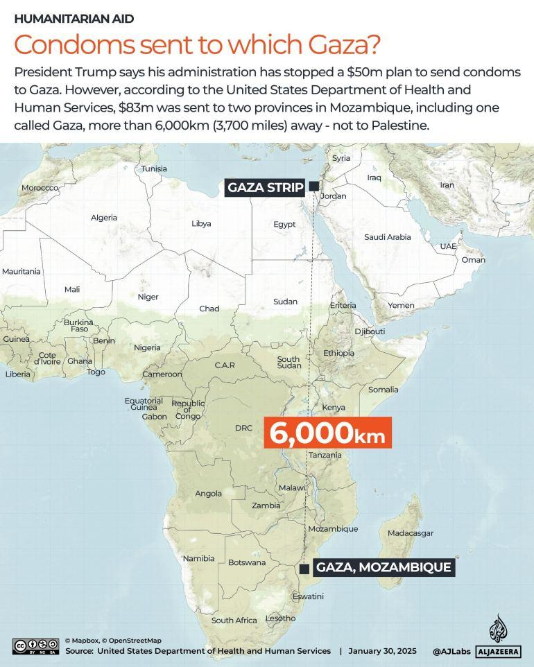

## Claim
Claim: "$50 Million in US taxpayer money almost went to fund condoms in Gaza before DOGE cut it."

## Actions
```
image_search("DOGE Gaza condoms")
image_search("US taxpayer money Gaza condoms")
```

## Evidence
### Evidence from `image_search`
Al Jazeera ([https://www.aljazeera.com/news/2025/1/30/is-the-us-sending-50m-in-condoms-to-gaza-as-trump-claims](https://www.aljazeera.com/news/2025/1/30/is-the-us-sending-50m-in-condoms-to-gaza-as-trump-claims)) reported that President Trump claimed his administration stopped a $50 million plan to send condoms to Gaza. However, the United States Department of Health and Human Services sent $83 million to two provinces in Mozambique, one of which is called Gaza, not Palestine. 

Kfoxtv.com ([https://kfoxtv.com/news/nation-world/doge-halts-50-million-payment-for-condoms-in-gaza-white-house-says-hamas-israel-trump-administration-government-efficiency-karoline-leavitt](https://kfoxtv.com/news/nation-world/doge-halts-50-million-payment-for-condoms-in-gaza-white-house-says-hamas-israel-trump-administration-government-efficiency-karoline-leavitt)) discusses a claim that DOGE halted a $50 million payment for condoms in Gaza. 


### Evidence from `image_search`
CNN published a fact-check on the topic of Gaza condoms (). Fox News reports that the State Department pulled millions in funding for condoms in Gaza ().

*   [Source](https://www.cnn.com/2025/01/29/politics/gaza-condoms-fact-check)
*   [Source](https://www.foxnews.com/politics/state-dept-pulls-millions-funding-condoms-gaza-trump-admin-looks-trim-spending)


## Elaboration
The claim is partially supported by the evidence. Al Jazeera ([https://www.aljazeera.com/news/2025/1/30/is-the-us-sending-50m-in-condoms-to-gaza-as-trump-claims](https://www.aljazeera.com/news/2025/1/30/is-the-us-sending-50m-in-condoms-to-gaza-as-trump-claims)) reports that Trump claimed to have stopped a $50 million plan for condoms in Gaza. However, the funds were intended for a province in Mozambique also named Gaza.

Kfoxtv.com ([https://kfoxtv.com/news/nation-world/doge-halts-50-million-payment-for-condoms-in-gaza-white-house-says-hamas-israel-trump-administration-government-efficiency-karoline-leavitt](https://kfoxtv.com/news/nation-world/doge-halts-50-million-payment-for-condoms-in-gaza-white-house-says-hamas-israel-trump-administration-government-efficiency-karoline-leavitt)) mentions DOGE halting a $50 million payment for condoms in Gaza. CNN and Fox News also report on the topic. The evidence suggests that the claim is related to a real event, but the details are potentially misrepresented.


## Final Judgement
The evidence indicates that the claim is based on a real event, but the details are misrepresented. The funds were intended for a province in Mozambique named Gaza, not the Gaza Strip. Additionally, the role of DOGE in halting the payment is unclear.

`false`

### Verdict: FALSE

### Justification
The claim is misleading. While there was a plan involving US taxpayer money and condoms, the funds were intended for a province in Mozambique also named Gaza, not the Gaza Strip, as reported by Al Jazeera ([https://www.aljazeera.com/news/2025/1/30/is-the-us-sending-50m-in-condoms-to-gaza-as-trump-claims](https://www.aljazeera.com/news/2025/1/30/is-the-us-sending-50m-in-condoms-to-gaza-as-trump-claims)). Additionally, the role of DOGE in halting the payment is unclear, as mentioned by Kfoxtv.com ([https://kfoxtv.com/news/nation-world/doge-halts-50-million-payment-for-condoms-in-gaza-white-house-says-hamas-israel-trump-administration-government-efficiency-karoline-leavitt](https://kfoxtv.com/news/nation-world/doge-halts-50-million-payment-for-condoms-in-gaza-white-house-says-hamas-israel-trump-administration-government-efficiency-karoline-leavitt)).
