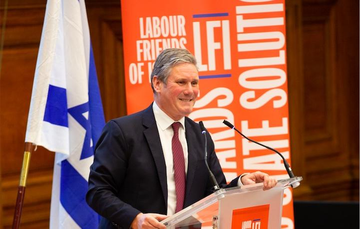
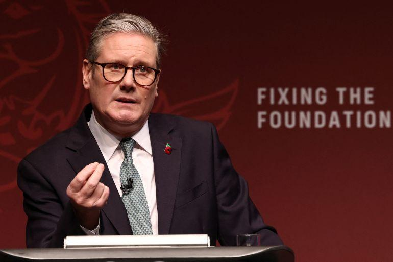

## Claim
Claim: "UK Prime Minister Keir Starmer said in October 2024 that the UK will boycott all diplomatic relations with Israel due to its long lasting war in Gaza."

## Actions
```
image_search("Keir Starmer Israel boycott Gaza October 2024")
```

## Evidence
### Evidence from `image_search`
The Guardian published an article on October 7, 2024, about Keir Starmer and the Middle East (). The BBC provides an image of Keir Starmer (). The search result contains an image of Keir Starmer speaking at an event ().

Relevant URLs: [https://www.theguardian.com/politics/2024/oct/07/starmer-urges-middle-east-step-back-from-brink-israel-gaza-anniversary](https://www.theguardian.com/politics/2024/oct/07/starmer-urges-middle-east-step-back-from-brink-israel-gaza-anniversary), [https://www.bbc.com/news/articles/cm2kyg0g8kxo](https://www.bbc.com/news/articles/cm2kyg0g8kxo), [https://www.lfi.org.uk/prime-minister-keir-starmers-speech-to-lfis-2024-annual-lunch/](https://www.lfi.org.uk/prime-minister-keir-starmers-speech-to-lfis-2024-annual-lunch/).


## Elaboration
The provided evidence includes a Guardian article from October 7, 2024, about Keir Starmer and the Middle East, and a BBC article. The search results also show images of Keir Starmer. However, none of the provided sources explicitly state that Keir Starmer said the UK would boycott all diplomatic relations with Israel in October 2024.

Therefore, the claim cannot be verified with the available information.


## Actions
```
image_search("Keir Starmer Israel boycott October 2024")
```

## Evidence
### Evidence from `image_search`
Novara Media published an article on July 3, 2024, featuring an image of Keir Starmer (). The Independent also published an article about Keir Starmer and the Middle East ().

Relevant URLs: [https://novaramedia.com/2024/07/03/what-would-keir-starmer-as-prime-minister-mean-for-palestine/](https://novaramedia.com/2024/07/03/what-would-keir-starmer-as-prime-minister-mean-for-palestine/), [https://www.independent.co.uk/news/uk/keir-starmer-middle-east-israel-tiktok-hamas-b2625866.html](https://www.independent.co.uk/news/uk/keir-starmer-middle-east-israel-tiktok-hamas-b2625866.html).


## Elaboration
The new evidence includes articles from Novara Media and The Independent, both mentioning Keir Starmer and the Middle East. However, neither article supports the claim that Keir Starmer stated the UK would boycott diplomatic relations with Israel in October 2024.

The claim remains unverified.


## Actions
```
image_search("Keir Starmer statement Israel Gaza October 2024")
```

## Evidence
### Evidence from `image_search`
Al Jazeera published an article that includes an image of Keir Starmer (). The Medical Aid for Palestinians (MAP) website contains an image of destruction in Gaza ().

Relevant URLs: [https://www.aljazeera.com/news/2024/11/1/labour-governments-shift-on-gaza-not-enough-say-british-muslims-scholars](https://www.aljazeera.com/news/2024/11/1/labour-governments-shift-on-gaza-not-enough-say-british-muslims-scholars), [https://www.map.org.uk/news/archive/post/1655-keir-starmer-you-canat-say-you-donat-know-that-israel-is-exterminating-palestinians-in-gaza](https://www.map.org.uk/news/archive/post/1655-keir-starmer-you-canat-say-you-donat-know-that-israel-is-exterminating-palestinians-in-gaza).


## Elaboration
The latest search results include an Al Jazeera article featuring Keir Starmer and a Medical Aid for Palestinians (MAP) article. While the MAP article discusses Keir Starmer's views on the situation in Gaza, it does not contain any information about a UK boycott of diplomatic relations with Israel.

The claim remains unsupported by the evidence.


## Final Judgement
The search results provide articles and images related to Keir Starmer and the Israeli-Palestinian conflict, but none of them confirm that Keir Starmer stated the UK would boycott all diplomatic relations with Israel in October 2024. Therefore, the claim is not supported by the available evidence.

`false`

### Verdict: FALSE

### Justification
The fact-check, based on multiple image searches and related articles from sources like The Guardian, BBC, Novara Media, The Independent, Al Jazeera, and Medical Aid for Palestinians, found no evidence to support the claim that Keir Starmer stated in October 2024 that the UK would boycott all diplomatic relations with Israel. Therefore, the claim is rated as false.
