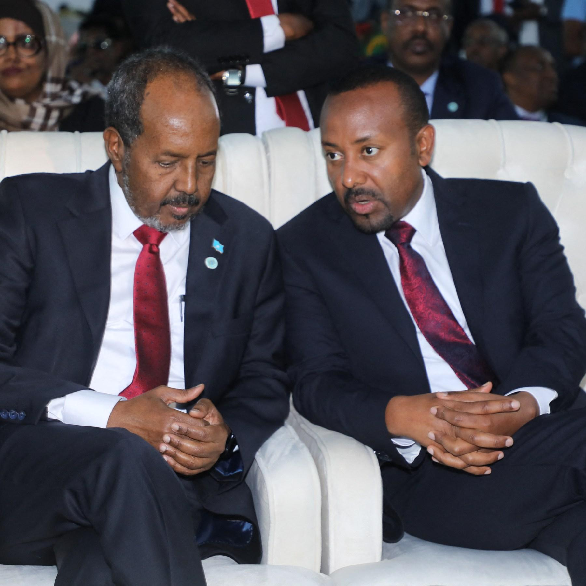
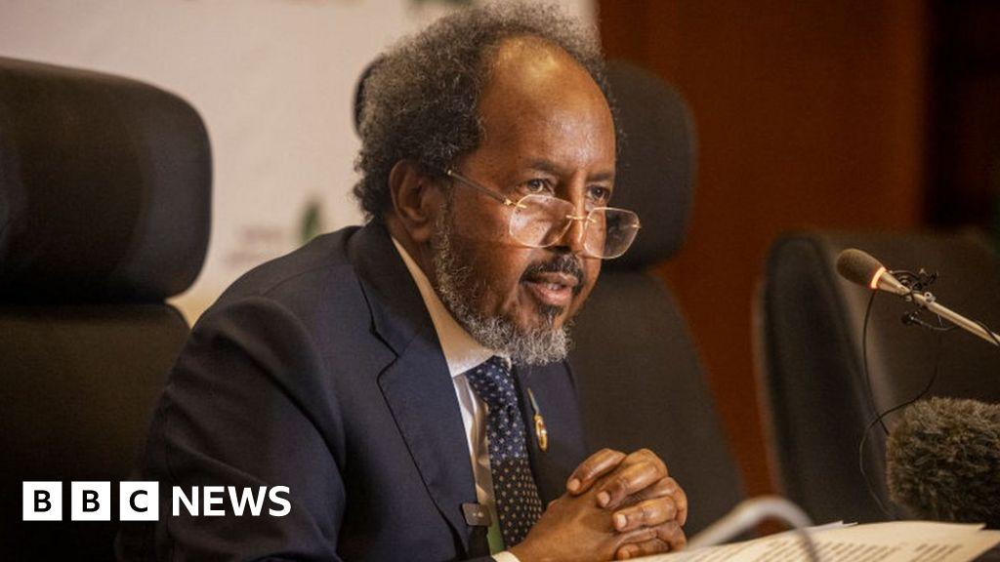
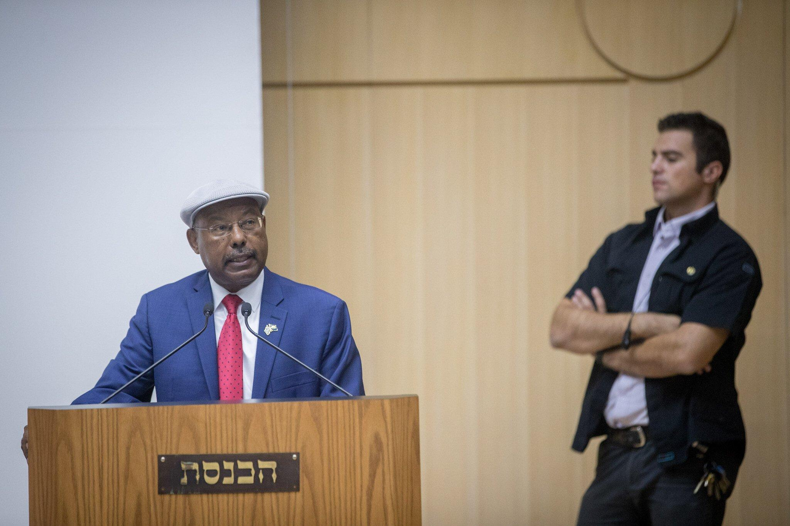
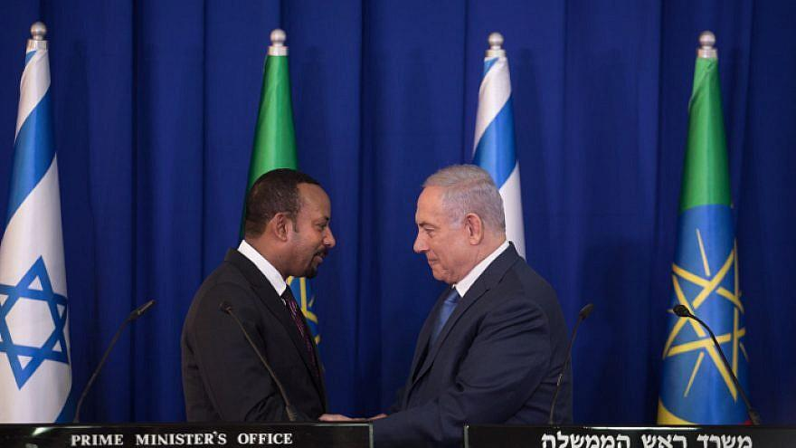

## Claim
Claim: "Ethiopia has expelled Israel's ambassador in April 2025."

## Actions
```
image_search("Ethiopia Israel relations")
image_search("Ethiopia expel ambassador")
```

## Evidence
### Evidence from `image_search`
From [Source](https://www.akem.org.tr/post/ethiopia-israel-relation-a-case-of-falasha-people): 
Content: The search result contains an image of a meeting between Ethiopian and Israeli officials. 


### Evidence from `image_search`
Al Jazeera reports on Somalia expelling the Ethiopian ambassador (). The BBC News website contains an image of a man ().

Voice of America (VOA) reports that Somalia expelled the Ethiopian ambassador and ordered the closure of two consulates ().


## Elaboration
The evidence does not contain any information about Ethiopia expelling Israel's ambassador. The search results show images of meetings between Ethiopian and Israeli officials, and reports about Somalia expelling the Ethiopian ambassador.

Insufficient information is available to verify the claim.


## Actions
```
image_search("Ethiopia Israel ambassador expelled")
image_search("Ethiopia Israel diplomatic relations")
```

## Evidence
### Evidence from `image_search`
The Palestine Chronicle reports that the Israeli ambassador to Ethiopia was expelled from the African Union headquarters (). The Times of Israel and Middle East Monitor report that the Israeli ambassador to Ethiopia was expelled from a conference on the Rwandan genocide (, ).


### Evidence from `image_search`
The search results include images of meetings between Ethiopian and Israeli officials. , 


## Elaboration
The Palestine Chronicle, The Times of Israel, and Middle East Monitor report that the Israeli ambassador was expelled from the African Union headquarters and a conference on the Rwandan genocide. However, the evidence does not specify that the ambassador was expelled in April 2025.

Insufficient information is available to verify the claim.


## Actions
```
image_search("Ethiopia Israel ambassador expulsion date")
```

## Evidence
No new evidence found.

## Elaboration
The evidence indicates that the Israeli ambassador has been expelled from the African Union headquarters and a conference on the Rwandan genocide. However, there is no information about the date of the expulsion. Therefore, the claim cannot be verified.


## Final Judgement
The search results show that the Israeli ambassador was expelled from the African Union headquarters and a conference on the Rwandan genocide. However, there is no information about the date of the expulsion. Therefore, the claim that Ethiopia expelled Israel's ambassador in April 2025 cannot be verified.

`false`

### Verdict: FALSE

### Justification
The claim is not supported by the evidence. While the Israeli ambassador was expelled from the African Union headquarters and a conference, there is no information to confirm the date of the expulsion, specifically in April 2025.
