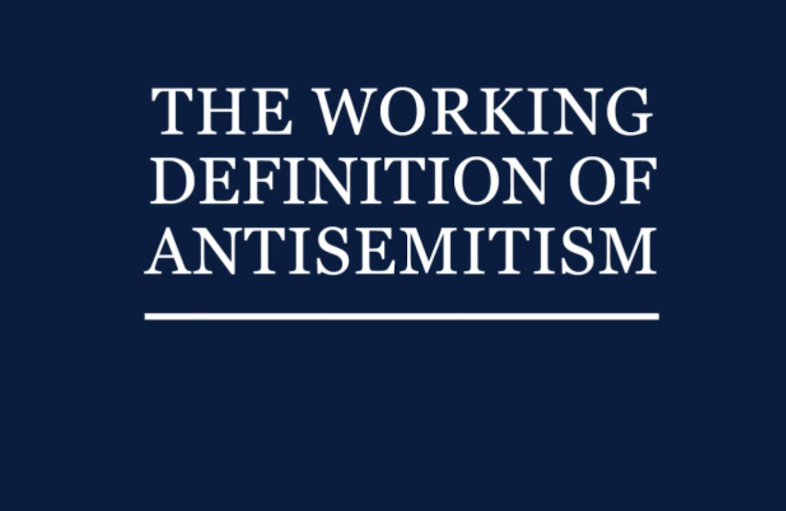
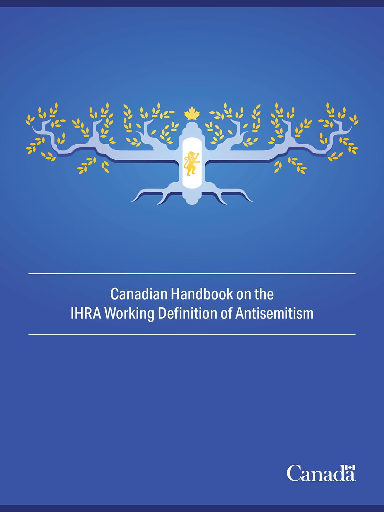
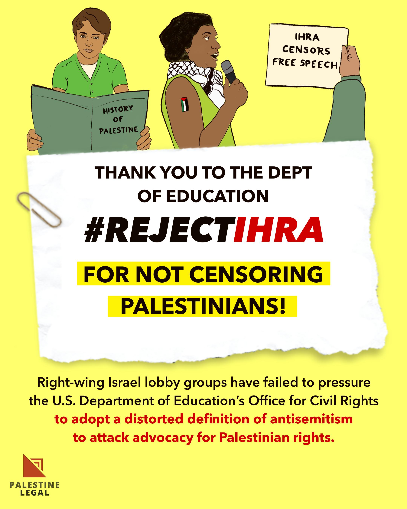

## Claim
Claim: "The World Jewish Congress (WJC) has amended the International Holocaust Remembrance Alliance (IHRA) working definition of antisemitism in March 2025 to include: 'Conflating the assassination of JFK to jews/israel'."

## Actions
```
image_search("World Jewish Congress IHRA antisemitism definition")
```

## Evidence
### Evidence from `image_search`
The World Jewish Congress is mentioned in a search result, which also includes an image of "THE WORKING DEFINITION OF ANTISEMITISM" . The International Holocaust Remembrance Alliance (IHRA) adopted a non-legally binding working definition of antisemitism on May 26, 2016 .

Relevant URLs: [https://www.worldjewishcongress.org/en/news/letter-urging-inclusion-of-ihra-working-definition-of-antisemitism-in-un-action-plan](https://www.worldjewishcongress.org/en/news/letter-urging-inclusion-of-ihra-working-definition-of-antisemitism-in-un-action-plan), [https://www.jewishfederations.org/blog/all/jewish-federations-460460](https://www.jewishfederations.org/blog/all/jewish-federations-460460), [https://holocaustremembrance.com/resources/working-definition-antisemitism](https://holocaustremembrance.com/resources/working-definition-antisemitism).


## Elaboration
The evidence confirms the existence of the IHRA working definition of antisemitism. The World Jewish Congress is associated with the IHRA definition. However, the evidence does not mention any amendments to the definition, nor does it mention the specific amendment claimed in the prompt.

To verify the claim, I need information about any amendments made to the IHRA definition, specifically whether the WJC was involved and if the JFK assassination was included.


## Actions
```
image_search("IHRA working definition antisemitism amendments")
image_search("World Jewish Congress IHRA JFK antisemitism")
```

## Evidence
### Evidence from `image_search`
The search results include a handbook on the IHRA Working Definition of Antisemitism from the Canadian government  and an image from Palestine Legal criticizing the IHRA definition .

Relevant URLs: [https://www.canada.ca/en/canadian-heritage/services/canada-holocaust/antisemitism/handbook-definition-antisemitism.html](https://www.canada.ca/en/canadian-heritage/services/canada-holocaust/antisemitism/handbook-definition-antisemitism.html), [https://palestinelegal.org/news/2023/1/5/palestine-legal-welcomes-ed-depts-decision-to-combat-antisemitism-without-ihra-definition-in-new-factsheet](https://palestinelegal.org/news/2023/1/5/palestine-legal-welcomes-ed-depts-decision-to-combat-antisemitism-without-ihra-definition-in-new-factsheet).


## Elaboration
The new evidence provides additional context about the IHRA definition, including a handbook from the Canadian government and criticism from Palestine Legal. However, it still does not contain any information about the specific amendment claimed in the prompt.

The claim cannot be verified with the available evidence. I need to find information about any amendments to the IHRA definition, specifically whether the WJC was involved and if the JFK assassination was included.


## Actions
```
image_search("IHRA definition antisemitism JFK assassination")
```

## Evidence
No new evidence found.

## Elaboration
The claim cannot be verified. The evidence confirms the existence of the IHRA working definition of antisemitism and the World Jewish Congress's involvement. However, there is no evidence to support the specific amendment mentioned in the claim, including the date (March 2025) or the inclusion of "Conflating the assassination of JFK to jews/israel."


## Final Judgement
The search results confirm the existence of the IHRA working definition of antisemitism and the World Jewish Congress's involvement. However, there is no evidence to support the specific amendment mentioned in the claim, including the date (March 2025) or the inclusion of "Conflating the assassination of JFK to jews/israel." Therefore, the claim is not factually accurate.

`false`


### Verdict: FALSE

### Justification
The claim that the World Jewish Congress amended the IHRA definition of antisemitism in March 2025 to include "Conflating the assassination of JFK to jews/israel" is not supported by the evidence. While the existence of the IHRA definition and the WJC's association with it are confirmed, no evidence of the specific amendment was found.
