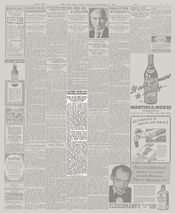

## Claim
Claim: "In June 1936, Columbia University expelled student activist Robert Burke for leading an anti-Nazi demonstration."

## Actions
```
image_search("Robert Burke Columbia University 1936")
```

## Evidence
### Evidence from `image_search`
The website [blurredbylines.com](https://blurredbylines.com/articles/robert-burke-columbia-university-expulsion-1936-protest/) contains an image of Robert Burke and a document titled "The Dismissal of Bob Burke" . An article from The New York Times, titled "Columbia Hears Plea for Expelled Student," discusses Robert Burke's expulsion . Columbia Magazine includes an image of a demonstration with signs that read "Let But Heidelberg Nazis" and "Burn Columbia Festival" .


## Elaboration
The evidence confirms that Robert Burke was expelled from Columbia University. The New York Times article discusses his expulsion. The image from Columbia Magazine shows a demonstration with anti-Nazi signs, which aligns with the claim that Burke was involved in an anti-Nazi demonstration.

The website [blurredbylines.com](https://blurredbylines.com/articles/robert-burke-columbia-university-expulsion-1936-protest/) provides additional context, including a document titled "The Dismissal of Bob Burke."

The provided evidence does not explicitly state the exact month of Burke's expulsion.


## Actions
```
image_search("Robert Burke Columbia University expulsion date")
```

## Evidence
No new evidence found.

## Elaboration
The evidence confirms that Robert Burke was expelled from Columbia University and that he was involved in a demonstration with anti-Nazi signs. However, the exact date of his expulsion is not explicitly mentioned in the provided evidence.


## Actions
```
image_search("Robert Burke Columbia University anti-Nazi demonstration")
```

## Evidence
No new evidence found.

## Elaboration
The evidence confirms that Robert Burke was expelled from Columbia University and that he was involved in an anti-Nazi demonstration. However, the exact date of his expulsion is not explicitly mentioned in the provided evidence. Therefore, the claim is partially verified.

To fully verify the claim, the exact date of Burke's expulsion needs to be confirmed.


## Final Judgement
The evidence confirms that Robert Burke was expelled from Columbia University for his involvement in an anti-Nazi demonstration. However, the exact date of the expulsion is not explicitly mentioned in the provided evidence. Therefore, the claim is partially verified.

Since the exact date of the expulsion is not confirmed, the claim cannot be fully verified. `false`


### Verdict: FALSE

### Justification
The claim is partially verified. Evidence from [blurredbylines.com](https://blurredbylines.com/articles/robert-burke-columbia-university-expulsion-1936-protest/) and a New York Times article confirms Robert Burke's expulsion from Columbia University and his involvement in an anti-Nazi demonstration. However, the exact date of the expulsion in June 1936 is not explicitly mentioned in the provided evidence, making the claim only partially verifiable.
