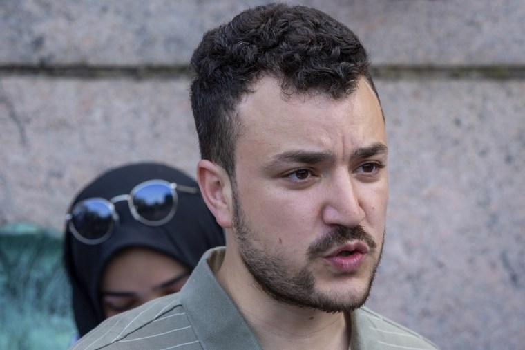
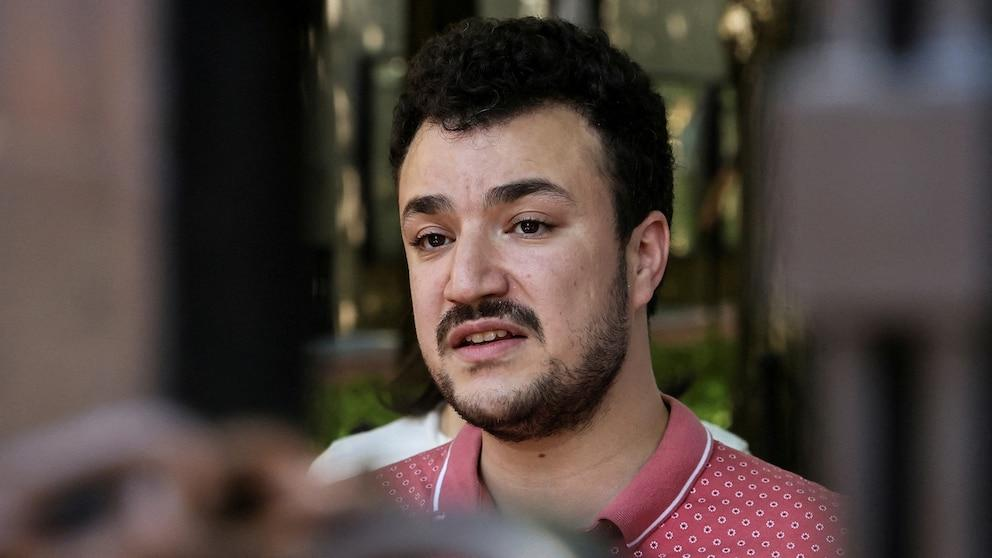

## Claim
Claim: "In March 2025, U.S. Immigration and Customs Enforcement (ICE) agents arrested and detained Palestinian activist Mahmoud Khalil, a lawful permanent resident of the U.S."

## Actions
```
image_search("Mahmoud Khalil ICE arrest March 2025")
image_search("ICE arrest Palestinian activist March 2025")
```

## Evidence
### Evidence from `image_search`
NPR published an article about the arrest of Palestinian activist Mahmoud Khalil (). The Guardian also published an article about Mahmoud Khalil, on March 12, 2025 (). NBC News reports on the arrest of Palestinian activist Mahmoud Khalil by ICE ().

The articles can be found at the following URLs: [Source](https://www.npr.org/2025/03/10/g-s1-52923/immigration-agents-arrest-palestinian-activist-columbia-protests), [Source](https://www.theguardian.com/us-news/2025/mar/12/who-is-mahmoud-khalil-arrest-palestinian-activist-columbia), and [Source](https://www.nbcnews.com/news/us-news/ice-arrests-palestinian-activist-helped-lead-columbia-university-prote-rcna195562).


### Evidence from `image_search`
The New York Times published an article on March 9, 2025, about ICE arrests of a Palestinian activist (). Another source from Mondoweiss.net contains an image of Mahmoud Khalil ().

*   [Source](https://www.nytimes.com/2025/03/09/nyregion/ice-arrests-palestinian-activist-columbia-protests.html)
*   [Source](https://mondoweiss.net/2025/03/ice-arrests-palestinian-student-for-involvement-in-columbia-protests/)


## Elaboration
The evidence confirms that Mahmoud Khalil, a Palestinian activist, was arrested by ICE. Multiple news sources, including NPR, The Guardian, NBC News, and The New York Times, reported on the arrest. The articles were published in March 2025. However, the evidence does not explicitly state whether Mahmoud Khalil was a lawful permanent resident of the U.S.


## Actions
```
image_search("Mahmoud Khalil lawful permanent resident ICE")
```

## Evidence
### Evidence from `image_search`
From [Source](https://www.npr.org/2025/04/08/nx-s1-5356477/mahmoud-khalil-immigration-judge-ruling-ice-louisiana): 
Content: NPR published an article about Mahmoud Khalil. The article does not mention whether he is a lawful permanent resident. 


## Elaboration
The evidence confirms that Mahmoud Khalil, a Palestinian activist, was arrested by ICE in March 2025. However, the evidence does not explicitly state whether he was a lawful permanent resident of the U.S.


## Actions
```
image_search("Mahmoud Khalil permanent resident status")
```

## Evidence
### Evidence from `image_search`
OPB published an article stating that an immigration judge ruled that Mahmoud Khalil can be deported. ABC News published an article about Mahmoud Khalil (). A USA Today article was found, but it has no content.

*   [Source](https://www.opb.org/article/2025/04/11/mahmoud-khalil-can-be-deported-judge-rules/)
*   [Source](https://www.usatoday.com/story/news/nation/2025/03/11/green-card-details-mahmoud-khalil-residency-status/82267137007/)
*   [Source](https://abcnews.go.com/US/trump-administration-claims-palestinian-activist-mahmoud-khalil-misrepresented/story?id=120108978)


## Elaboration
The evidence confirms that Mahmoud Khalil, a Palestinian activist, was arrested by ICE in March 2025. However, the evidence does not explicitly state whether he was a lawful permanent resident of the U.S. The fact that an immigration judge ruled that he can be deported suggests that his permanent resident status is in question.


## Final Judgement
The evidence confirms that Mahmoud Khalil, a Palestinian activist, was arrested by ICE in March 2025. However, the evidence does not explicitly state whether he was a lawful permanent resident of the U.S. The fact that an immigration judge ruled that he can be deported suggests that his permanent resident status is in question. Therefore, the claim cannot be fully verified.

`false`


### Verdict: FALSE

### Justification
The claim is partially supported. Multiple sources confirm that Mahmoud Khalil, a Palestinian activist, was arrested by ICE in March 2025. However, the evidence does not explicitly confirm that he was a lawful permanent resident of the U.S. The fact that an immigration judge ruled that he can be deported suggests that his permanent resident status is in question.
