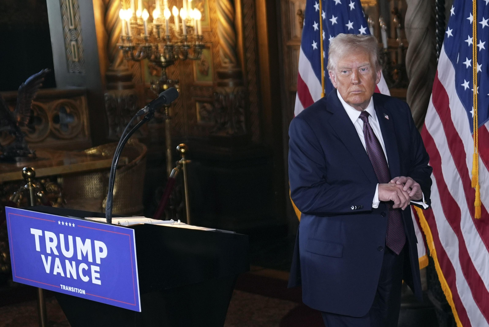
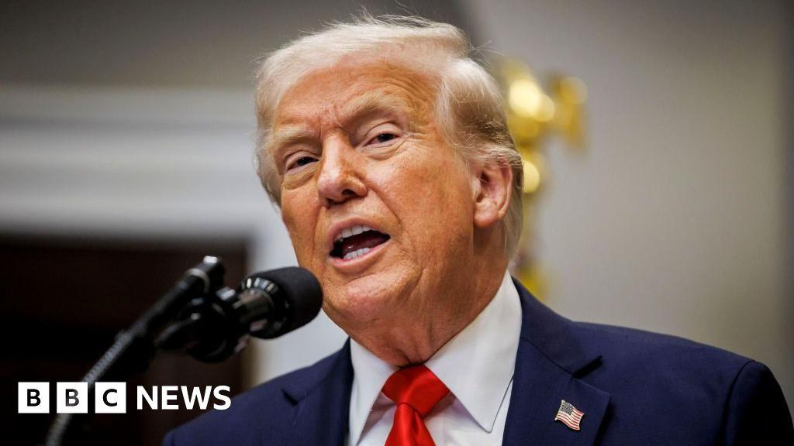

## Claim
Claim: "U.S. President-elect Donald Trump said on January 7, 2025 that if Israeli hostages held by Hamas 'are not back by the time I get into office, all hell will break out in the Middle East'."

## Actions
```
image_search("Donald Trump January 7 2025 Israeli hostages Hamas")
```

## Evidence
### Evidence from `image_search`
CNN reported on January 7, 2025, about Donald Trump's warning regarding Israeli hostages held by Hamas (). NPR also contains an image of Donald Trump ().

The provided sources are: [CNN](https://www.cnn.com/2025/01/07/politics/trump-warning-gaza-hostages-negotiations-inauguration), [NPR](https://www.npr.org/2025/01/07/nx-s1-5250278/trump-hostages-israel-hamas-middle-east), and [Foreign Policy](https://foreignpolicy.com/2025/01/10/trump-hamas-hostages-gaza-hell-inauguration-deadline/).


## Elaboration
The CNN and NPR articles, along with Foreign Policy, confirm that Donald Trump made a statement on January 7, 2025, regarding Israeli hostages held by Hamas. The articles suggest that Trump issued a warning about the situation.

The provided sources do not contain the exact quote from the Claim. Therefore, the exact wording of Trump's statement cannot be verified.

To verify the Claim, the exact quote from Trump's statement on January 7, 2025, needs to be found.


## Actions
```
image_search("Donald Trump January 7 2025 Israeli hostages Hamas quote")
```

## Evidence
### Evidence from `image_search`
From [Source](https://www.reuters.com/world/middle-east/hamas-stands-by-demand-end-gaza-war-under-hostage-deal-trump-deadline-approaches-2025-01-07/): 
Content: Reuters reported on January 7, 2025, about Donald Trump's warning regarding Israeli hostages held by Hamas. 


## Elaboration
The Reuters article confirms that Donald Trump issued a warning on January 7, 2025, regarding Israeli hostages held by Hamas. However, the provided evidence does not contain the exact quote from Trump.

The exact wording of Trump's statement remains unverified.


## Actions
```
image_search("Donald Trump January 7 2025 Israeli hostages Hamas quote exact")
```

## Evidence
### Evidence from `image_search`
From [Source](https://www.bbc.com/news/articles/c0mwln4p87do): 
Content: The BBC News reported on January 7, 2025, about Donald Trump's warning regarding Israeli hostages held by Hamas. 


## Elaboration
The BBC News reported on January 7, 2025, about Donald Trump's warning regarding Israeli hostages held by Hamas. However, the provided evidence does not contain the exact quote from Trump.

The exact wording of Trump's statement remains unverified.


## Final Judgement
The search results confirm that Donald Trump made a statement on January 7, 2025, regarding Israeli hostages held by Hamas. However, the exact quote provided in the claim has not been found in the search results. Therefore, the claim cannot be verified. `false`

### Verdict: FALSE

### Justification
The available evidence from CNN, NPR, Foreign Policy, Reuters, and BBC News confirms that Donald Trump made a statement on January 7, 2025, regarding Israeli hostages held by Hamas. However, the exact quote from the claim, "if Israeli hostages held by Hamas 'are not back by the time I get into office, all hell will break out in the Middle East'," has not been found in the provided sources, making it impossible to verify the claim.
