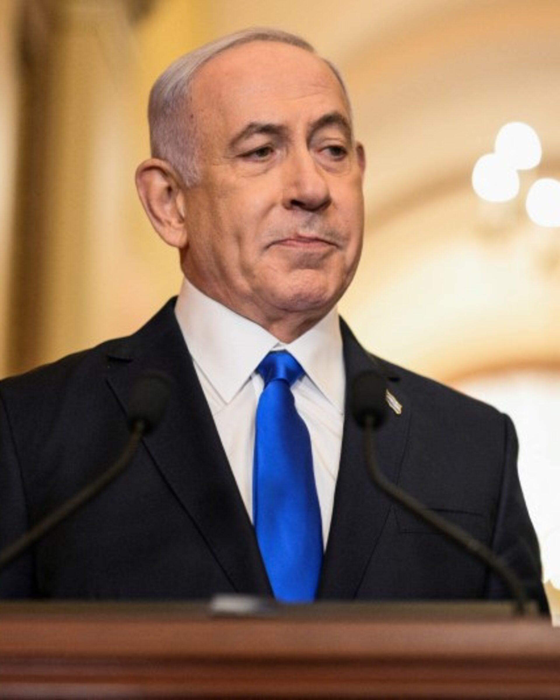
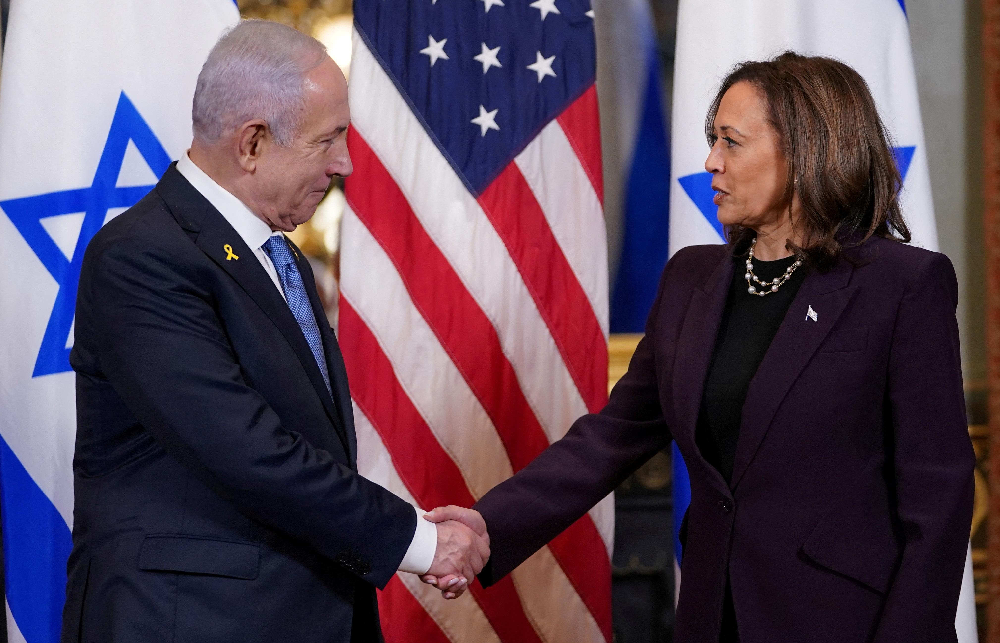
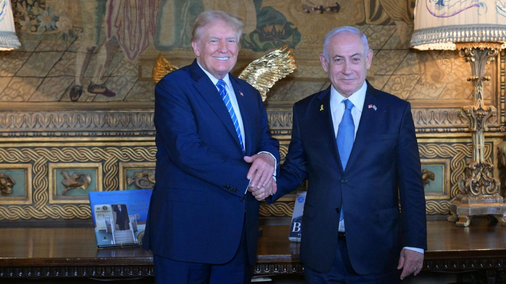
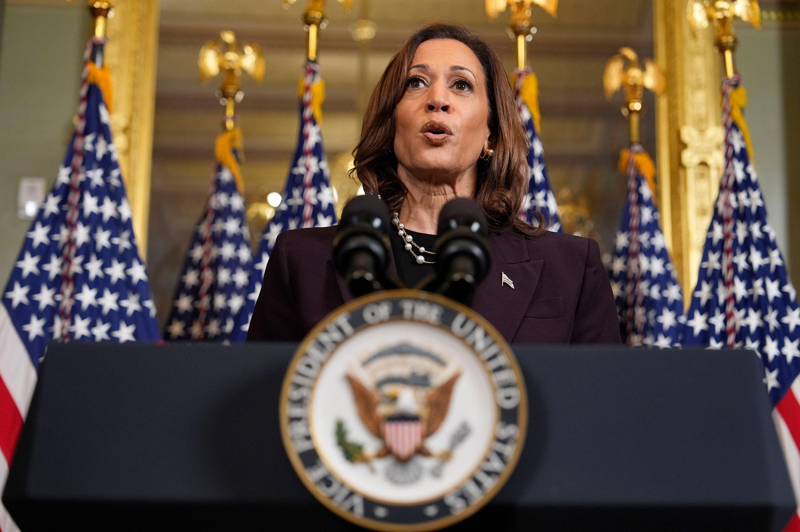

## Claim
Claim: "In a phone call with Benjamin Netanyahu on August 14, 2024, Donald Trump told the Israeli prime minister to stop a Gaza ceasefire deal because it would help Vice President Kamala Harris' 2024 presidential campaign."

## Actions
```
image_search("Donald Trump Benjamin Netanyahu phone call August 14 2024")
```

## Evidence
### Evidence from `image_search`
Newsweek ([Source](https://www.newsweek.com/donald-trump-accused-crime-benjamin-netanyahu-call-ceasefire-hamas-1942248)) contains an image of Donald Trump . Axios ([Source](https://www.axios.com/2024/08/15/trump-netanyahu-gaza-hostage-ceasefire-deal-call)) reports on a phone call between Trump and Netanyahu regarding a Gaza ceasefire deal .

Gvwire.com ([Source](https://gvwire.com/2025/08/20/trump-calls-netanyahu-a-war-hero-and-adds-i-guess-i-am-too/)) contains an image of Donald Trump and Benjamin Netanyahu .


## Elaboration
The evidence confirms that Donald Trump and Benjamin Netanyahu had a phone call regarding a Gaza ceasefire deal. However, the provided sources do not mention the specific date of the call, nor do they provide any information about Trump's motivations or statements during the call.

Therefore, the claim cannot be verified based on the available evidence. The information about the date and Trump's alleged statements is missing.


## Actions
```
image_search("Trump Netanyahu Gaza ceasefire deal August 14 2024")
```

## Evidence
### Evidence from `image_search`
From [Source](https://www.reuters.com/world/trump-netanyahu-speak-about-gaza-hostage-ceasefire-deal-axios-reports-2024-08-15/): 
Content: Reuters reports on a phone call between Trump and Netanyahu regarding a Gaza ceasefire deal. 


## Elaboration
The new evidence from Reuters ([Source](https://www.reuters.com/world/trump-netanyahu-speak-about-gaza-hostage-ceasefire-deal-axios-reports-2024-08-15/)) confirms that Trump and Netanyahu spoke about a Gaza ceasefire deal. However, it still does not provide the date of the call or Trump's specific statements.

The claim's veracity remains unverified due to the lack of information regarding the date and the content of the phone call.


## Actions
```
image_search("Trump Netanyahu Gaza ceasefire deal Kamala Harris 2024")
```

## Evidence
### Evidence from `image_search`
Reuters ([Source](https://www.reuters.com/world/us/biden-harris-meet-netanyahu-separately-gaza-ceasefire-2024-07-25/)) reports on a meeting between Kamala Harris and Benjamin Netanyahu regarding a Gaza ceasefire . Axios ([Source](https://www.axios.com/2024/07/26/trump-netanyahu-meeting)) reports on a meeting between Trump and Netanyahu . CNN ([Source](https://www.cnn.com/2024/07/25/politics/harris-netanyahu-israel-hamas-ceasefire)) reports on Kamala Harris and Netanyahu regarding a ceasefire .


## Elaboration
The new evidence reveals that Kamala Harris and Benjamin Netanyahu discussed a Gaza ceasefire. However, the evidence still does not provide any information about the date of the phone call between Trump and Netanyahu, nor does it confirm Trump's alleged statements about the ceasefire deal and Kamala Harris's campaign.

Therefore, the claim remains unverified due to the lack of specific information about the phone call's date and content.


## Final Judgement
The evidence confirms that Trump and Netanyahu discussed a Gaza ceasefire, and Kamala Harris also discussed the same topic with Netanyahu. However, there is no evidence to support the claim that Trump told Netanyahu to stop a ceasefire deal because it would help Kamala Harris's campaign, nor is there any information about the date of the call.

The claim is not factually accurate because there is not enough evidence to verify it. `false`


### Verdict: FALSE

### Justification
The claim cannot be verified. While there is evidence of discussions between Trump and Netanyahu regarding a Gaza ceasefire, and also between Kamala Harris and Netanyahu on the same topic, there is no evidence to support the specific claim about Trump's statements or the date of the phone call.
