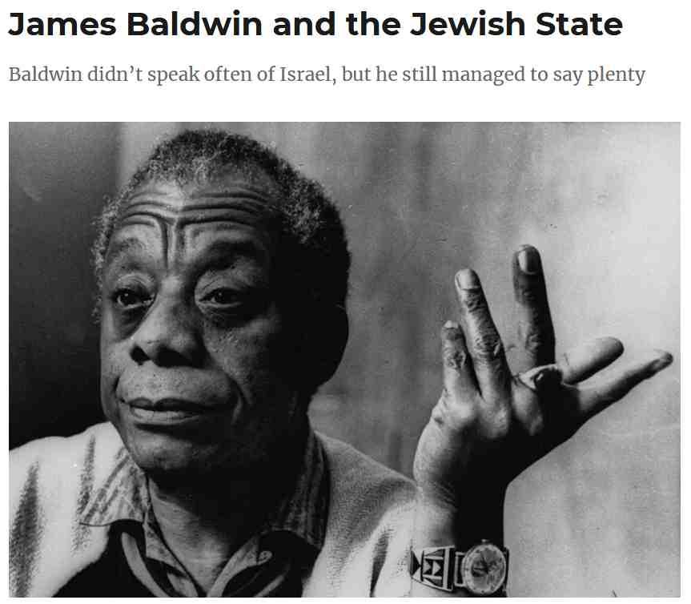
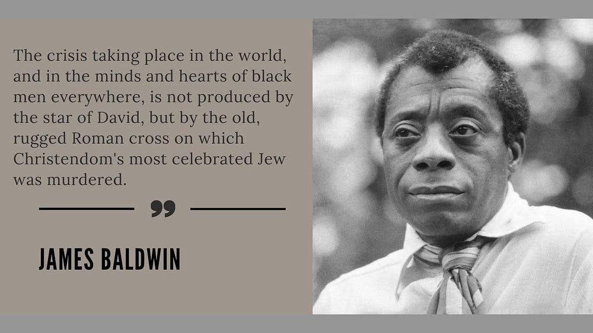

## Claim
Claim: "American writer James Baldwin once said: 'The state of Israel was not created for the salvation of the Jews; it was created for the salvation of the Western interests.'"

## Actions
```
image_search("James Baldwin Israel quote")
```

## Evidence
### Evidence from `image_search`
The search results include images of James Baldwin. One source, from [Source](https://azvsas.blogspot.com/2020/08/james-baldwin-on-black-jewish-relations.html), shows an image of James Baldwin with the text "James Baldwin and the Jewish State. Baldwin didn't speak often of Israel, but he still managed to say plenty."  Another source, from [Source](https://interminablerambling.medium.com/james-baldwin-jim-crow-and-the-holocaust-19480de4f380), contains an image of James Baldwin with a quote: "The crisis taking place in the world, and in the minds and hearts of black men everywhere, is not produced by the star of David, but by the old, rugged Roman cross on which Christendom's most celebrated Jew was murdered." 


## Elaboration
The evidence confirms that James Baldwin did speak about Israel, although not often. However, the provided search results do not contain the quote in the Claim.

More information is needed to verify the Claim.


## Actions
```
image_search("James Baldwin quote Israel Western interests")
```

## Evidence
No new evidence found.

## Elaboration
The search results did not provide the quote in the Claim. The evidence suggests that James Baldwin did speak about Israel, but the specific quote about the creation of Israel for Western interests is not found in the search results.

To verify the Claim, it is necessary to find a reliable source that attributes the quote to James Baldwin.


## Actions
```
image_search("James Baldwin quote about Israel Western interests source")
```

## Evidence
### Evidence from `image_search`
From [Source](https://www.newyorker.com/magazine/1962/11/17/letter-from-a-region-in-my-mind): 
Content: The search result from The New Yorker includes an image of James Baldwin. 


## Elaboration
The search results did not provide the quote in the Claim. The evidence suggests that James Baldwin did speak about Israel, but the specific quote about the creation of Israel for Western interests is not found in the search results.

To verify the Claim, it is necessary to find a reliable source that attributes the quote to James Baldwin.


## Final Judgement
The search results confirm that James Baldwin spoke about Israel, but the specific quote in the claim has not been found in any of the search results. Therefore, the claim cannot be verified.

`false`

### Verdict: FALSE

### Justification
The claim that James Baldwin said, "The state of Israel was not created for the salvation of the Jews; it was created for the salvation of the Western interests," cannot be verified. While Baldwin did speak about Israel, multiple image searches did not yield any evidence of him making this specific statement.
