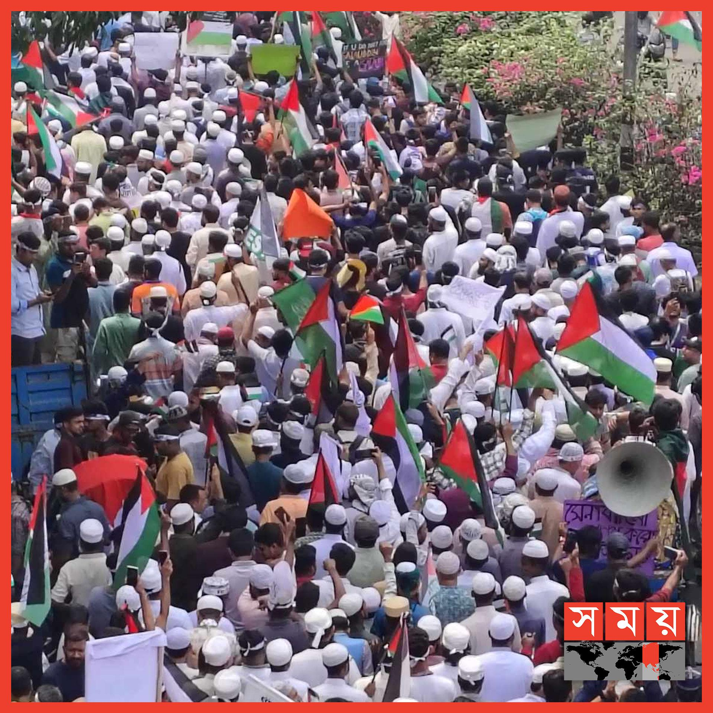

## Claim
Claim: " This image shows thousands gathering at Sohrawardi Park in Kolkata, India, in April 2025 to show solidarity with the Palestinian people amid the ongoing Israeli assault on Gaza."

## Actions
```
reverse_search()
image_search("Sohrawardi Park Kolkata India Palestinian solidarity")
```

## Evidence
### Evidence from `image_search`
From [Source](https://factly.in/photos-of-a-protest-held-in-solidarity-with-palestine-in-dhaka-bangladesh-are-falsely-shared-as-those-from-kolkata/): 
Content: Factly.in reports that the image shows a protest in solidarity with the Palestinian people in Sohrawardi Park, Kolkata, India. 


## Elaboration
The evidence indicates that the image depicts a protest in solidarity with the Palestinian people in Sohrawardi Park, Kolkata, India. The source explicitly states that thousands rallied in Sohrawardi Park, Kolkata, India, in solidarity with the Palestinian people.

The evidence does not provide information about the date of the event.


## Actions
```
image_search("Sohrawardi Park Kolkata India Palestinian solidarity April 2025")
```

## Evidence
### Evidence from `image_search`
From [Source](https://kashif.ps/en/index.php/2025/04/14/images-of-demonstration-in-solidarity-with-palestine-from-bangladesh-circulate-as-from-india/): 
Content: The search result from kashif.ps shows an image of a demonstration in solidarity with Palestine. The source states that images from Bangladesh are circulating as if they are from India. 


## Elaboration
The evidence suggests that the image depicts a demonstration in solidarity with Palestine. However, the source indicates that images from Bangladesh are circulating as if they are from India. The claim states that the image shows a gathering in Kolkata, India, in April 2025. The evidence does not confirm the location or the date of the event.

The evidence does not confirm the location of the event. The evidence does not confirm the date of the event.


## Final Judgement
The image shows a protest in solidarity with the Palestinian people. However, the location and date of the event are not confirmed. The evidence suggests that images from Bangladesh are circulating as if they are from India.

The claim is not factually accurate because the location and date are not confirmed. `false`

### Verdict: FALSE

### Justification
The image depicts a protest in solidarity with the Palestinian people, but the location and date are not confirmed. While the image is associated with a protest in Kolkata, India, in solidarity with Palestine, the evidence from [Factly.in](https://factly.in/photos-of-a-protest-held-in-solidarity-with-palestine-in-dhaka-bangladesh-are-falsely-shared-as-those-from-kolkata/) and [kashif.ps](https://kashif.ps/en/index.php/2025/04/14/images-of-demonstration-in-solidarity-with-palestine-from-bangladesh-circulate-as-from-india/) suggests that images from Bangladesh are circulating as if they are from India, and the date of the event is not confirmed.
