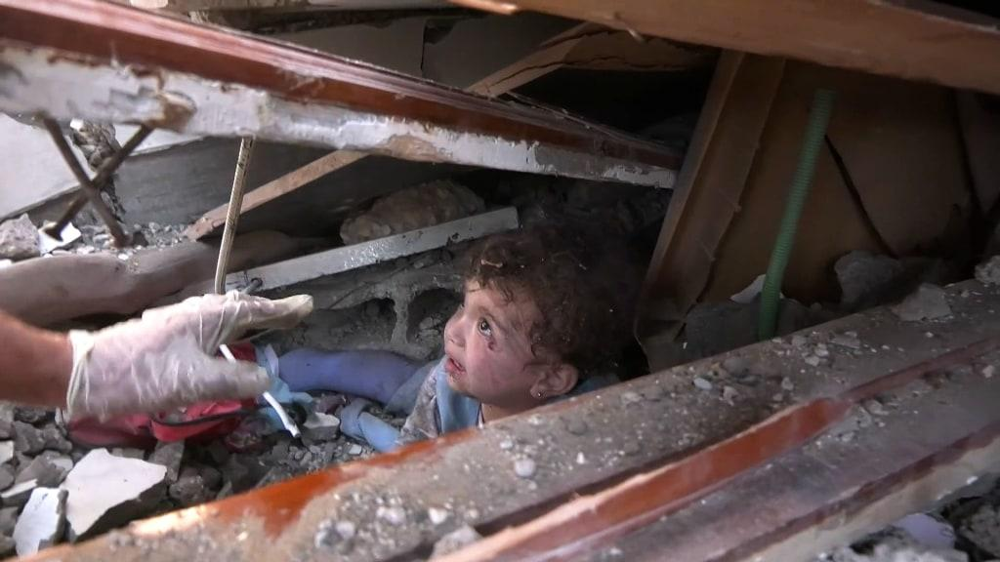

## Claim
Claim: " This image shows two children in Gaza in April 2025 found dead under the rubble of their home two months after an Israeli airstrike destroyed it."

## Actions
```
reverse_search()
image_search("children found rubble home airstrike")
```

## Evidence
### Evidence from `reverse_search`
From [Source](https://kashif.ps/en/index.php/2025/04/14/image-of-two-mummified-children-in-a-bolivian-museum-goes-viral-as-from-gaza/): Found exact image on website with title: Image of two mummified children in a Bolivian museum goes viral as ...
Content: The article from Kashif, published on April 14, 2025, addresses a viral image of two mummified children. The image is being falsely presented as children found in Gaza after an Israeli airstrike. The article clarifies that the image actually depicts mummified Spanish children from the 19th century, located in a Bolivian museum. , , . The article also mentions the Palestinian Ministry of Health in Gaza documenting casualties since October 7, 2023.


### Evidence from `image_search`
PBS NewsHour published an article about Israeli airstrikes in Gaza (). The Guardian published a video of children being pulled from rubble after their home was hit by an Israeli airstrike (). NBC News published a video about rescue workers trying to save children trapped in Gaza City airstrike rubble ().

*   [https://www.pbs.org/newshour/world/israeli-airstrikes-escalate-across-gaza-destroying-homes-and-killing-dozens-of-people-at-a-time](https://www.pbs.org/newshour/world/israeli-airstrikes-escalate-across-gaza-destroying-homes-and-killing-dozens-of-people-at-a-time)
*   [https://www.theguardian.com/world/video/2023/oct/19/gaza-moment-children-are-pulled-from-rubble-after-home-hit-by-israeli-airstrike-video](https://www.theguardian.com/world/video/2023/oct/19/gaza-moment-children-are-pulled-from-rubble-after-home-hit-by-israeli-airstrike-video)
*   [https://www.nbcnews.com/video/rescue-workers-fight-to-save-children-trapped-in-gaza-city-airstrike-rubble-196401733655](https://www.nbcnews.com/video/rescue-workers-fight-to-save-children-trapped-in-gaza-city-airstrike-rubble-196401733655)


## Elaboration
The claim is false. The image depicts mummified Spanish children from the 19th century, not children found in Gaza after an Israeli airstrike. The image is being falsely presented as related to the conflict in Gaza.


## Final Judgement
The image in the claim is of mummified children from a Bolivian museum, not children found in Gaza. The claim misrepresents the origin of the image. `false`

### Verdict: FALSE

### Justification
The image in the claim is of mummified children from a Bolivian museum, not children found in Gaza after an Israeli airstrike, as reported by [Kashif](https://kashif.ps/en/index.php/2025/04/14/image-of-two-mummified-children-in-a-bolivian-museum-goes-viral-as-from-gaza/). The claim misrepresents the origin of the image.
