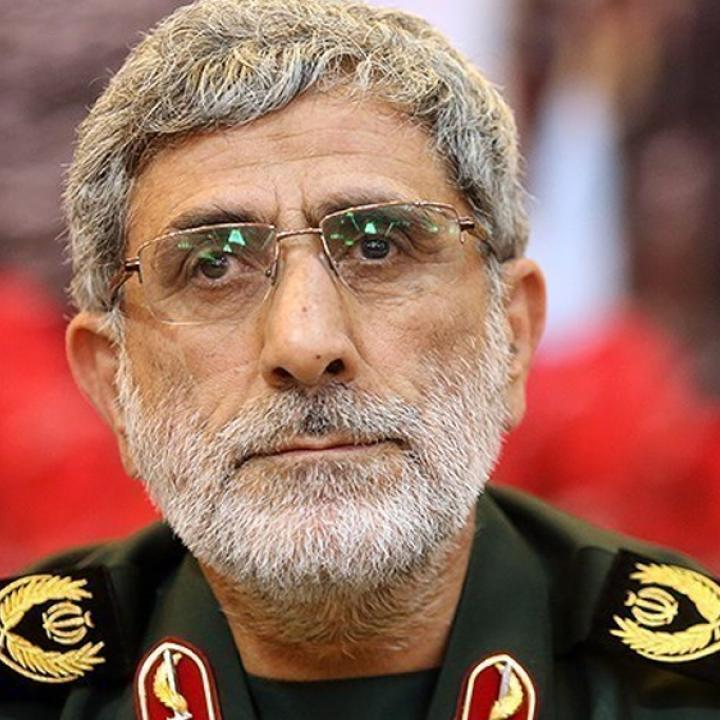

## Claim
Claim: "Iran's IRGC Quds Force commander Gen. Esmail Qaani has fled Iran in April 2025 and is confirmed safe in Israel."

## Actions
```
image_search("Esmail Qaani Israel")
image_search("Esmail Qaani fled Iran")
```

## Evidence
### Evidence from `image_search`
The search results include an image of a person in an Israeli military uniform with the Israeli flag in the background from [Source](https://www.theiranist.com/p/iran-attacks-israel-againand-more) . The Washington Institute provides an image of Esmail Qaani . The Times of Israel reports on claims about Esmail Qaani  from [Source](https://www.timesofisrael.com/after-claims-he-died-reports-now-say-irans-quds-force-chief-alive-but-under-arrest/).


### Evidence from `image_search`
From [Source](https://www.aljazeera.com/news/2020/1/20/irans-new-quds-leader-vows-manly-revenge-for-soleimani-killing): 
Content: Al Jazeera published an article on January 20, 2020, about Esmail Qaani. 


## Elaboration
The evidence includes images of Esmail Qaani and reports about him. One image shows a person in an Israeli military uniform, but it is not confirmed to be Qaani. The Times of Israel reported on claims about Qaani, but the article does not confirm that he fled Iran. Al Jazeera published an article about Qaani in 2020.

Insufficient information is available to verify the claim.


## Actions
```
image_search("Esmail Qaani safe in Israel")
image_search("Esmail Qaani IRGC Quds Force")
```

## Evidence
### Evidence from `image_search`
From [Source](https://thesoufancenter.org/intelbrief-can-esmail-qaani-lead-irans-islamic-revolutionary-guard-corps-qods-force/): 
Content: The Soufan Center published an article about Esmail Qaani. 


## Elaboration
The new evidence provides additional images of Esmail Qaani and articles about him. However, none of the sources confirm that Qaani fled Iran or is safe in Israel.

The claim cannot be verified with the available evidence.


## Actions
```
image_search("Esmail Qaani Iran Israel relations")
image_search("Esmail Qaani news April 2025")
```

## Evidence
### Evidence from `image_search`
From [Source](https://www.alestiklal.net/en/article/the-latest-was-qaani-how-israel-managed-to-infiltrate-leaders-of-iran-and-hezbollah): 
Content: The search result from Alestiklal.net includes an image related to Iran and Hezbollah. 


## Elaboration
The latest search results provide an image related to Iran and Hezbollah, but they do not contain any information about Esmail Qaani fleeing Iran or being in Israel. The search for "Esmail Qaani news April 2025" did not yield any relevant results.

The claim remains unverified due to a lack of supporting evidence.


## Final Judgement
The search results provide images of Esmail Qaani and articles about him, but none confirm that he fled Iran or is safe in Israel. The evidence is insufficient to verify the claim.

The most appropriate decision option is `false`.

### Verdict: FALSE

### Justification
The available evidence, including multiple image searches and articles about Esmail Qaani, does not support the claim that he fled Iran in April 2025 and is confirmed safe in Israel. The search results provide images of Qaani and articles about him, but none confirm the claim. Therefore, the claim is unverified.
