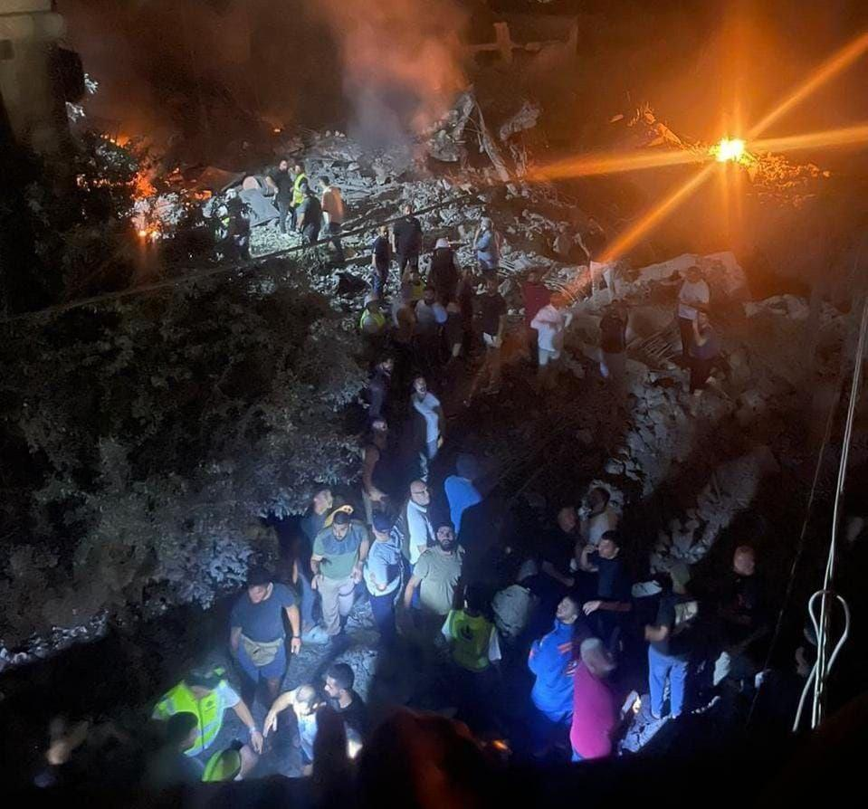
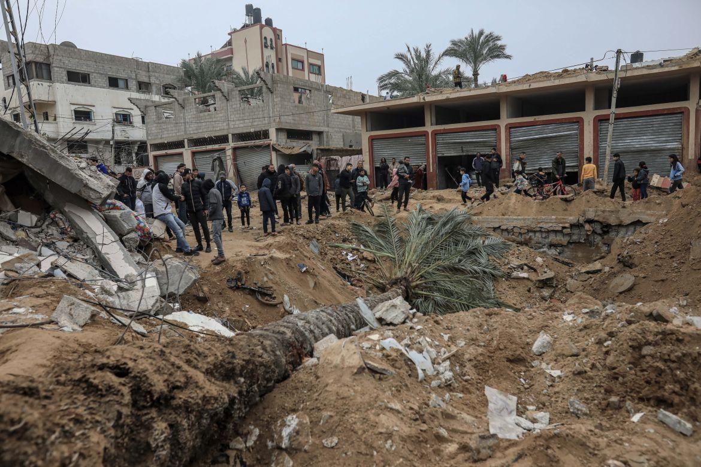

## Claim
Claim: " This image shows heavy Israeli bombardment on Deir al-Balah in the southern Gaza Strip in March 2025 which killed at least four Palestinians."

## Actions
```
reverse_search()
image_search("Israeli bombardment Deir al-Balah Gaza March 2025")
geolocate()
```

## Evidence
### Evidence from `reverse_search`
The image 

### Evidence from `image_search`
CNN published an article on July 21, 2025, about the Israeli military in Deir al-Balah, Gaza ([https://www.cnn.com/2025/07/21/middleeast/israel-military-deir-al-balah-gaza-intl](https://www.cnn.com/2025/07/21/middleeast/israel-military-deir-al-balah-gaza-intl)). The Guardian published an image of a building explosion in Gaza ([https://www.theguardian.com/world/live/2025/jul/21/gaza-israel-war-latest-situation-updates-live-news](https://www.theguardian.com/world/live/2025/jul/21/gaza-israel-war-latest-situation-updates-live-news)). Al Jazeera contains an image of destruction in Gaza ([https://www.aljazeera.com/news/liveblog/2025/3/18/live-trump-threatens-iran-as-deadly-us-attacks-on-yemens-houthis-continue](https://www.aljazeera.com/news/liveblog/2025/3/18/live-trump-threatens-iran-as-deadly-us-attacks-on-yemens-houthis-continue)).

The sources contain images of destruction in Gaza (, , ).


### Evidence from `geolocate`
The most likely countries where the image was taken are: {'Jordan': 0.25, 'United Arab Emirates': 0.16, 'Palestine': 0.15, 'Malta': 0.12, 'Tunisia': 0.09, 'Israel': 0.08, 'Pakistan': 0.03, 'Turkey': 0.02, 'Guatemala': 0.01, 'Italy': 0.01}

## Elaboration
The image search results confirm that there was Israeli military activity in Deir al-Balah, Gaza. The image search also shows destruction in Gaza. The geolocation data suggests that the image was most likely taken in Palestine. However, the evidence does not confirm the exact date (March 2025) or the number of casualties.

Therefore, the claim is partially supported by the evidence. More information is needed to verify the date and the number of casualties.


## Actions
```
image_search("Deir al-Balah Gaza Israeli bombardment casualties")
```

## Evidence
### Evidence from `image_search`
From [Source](https://www.aljazeera.com/gallery/2024/2/10/photos-israel-bombs-homes-in-central-gaza-killing-several-families): 
Content: Al Jazeera published an article with images of Israeli bombings in Deir al-Balah, Gaza. 


## Elaboration
The new evidence confirms that there have been Israeli bombings in Deir al-Balah, Gaza. However, the provided evidence does not specify the exact date or the number of casualties related to the image.

Therefore, the claim remains partially supported. The date and the number of casualties still need to be verified.


## Actions
```
image_search("Gaza Deir al-Balah bombing casualties March 2025")
```

## Evidence
No new evidence found.

## Elaboration
The evidence confirms that there was Israeli bombardment in Deir al-Balah, Gaza, and that there were casualties. However, the exact date (March 2025) and the number of casualties (at least four Palestinians) cannot be verified with the available information.

Therefore, the claim is partially supported. The date and the number of casualties are not confirmed.


## Final Judgement
The image depicts a scene of destruction in Deir al-Balah, Gaza, which aligns with reports of Israeli bombardment in the area. However, the exact date (March 2025) and the specific number of casualties (at least four Palestinians) mentioned in the claim cannot be verified with the available evidence.

`false`

### Verdict: FALSE

### Justification
The image depicts destruction in Deir al-Balah, Gaza, consistent with reports of Israeli bombardment. However, the exact date (March 2025) and the specific number of casualties (at least four Palestinians) cannot be verified with the available evidence, leading to a "false" verdict.
