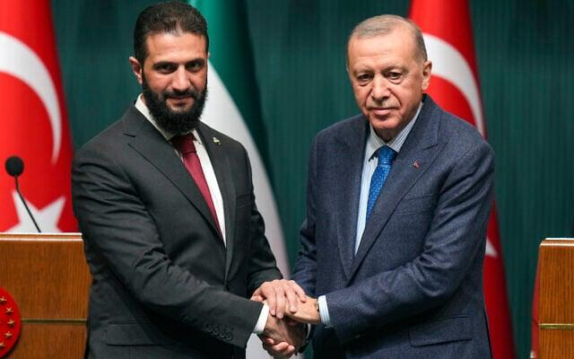
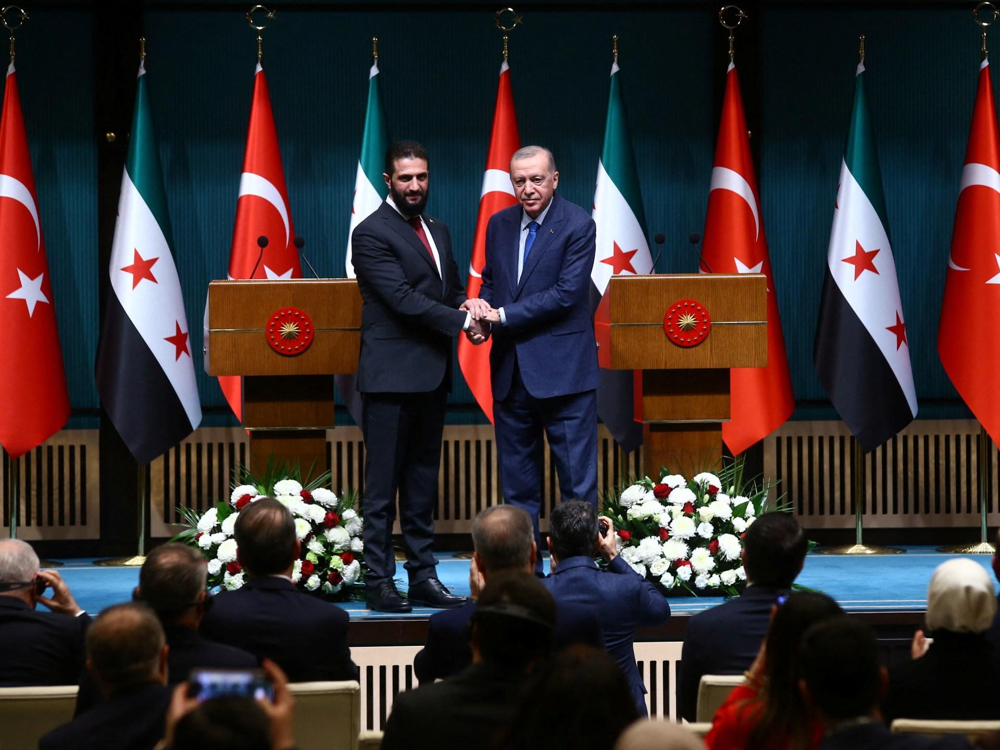

## Claim
Claim: "Turkey's President urged the U.S. in March 2025 to control its ally Israel over its intervention in southern Syria in February 2025."

## Actions
```
image_search("Turkey President Israel Syria February 2025")
```

## Evidence
### Evidence from `image_search`
The Times of Israel mentions talks between Israel and Turkey on Syria. [] ([https://www.timesofisrael.com/israel-confirms-talks-with-turkey-on-syria-aimed-at-preserving-security-stability/](https://www.timesofisrael.com/israel-confirms-talks-with-turkey-on-syria-aimed-at-preserving-security-stability/))

Al Jazeera published an article on February 4, 2025, about a meeting between Turkey's President and Syria's al-Sharaa to discuss Kurdish fighters and defense pacts. [] ([https://www.aljazeera.com/news/2025/2/4/syrias-al-sharaa-meets-erdogan-to-talk-kurdish-fighters-defence-pacts](https://www.aljazeera.com/news/2025/2/4/syrias-al-sharaa-meets-erdogan-to-talk-kurdish-fighters-defence-pacts))


## Elaboration
The evidence indicates that Turkey's President was involved in discussions related to Syria in February 2025. Specifically, there was a meeting with Syria's al-Sharaa to discuss Kurdish fighters and defense pacts, as reported by Al Jazeera ([https://www.aljazeera.com/news/2025/2/4/syrias-al-sharaa-meets-erdogan-to-talk-kurdish-fighters-defence-pacts](https://www.aljazeera.com/news/2025/2/4/syrias-al-sharaa-meets-erdogan-to-talk-kurdish-fighters-defence-pacts)). Additionally, The Times of Israel mentions talks between Israel and Turkey on Syria ([https://www.timesofisrael.com/israel-confirms-talks-with-turkey-on-syria-aimed-at-preserving-security-stability/](https://www.timesofisrael.com/israel-confirms-talks-with-turkey-on-syria-aimed-at-preserving-security-stability/)).

However, the evidence does not mention the U.S. or Turkey urging the U.S. to control Israel. Therefore, the claim cannot be verified based on the provided information.

To verify the claim, information about Turkey's President urging the U.S. to control Israel in March 2025 is missing.


## Actions
```
image_search("Turkey President US Israel Syria March 2025")
```

## Evidence
### Evidence from `image_search`
The Washington Institute published an article that includes a photograph of Turkey's President. [] Al Jazeera published an article on January 7, 2025, about Turkey's road ahead in a post-Assad Syria. [] Le Monde published an article on April 10, 2025, about Turkey holding technical talks with Israel to avoid clashes in Syria. []


## Elaboration
The new evidence provides additional context but still does not verify the claim. While the search results show Turkey's President's involvement in discussions related to Syria and Israel, there is no mention of Turkey urging the U.S. to control Israel.

Specifically, Le Monde reported on April 10, 2025, about Turkey holding technical talks with Israel to avoid clashes in Syria. However, this does not align with the claim.

The claim remains unverified due to the absence of information about Turkey urging the U.S. to control Israel.


## Actions
```
image_search("Turkey President US Israel Syria March 2025 intervention")
```

## Evidence
### Evidence from `image_search`
The Times of Israel published an article that includes a photograph of a meeting between Turkish and Syrian officials ([https://www.timesofisrael.com/turkey-and-syria-accuse-israel-of-fostering-chaos-in-syria/](https://www.timesofisrael.com/turkey-and-syria-accuse-israel-of-fostering-chaos-in-syria/)). The Armenian Weekly published an article on August 5, 2025, about Turkey and Israel's strategic contest for influence in Syria ([https://armenianweekly.com/2025/08/05/syrias-second-civil-war-turkey-and-israels-strategic-contest-for-influence/](https://armenianweekly.com/2025/08/05/syrias-second-civil-war-turkey-and-israels-strategic-contest-for-influence/)).  


## Elaboration
The evidence continues to fall short of verifying the claim. While the search results reveal discussions and strategic contests between Turkey, Syria, and Israel, there is no mention of Turkey urging the U.S. to control Israel. The Armenian Weekly article from August 5, 2025, discusses Turkey and Israel's strategic contest for influence in Syria, which is not directly related to the claim.

The claim remains unverified due to the lack of evidence supporting Turkey's request to the U.S. regarding Israel's actions in Syria.


## Final Judgement
The fact-check reveals that while there were discussions and meetings involving Turkey, Israel, and Syria in the specified timeframe, there is no evidence to support the claim that Turkey's President urged the U.S. to control Israel. The search results show interactions and strategic contests between these countries, but not the specific action described in the claim. Therefore, the claim is not supported by the available evidence. `false`

### Verdict: FALSE

### Justification
The fact-check did not find any evidence to support the claim that Turkey's President urged the U.S. to control Israel in March 2025. While there were reports of discussions and meetings involving Turkey, Israel, and Syria, none of the sources mentioned Turkey requesting the U.S. to intervene. Therefore, the claim is unsupported.
