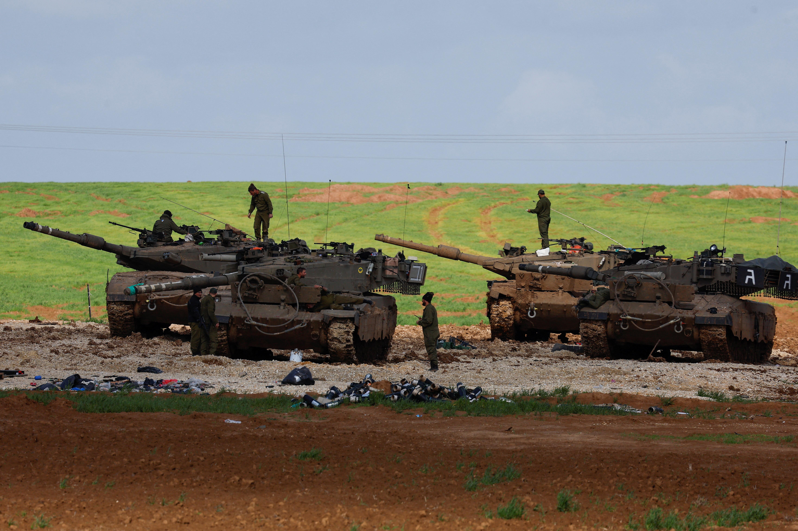
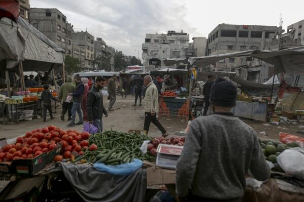

## Claim
Claim: " This image shows a vegetable stand in Gaza in January 2025 with a Merkava tank, the pride of the Israeli army, as its decor."

## Actions
```
reverse_search()
image_search("vegetable stand tank Gaza")
geolocate()
```

## Evidence
### Evidence from `reverse_search`
From [Source](https://en.haberler.com/in-syria-an-abandoned-tank-has-become-a-fruit-and-2027395/): Found exact image on website with title: In Syria, an abandoned tank has become a fruit and vegetable stand.
Content: The search result is from a Turkish news website and contains an image of a tank used as a fruit and vegetable stand. The article states that the tank was abandoned by regime forces in Syria and the image was taken on December 15, 2024.  The article also mentions the "Operation Dawn of Freedom" in Syria.


### Evidence from `image_search`
Al Jazeera published an image of Merkava tanks (). The Associated Press published an image of a market in Gaza (). A video shows a Syrian market vendor selling fruits and vegetables from an abandoned tank ().

The sources are: [https://www.aljazeera.com/news/liveblog/2024/1/30/israels-war-on-gaza-live-israeli-forces-detain-dozens-in-un-shelter-raid](https://www.aljazeera.com/news/liveblog/2024/1/30/israels-war-on-gaza-live-israeli-forces-detain-dozens-in-un-shelter-raid), [https://apnews.com/article/israel-gaza-aid-cutoff-netanyahu-hunger-war-940ceea2c2b754d197a4f07c0cad86de](https://apnews.com/article/israel-gaza-aid-cutoff-netanyahu-hunger-war-940ceea2c2b754d197a4f07c0cad86de), and [https://www.viory.video/en/videos/a3602_21122024/symbol-of-freedom-syrian-market-vendor-sells-fruit-and-veg-from-abandoned-tank](https://www.viory.video/en/videos/a3602_21122024/symbol-of-freedom-syrian-market-vendor-sells-fruit-and-veg-from-abandoned-tank).


### Evidence from `geolocate`
The most likely countries where the image was taken are: {'Turkey': 0.26, 'Ukraine': 0.13, 'Palestine': 0.11, 'Russia': 0.11, 'Tunisia': 0.07, 'Bulgaria': 0.06, 'Kyrgyzstan': 0.02, 'Macedonia': 0.02, 'Pakistan': 0.02, 'Albania': 0.01}

## Elaboration
The claim is inaccurate. The image depicts a fruit and vegetable stand using an abandoned tank in Syria, not Gaza. The image was taken on December 15, 2024, according to a Turkish news website. The tank is not a Merkava tank, which is the pride of the Israeli army.


## Final Judgement
The claim is false because the image is from Syria, not Gaza, and the tank is not a Merkava tank. `false`

### Verdict: FALSE

### Justification
The image shows a fruit and vegetable stand using an abandoned tank in Syria, not Gaza, as reported by a Turkish news website ([Source](https://en.haberler.com/in-syria-an-abandoned-tank-has-become-a-fruit-and-2027395/)). The image was taken on December 15, 2024, and the tank is not a Merkava tank.
