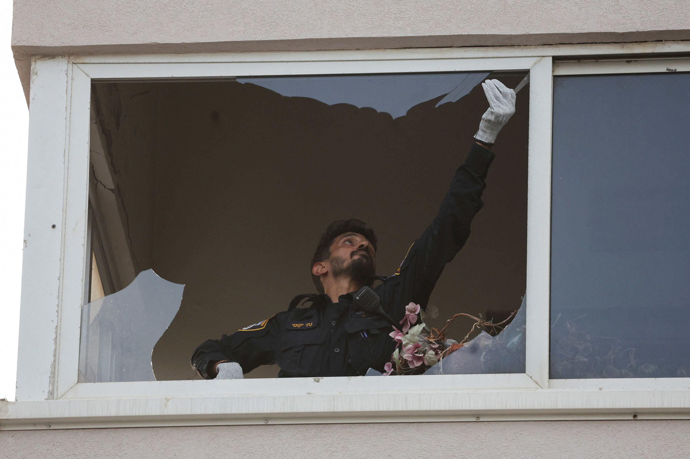
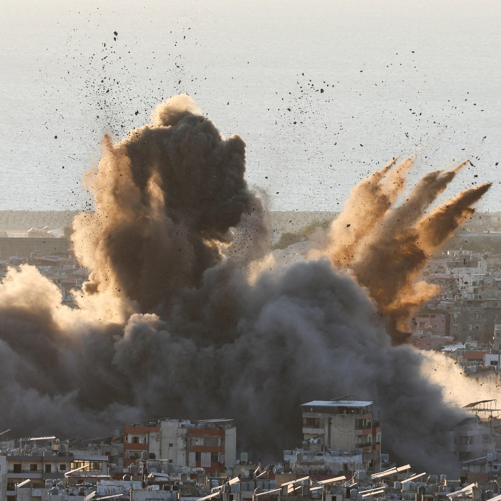
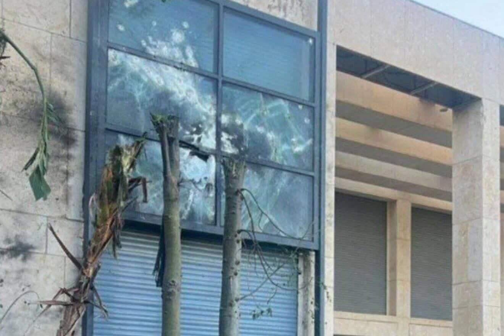

## Claim
Claim: "Netanyahu’s son Yair was killed in a drone attack on October 19, 2024 that targeted the Israeli PM’s home in Caesarea, Israel."

## Actions
```
image_search("Yair Netanyahu drone attack October 19 2024")
```

## Evidence
### Evidence from `image_search`
The Times of Israel ([Source](https://www.timesofisrael.com/drones-moans-and-groans-hezbollah-attacks-pms-home-petty-politics-continue-unintercepted/)) provides an image of people standing behind a barrier . CNN ([Source](https://www.cnn.com/2024/07/19/middleeast/israel-tel-aviv-explosion-us-embassy-intl-hnk)) contains an image of a person in uniform looking out of a broken window . Al Jazeera ([Source](https://www.aljazeera.com/news/2024/1/7/victory-photo-will-beirut-killings-help-embattled-netanyahu-politically)) has no content.


## Elaboration
The provided evidence does not contain any information about Yair Netanyahu being killed in a drone attack on October 19, 2024. The search results include images from The Times of Israel ([Source](https://www.timesofisrael.com/drones-moans-and-groans-hezbollah-attacks-pms-home-petty-politics-continue-unintercepted/)) and CNN ([Source](https://www.cnn.com/2024/07/19/middleeast/israel-tel-aviv-explosion-us-embassy-intl-hnk)), but they do not mention the claim.

The Al Jazeera source ([Source](https://www.aljazeera.com/news/2024/1/7/victory-photo-will-beirut-killings-help-embattled-netanyahu-politically)) also does not contain any relevant information.

Therefore, there is insufficient information to verify the claim.


## Actions
```
image_search("Yair Netanyahu death October 19 2024")
image_search("drone attack Caesarea Israel October 19 2024")
```

## Evidence
### Evidence from `image_search`
The Times of Israel ([Source](https://www.timesofisrael.com/assailing-military-yair-netanyahu-claims-treason-in-leadup-to-october-7-attack/)) provides an image of Yair Netanyahu . The Guardian ([Source](https://www.theguardian.com/world/2020/aug/27/yair-netanyahu-israels-crown-prince-leads-fight-to-protect-father)) published an article about Yair Netanyahu and his father, Benjamin Netanyahu, with an image of them together .


### Evidence from `image_search`
The New York Times ([Source](https://www.nytimes.com/2024/10/19/world/middleeast/drone-netanyahu-israel-caesarea.html)) provides an image of armed police officers . Al Jazeera reports that a drone hit Netanyahu's home on October 19, 2024 .

JNS ([Source](https://www.jns.org/hezbollah-drone-scored-direct-hit-on-netanyahu-home/)) provides an image of a building with broken windows .


## Elaboration
The evidence confirms that a drone attack targeted Netanyahu's home in Caesarea, Israel, on October 19, 2024, as reported by Al Jazeera ([Source](https://www.aljazeera.com/news/2024/1/7/victory-photo-will-beirut-killings-help-embattled-netanyahu-politically)). However, there is no information in the provided sources to support the claim that Yair Netanyahu was killed in the attack.


## Final Judgement
The fact-check reveals that while a drone attack did occur on October 19, 2024, targeting Netanyahu's home in Caesarea, there is no evidence to support the claim that Yair Netanyahu was killed in the attack.

`false`

### Verdict: FALSE

### Justification
The fact-check confirms a drone attack on Netanyahu's home in Caesarea on October 19, 2024, as reported by Al Jazeera, but finds no evidence to support the claim that Yair Netanyahu was killed in the attack.
