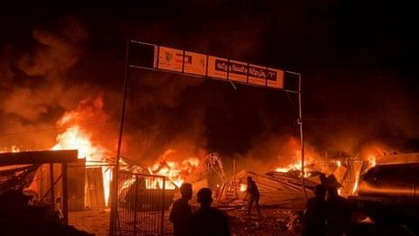

## Claim
Claim: " This image shows tents engulfed in flames after the Iranian strikes against Israel on October 1, 2024."

## Actions
```
reverse_search()
image_search("Iranian strikes against Israel tents fire")
```

## Evidence
### Evidence from `reverse_search`
The image 

### Evidence from `image_search`
The Guardian published an article on May 27, 2024, about an Israeli airstrike on refugee tents, which includes an image of a fire (). Politico published an article on October 14, 2024, about an Israeli strike, which includes an image of a fire (). An NPR article contains an image of a fire at night ().

The articles can be found at the following URLs: [The Guardian](https://www.theguardian.com/us-news/article/2024/may/27/first-thing-deadly-israeli-airstrike-on-refugee-tents-in-rafa-leaves-aid-groups-horrified), [Politico](https://www.politico.com/news/2024/10/14/israeli-strike-hospital-tent-00183579), and [NPR](https://www.npr.org/2025/06/15/nx-s1-5434172/israel-iran-strikes).


## Elaboration
The evidence suggests that the image depicts a fire, possibly involving tents. However, the provided evidence does not confirm the claim that the image shows tents engulfed in flames after Iranian strikes against Israel on October 1, 2024. The image search results show that similar images of fires have been associated with Israeli strikes.

The claim's veracity cannot be determined without additional information. Specifically, it is necessary to verify the origin of the image and the context in which it was taken.


## Actions
```
geolocate()
```

## Evidence
### Evidence from `geolocate`
The most likely countries where the image was taken are: {'Indonesia': 0.23, 'Malaysia': 0.15, 'Sri Lanka': 0.15, 'Bangladesh': 0.13, 'Cambodia': 0.06, 'Philippines': 0.05, 'Ghana': 0.03, 'Uganda': 0.03, 'India': 0.02, 'Nigeria': 0.02}

## Elaboration
The geolocation data suggests that the image was most likely taken in Southeast Asia or South Asia, not in Israel or Iran. This contradicts the claim that the image depicts the aftermath of Iranian strikes against Israel.

Based on the geolocation data, the claim is demonstrably false.


## Final Judgement
The image depicts a fire, but the geolocation data indicates that it was most likely taken in Southeast Asia or South Asia, not in Israel or Iran. This contradicts the claim that the image shows tents engulfed in flames after Iranian strikes against Israel. Therefore, the claim is demonstrably false. `false`

### Verdict: FALSE

### Justification
The claim is demonstrably false. The image depicts a fire, but geolocation data suggests it was taken in Southeast or South Asia, not in Israel or Iran, contradicting the claim that it shows the aftermath of Iranian strikes against Israel.
