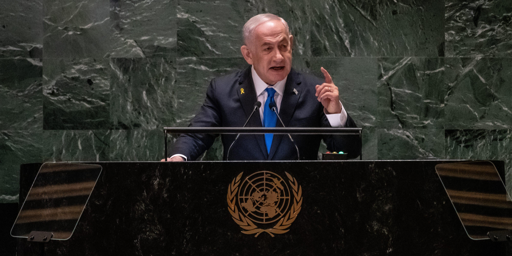

## Claim
Claim: "Netanyahu left Israel and fled to Poland amid Iran's missile attack on Israel on October 1, 2024."

## Actions
```
image_search("Netanyahu Poland October 1 2024")
```

## Evidence
### Evidence from `image_search`
The Los Angeles Times ([https://www.latimes.com/world-nation/story/2025-01-09/polish-president-seeks-protection-for-netanyahu-if-he-attends-auschwitz-anniversary-event](https://www.latimes.com/world-nation/story/2025-01-09/polish-president-seeks-protection-for-netanyahu-if-he-attends-auschwitz-anniversary-event)) published an article on January 9, 2025, about the Polish president seeking protection for Netanyahu, including an image of Netanyahu . The Intercept ([https://theintercept.com/2025/01/23/netanyahu-auschwitz-memorial-poland-icc-warrant/](https://theintercept.com/2025/01/23/netanyahu-auschwitz-memorial-poland-icc-warrant/)) published an article on January 23, 2025, about Netanyahu, including an image of Netanyahu .

Reuters ([https://www.reuters.com/world/polish-president-wants-icc-indictee-netanyahu-be-able-go-auschwitz-anniversary-2025-01-09/](https://www.reuters.com/world/polish-president-wants-icc-indictee-netanyahu-be-able-go-auschwitz-anniversary-2025-01-09/)) published an article about the Polish president and Netanyahu .


## Elaboration
The provided evidence does not support the claim that Netanyahu fled to Poland amid an Iranian missile attack on October 1, 2024. The articles from the Los Angeles Times, The Intercept, and Reuters discuss events in January 2025, and do not mention any missile attacks or the circumstances described in the claim. The articles focus on Netanyahu's potential attendance at an Auschwitz anniversary event and related security concerns.

The evidence suggests that Netanyahu was potentially in Poland in January 2025, but it does not confirm the reason for his presence or the events leading up to it.

To verify the claim, information is missing about Netanyahu's whereabouts on October 1, 2024, and whether there was an Iranian missile attack on that date.


## Actions
```
image_search("Netanyahu October 1 2024 Iran missile attack")
```

## Evidence
### Evidence from `image_search`
The Times of Israel published an article with an image of Netanyahu . France 24 published an article on October 2, 2024, about Iran's missile strikes on Israel, mentioning world leaders calling for de-escalation. The Guardian published a video on October 2, 2024, where Netanyahu says Iran will pay for missile strikes .


## Elaboration
The evidence confirms that Iran launched missile strikes on Israel around October 1, 2024, and that Netanyahu responded to these strikes. However, the evidence does not support the claim that Netanyahu fled to Poland. Instead, the evidence suggests that Netanyahu was in Israel and responded to the attacks.

The Guardian published a video on October 2, 2024, where Netanyahu stated that Iran would pay for the missile strikes. This contradicts the claim that he fled the country.


## Final Judgement
The fact-check reveals that Iran launched missile strikes on Israel around October 1, 2024, and Netanyahu responded to these strikes. However, there is no evidence to support the claim that Netanyahu fled to Poland. On the contrary, evidence suggests he was in Israel and addressed the attacks.

`false`

### Verdict: FALSE

### Justification
The claim is false. While Iran launched missile strikes on Israel around October 1, 2024, and Netanyahu responded, there is no evidence to support the assertion that he fled to Poland. In fact, a video from The Guardian ([https://www.theguardian.com/](https://www.theguardian.com/)) shows Netanyahu responding to the attacks, indicating he remained in Israel.
