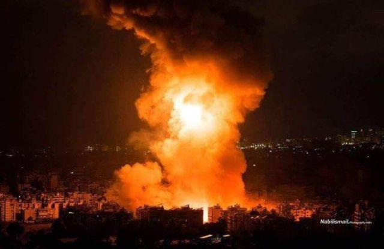

## Claim
Claim: " This image shows Israel launching several waves of revengeful attacks on Iranian military targets on October 26, 2024."

## Actions
```
reverse_search()
geolocate()
image_search("Israel attacks Iranian military targets October 26 2024")
```

## Evidence
### Evidence from `reverse_search`
The image 
appears in a Syria Live Map article about an "Islamic State" (ISIS) cell attack in July 2025, and in a News Live - Oregon article about an explosion in October 2024. The image 
is also present in an article from Harapan Daily discussing the conflict in the Middle East, focusing on the Israeli assault on Gaza and the role of Iran. The article mentions an Iranian drone and missile operation targeting Israeli military installations in April 2024.


### Evidence from `geolocate`
The most likely countries where the image was taken are: {'Palestine': 0.4, 'Israel': 0.3, 'Bangladesh': 0.04, 'Taiwan': 0.04, 'Ukraine': 0.04, 'China': 0.02, 'Pakistan': 0.02, 'Bulgaria': 0.01, 'Jordan': 0.01, 'Malta': 0.01}

### Evidence from `image_search`
The Institute for the Study of War and AEI's Critical Threats Project published a map showing confirmed IDF strikes in Iran as of October 28, 2024, at 2:00 PM ET. The IDF launched three waves of strikes targeting around 20 locations around Tehran and western Iran on October 25. ([https://www.understandingwar.org/backgrounder/iran-update-october-28-2024](https://www.understandingwar.org/backgrounder/iran-update-october-28-2024)) 

CNN and Al Jazeera also reported on Israeli strikes on military targets in Iran on October 26, 2024. ([https://www.cnn.com/2024/10/26/middleeast/israel-strikes-iran-explainer-intl-hnk](https://www.cnn.com/2024/10/26/middleeast/israel-strikes-iran-explainer-intl-hnk), [https://www.aljazeera.com/news/2024/10/26/condemnation-calls-for-restraint-world-reacts-to-israeli-strikes-on-iran](https://www.aljazeera.com/news/2024/10/26/condemnation-calls-for-restraint-world-reacts-to-israeli-strikes-on-iran)) , 


## Elaboration
The claim that the image shows Israel launching attacks on Iranian military targets on October 26, 2024, is partially supported by the evidence. The image search results confirm that Israel did launch strikes on military targets in Iran on October 26, 2024, as reported by CNN and Al Jazeera ([https://www.cnn.com/2024/10/26/middleeast/israel-strikes-iran-explainer-intl-hnk](https://www.cnn.com/2024/10/26/middleeast/israel-strikes-iran-explainer-intl-hnk), [https://www.aljazeera.com/news/2024/10/26/condemnation-calls-for-restraint-world-reacts-to-israeli-strikes-on-iran](https://www.aljazeera.com/news/2024/10/26/condemnation-calls-for-restraint-world-reacts-to-israeli-strikes-on-iran)). However, the evidence does not confirm that the image itself depicts these specific attacks. The reverse image search indicates that the image has been used in different contexts, including an article about an explosion in October 2024.

The geolocation data suggests that the image could have been taken in Palestine or Israel.

Therefore, while the claim's date and general context are accurate, the evidence does not verify that the image specifically depicts the Israeli attacks on October 26, 2024.


## Final Judgement
The claim is partially accurate as it correctly states that Israel launched attacks on Iranian military targets on October 26, 2024. However, the evidence does not confirm that the image depicts these specific attacks. Therefore, the claim is misleading. `false`

### Verdict: FALSE

### Justification
The claim is misleading. While Israel did launch strikes on Iranian military targets on October 26, 2024, as reported by CNN and Al Jazeera ([https://www.cnn.com/2024/10/26/middleeast/israel-strikes-iran-explainer-intl-hnk](https://www.cnn.com/2024/10/26/middleeast/israel-strikes-iran-explainer-intl-hnk), [https://www.aljazeera.com/news/2024/10/26/condemnation-calls-for-restraint-world-reacts-to-israeli-strikes-on-iran](https://www.aljazeera.com/news/2024/10/26/condemnation-calls-for-restraint-world-reacts-to-israeli-strikes-on-iran)), the provided evidence does not confirm that the image depicts these specific attacks.
